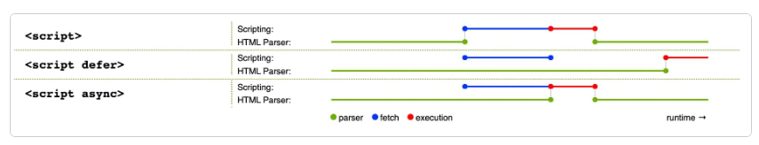

# 定义
JavaScript是一种脚本编程语言，可以在网页上实现复杂的功能。

## 可以做什么？
- 在变量中存储有用的值
- 操作一段文本
- 运行代码以响应网页中发生的特定事件

JavaScript语言核心之上所构建的功能——**应用程序接口（application programming interface，API）**

API是已经建立好的一套代码组件，可以让开发者实现原本很难甚至无法实现的程序。

API通常分为两类。
1、浏览器API内建于web浏览器中，可以将数据从周边计算机环境中筛选出来，还可以做实用的复杂工作。
- 文档对象模型API：能通过创建、移除和修改HTML，为页面动态应用新的样式等手段来操作HTML和CSS。
- 地理位置API：获取地理信息
- 画布Canvas和WebGL API可以创建生动的2D和3D图像
- HTMLMediaElement和WebRTC等影音类API：利用多媒体做一些有趣的事。

2、第三方API：一般从网上取得代码和信息。
- Twitter API、新浪微博API
- 谷歌地图API、OpenStreeMap API、高德地图API

## 在页面上做了什么？
通过文档对象模型动态修改HTML和CSS，以更新用户界面

## 浏览器安全
大多数情况，每个标签页中的代码完全独立运行，不相互影响。

## 运行次序
从上往下的顺序执行代码

## 解释代码vs编译代码
- 解释interpret
解释型语言中，代码自上而下运行，实时返回运行结果。代码在由浏览器执行前，不需要将其转化为其他形式。代码直接以文本格式被接收和处理
- 编译compile
编译型语言需要先将代码转化（编译）成另一种形式才能运行。

JavaScript是轻量级解释型语言。浏览器接受到JavaScript代码，并以代码自身的文本格式运行它。
技术上，几乎所有 JavaScript 转换器都运用了一种叫做即时编译（just-in-time compiling）的技术；当 JavaScript 源代码被执行时，它会被编译成二进制的格式，使代码运行速度更快。
尽管如此，JavaScript 仍然是一门解释型语言，因为编译过程发生在代码运行中，而非之前。

## 服务器端代码vs客户端代码
客户端代码是在用户的电脑上运行的代码，在浏览一个网页时，它的客户端代码就会被下载，然后由浏览器来运行并展示。客户端 JavaScript
服务器端代码在服务器上运行，然后运行结果才由浏览器下载并展示出来。
流行的服务器端web语言包括：PHP、Python、Ruby、ASP.NET，还有JavaScript，如Node.js

## 动态代码vs静态代码
动态：是指通过按需生成新内容来更新web页面或应用，使不同环境下可以显示出不同内容。
没有动态更新内容的网页叫做静态页面，所显示的内容不会改变

## 内联JavaScript处理器
```html
<button onclick="createParagraph()">点我！</button>
```
内联的`onclick`处理器，这会使JavaScript污染了HTML，而且效率低下
使用addEventListener

## 脚本调用策略
HTML元素是按照其在页面中出现的次序调用的，如果用JavaScript来管理页面上的元素，若JavaScript加载要操作的HTML元素之前，代码将出错。

页面中的“内部JavaScript”

```javascript
document.addEventListener("DOMContentLoaded", () => {
  
});
```

这是一个事件监听器，监听浏览器的`DOMContentLoaded`事件，标志着HTML文档体完全加载和解析。

“外部JavaScript”：
```javascript
<script src="script.js" defer></script>
```
`defer`属性，告知浏览器遇到`<script>`元素时继续下载HTML内容

## async和defer
- 浏览器遇到async脚本时不会阻塞页面渲染，而是直接下载然后运行。但一旦下载完成，脚本就会执行，从而阻止页面渲染。脚本的运行次序无法控制。当页面脚本之间彼此独立，且不依赖于本页面的其他任何脚本时，`async`是理想的选择
- 使用`defer`属性加载的脚本将按照它们在页面上出现的顺序加载。在页面内容全部加载完毕之前，脚本不会运行，如果脚本依赖于 DOM 的存在（例如，脚本修改了页面上的一个或多个元素），这一点非常有用。




示例：
```html
<script async src="js/vendor/jquery.js"></script>

<script async src="js/script2.js"></script>

<script async src="js/script3.js"></script>
```
三者的调用顺序是不确定的。jquery.js 可能在 script2 和 script3 之前或之后调用，如果这样，后两个脚本中依赖 jquery 的函数将产生错误，因为脚本运行时 jquery 尚未加载。

async 应该在有大量后台脚本需要加载，并且只想尽快加载到位的情况下使用。例如，可能需要加载一些游戏数据文件，这在游戏真正开始时是需要的，但现在只想显示游戏介绍、标题和大厅，而不想被脚本加载阻塞。

解决这一问题可使用 defer 属性，脚本将按照在页面中出现的顺序加载和运行：
```html
<script defer src="js/vendor/jquery.js"></script>

<script defer src="js/script2.js"></script>

<script defer src="js/script3.js"></script>
```


