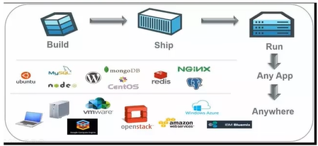
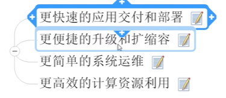
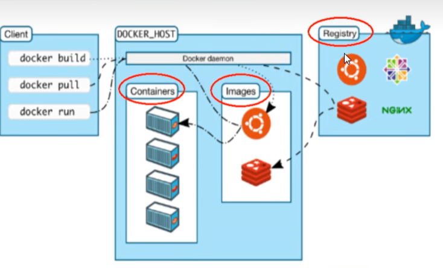
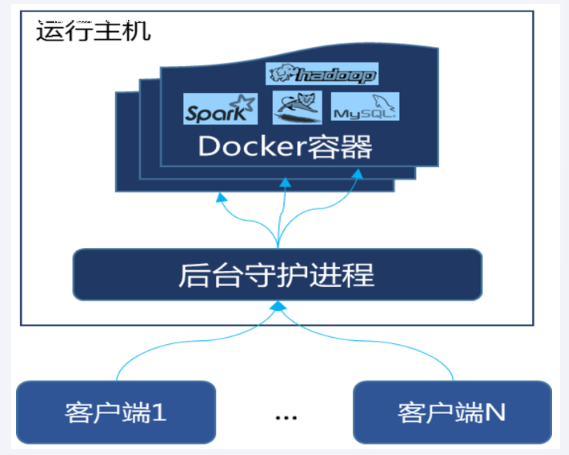

# 01

## docker简介

1、是什么
docker的出现使得docker得以打破过去 程序即应用 的观念。

透过镜像image将作业系统核心除外，运作应用程式所需的系统环境，由下而上打包，达到应用程式跨平台间的无缝接轨运作

一次镜像，处处运行

docker是基于go语言实现的云开源项目

主要目标是“build, ship and run any app, anywhere”，也就是通过封装、分发、部署、运行等生命周期的管理，使用户的APP及其运行环境能够做到“一次镜像，处处运行”

docker的出现解决了运行环境和配置问题的软件容器，方便做持续集成并有助于整体发布的容器虚拟化技术

2、能干嘛

Docker本身是一个容器运行载体或称之为管理引擎。

把应用程序和配置依赖打包好形成一个可交付的运行环境，这个打包好的运行环境就是image镜像文件。

只有通过这个镜像文件才能生成Docker容器实例（类似Java中new出来一个对象）。

image文件可以看作是容器的模板。Docker根据image文件生成容器的实例。同一个image文件，可以生成多个同时运行的容器实例。

镜像文件：
- image文件生成的容器实例，本身也是一个文件，称为镜像文件

容器实例：
- 一个容器运行一种服务，当需要的时候，就可以通过docker客户端创建一个对应的运行实例，也就是容器

仓库：
- 就是放一堆镜像的地方，可以把镜像发布到仓库中，需要的时候再从仓库中拉下来就可以了

## docker架构图

**工作原理**
Docker是一个client-server结构的系统，Docker守护进程运行在主机上，然后通过socket连接从客户端访问，守护进程从客户端接受命令并管理运行在主机上的容器。

容器是一个运行时环境。

