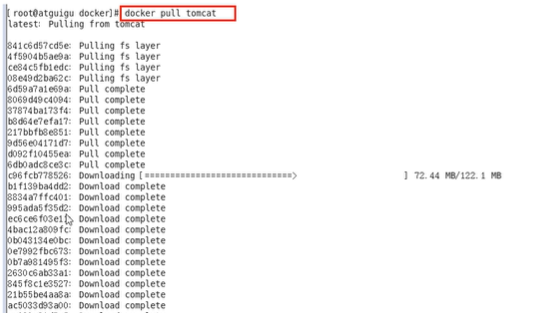
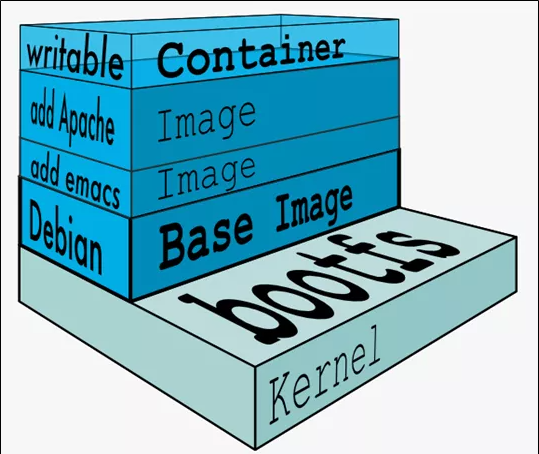
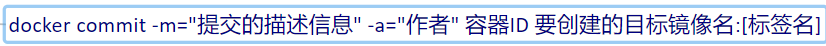
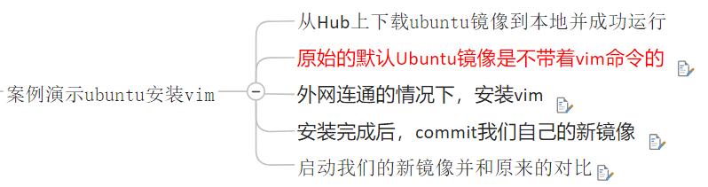
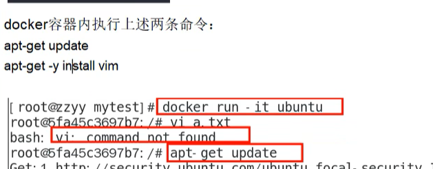
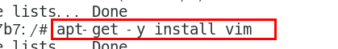
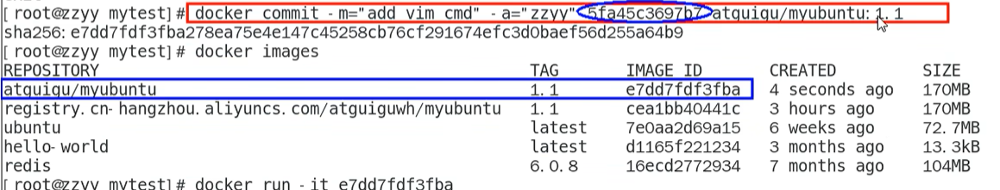
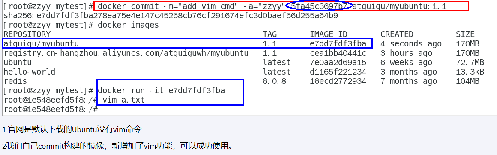

# 02

## docker镜像
镜像是一种轻量级、可执行的独立软件包，包含运行某个软件所需的所有内容，把应用程序和配置依赖打包好形成一个可交付的运行环境（包括代码、运行时所需要的库、环境变量和配置文件等），这个打包好的运行环境就是image镜像文件

只有通过这个镜像文件才能生成docker容器实例

### 分层的镜像

**UnionFS**
UnionFS(联合文件系统)：Union文件系统是一种分层、轻量级并且高性能的文件系统，它支持对文件系统的修改作为一次提交来一层层的叠加，同时可以将不同目录挂载到同一虚拟文件系统下。

Union文件系统是docker镜像的基础。镜像可以通过分层来进行继承，基于基础镜像（没有父镜像），可以制作各种具体的应用镜像

特性：一次同时加载多个文件系统，但从外面看起来，只能看到一个文件系统，联合加载会把各层文件系统叠加起来，这样最终的文件系统会包含所有底层的文件和目录

**docker镜像加载原理**

docker的镜像实际上由一层一层的文件系统组成，这种层级的文件系统UnionFS

bootfs(boot file system)主要包含bootloader和kernel，bootloader主要是引导加载kernel，Linux刚启动时会加载bootfs文件系统，在docker镜像的最底层是引导文件系统bootfs。

这与典型的Linux/unix系统是一样的，包含boot加载器和内核。当boot加载完成之后整个内核就都在内存中了，此时内存的使用权已由bootfs转交给内核，此时系统也会卸载bootfs

rootfs(root file system)，在bootfs之上，包含的就是典型Linux系统中的/dev，/proc，/bin，/etc等标准目录和文件。rootfs就是各种不同的操作系统发行版，比如Ubuntu，centos等等

**采用分层？**
镜像分层最大的一个好处就是共享资源，方便复制迁移，就是为了复用

比如有多个镜像都从相同的base镜像构建而来，那么docker host只需在磁盘上保存一份base镜像，同时内存中也只需加载一份base镜像，就可以为所有容器服务了。而且镜像的每一层都可以被共享。

**重点**
docker镜像层都是只读的，容器层是可写的，当容器启动时，一个新的可写层被加载到镜像的顶部。这一层通常被称作“容器层”，“容器层”之下都叫“镜像层”

### Docker镜像commit操作
docker commit提交容器副本使之成为一个新的镜像

**案例**

1、

2、

3、

## 本地镜像发布到阿里云

## 本地镜像发布到私有库