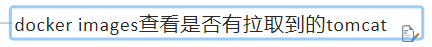
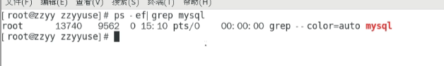

# 02

## docker镜像
镜像是一种轻量级、可执行的独立软件包，包含运行某个软件所需的所有内容，把应用程序和配置依赖打包好形成一个可交付的运行环境（包括代码、运行时所需要的库、环境变量和配置文件等），这个打包好的运行环境就是image镜像文件

只有通过这个镜像文件才能生成docker容器实例

### 分层的镜像


**UnionFS**
UnionFS(联合文件系统)：Union文件系统是一种分层、轻量级并且高性能的文件系统，它支持对文件系统的修改作为一次提交来一层层的叠加，同时可以将不同目录挂载到同一虚拟文件系统下。

Union文件系统是docker镜像的基础。镜像可以通过分层来进行继承，基于基础镜像（没有父镜像），可以制作各种具体的应用镜像

特性：一次同时加载多个文件系统，但从外面看起来，只能看到一个文件系统，联合加载会把各层文件系统叠加起来，这样最终的文件系统会包含所有底层的文件和目录

**docker镜像加载原理**

docker的镜像实际上由一层一层的文件系统组成，这种层级的文件系统UnionFS

bootfs(boot file system)主要包含bootloader和kernel，bootloader主要是引导加载kernel，Linux刚启动时会加载bootfs文件系统，在docker镜像的最底层是引导文件系统bootfs。

这与典型的Linux/unix系统是一样的，包含boot加载器和内核。当boot加载完成之后整个内核就都在内存中了，此时内存的使用权已由bootfs转交给内核，此时系统也会卸载bootfs

rootfs(root file system)，在bootfs之上，包含的就是典型Linux系统中的/dev，/proc，/bin，/etc等标准目录和文件。rootfs就是各种不同的操作系统发行版，比如Ubuntu，centos等等

**采用分层？**
镜像分层最大的一个好处就是共享资源，方便复制迁移，就是为了复用

比如有多个镜像都从相同的base镜像构建而来，那么docker host只需在磁盘上保存一份base镜像，同时内存中也只需加载一份base镜像，就可以为所有容器服务了。而且镜像的每一层都可以被共享。

**重点**
docker镜像层都是只读的，容器层是可写的，当容器启动时，一个新的可写层被加载到镜像的顶部。这一层通常被称作“容器层”，“容器层”之下都叫“镜像层”


### Docker镜像commit操作
docker commit提交容器副本使之成为一个新的镜像


**案例**


1、


2、

3、


## 本地镜像发布到阿里云
[https://cr.console.aliyun.com/cn-hangzhou/instance/namespaces](https://cr.console.aliyun.com/cn-hangzhou/instance/namespaces)


## 本地镜像发布到私有库
[https://hub.docker.com/](https://hub.docker.com/)


1、下载镜像Docker Registry
docker pull registry

2、运行私有库Registry，相当于本地有个私有dockerhub


commit


curl可以查看私服库上有什么镜像
```bash
 curl -XGET http://192.168.111.162:5000/v2/_catalog
```


将新镜像修改符合私服规范的Tag


修改配置文件使之支持http


push推送到私服库


curl再次验证私服库上有什么镜像


pull到本地


## docker容器数据卷


docker容器数据卷，主要完成容器和主机数据的映射，容器内的数据备份+持久化到本地主机目录（数据的持久化，重要资料backup【备份】）


案例：
１、宿主vs容器之间映射添加容器卷


查看数据卷是否挂载成功：


容器和宿主机之间数据共享：


2、读写规则映射添加说明

读写（默认）：


只读：


3、卷的继承和共享
 - 容器1完成和宿主机的映射
 
 
 - 容器2继承容器1的卷规则：
 
 


## docker常规软件安装简介


**安装tomcat**




问题：localhost:8080 404报错
1、可能没有映射端口或者没有关闭防火墙


2、新版文件夹为空


免修改版本：


**mysql**
5.7为例

```bash
docker pull mysql:5.7
```
查看宿主机是否有mysql，以下示例没有


使用mysql镜像：


启动mysql：


外部连接容器内mysql:


问题：
无法插入中文，docker上默认字符集编码隐患
容器内mysql运行： SHOW VARIABLES LIKE 'character%'


数据卷没有映射，删掉实例数据就没了


数据卷映射启动mysql：


数据映射测试：


**redis**


