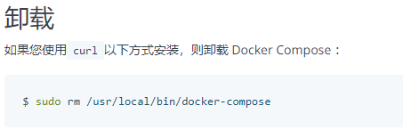

# 03

redis-cli --cluster create 192.168.181.141:6381 192.168.181.141:6382 192.168.181.141:6383 192.168.181.141:6384 192.168.181.141:6385 192.168.181.141:6386 --cluster-replicas 1

## Dockerfile

Dockerfile是用来构建Docker镜像的文本文件，是由一条条构建镜像所需的指令和参数构成的脚本

### 官网
[https://docs.docker.com/engine/reference/builder/](https://docs.docker.com/engine/reference/builder/)

### Dockerfile内容
1、每条保留字指令都必须为大写字母且后面要跟随至少一个参数

2、指令按照从上到下，顺序执行

3、#表示注释

4、每条指令都会创建一个新的镜像层并对镜像进行提交

### 常用保留字指令


### 构建
1、编写Dockerfile文件

```Dockerfile
FROM centos
MAINTAINER zzyy<zzyybs@126.com>
 
ENV MYPATH /usr/local
WORKDIR $MYPATH
 
#安装vim编辑器
RUN yum -y install vim
#安装ifconfig命令查看网络IP
RUN yum -y install net-tools
#安装java8及lib库
RUN yum -y install glibc.i686
RUN mkdir /usr/local/java
#ADD 是相对路径jar,把jdk-8u171-linux-x64.tar.gz添加到容器中,安装包必须要和Dockerfile文件在同一位置
ADD jdk-8u171-linux-x64.tar.gz /usr/local/java/
#配置java环境变量
ENV JAVA_HOME /usr/local/java/jdk1.8.0_171
ENV JRE_HOME $JAVA_HOME/jre
ENV CLASSPATH $JAVA_HOME/lib/dt.jar:$JAVA_HOME/lib/tools.jar:$JRE_HOME/lib:$CLASSPATH
ENV PATH $JAVA_HOME/bin:$PATH
 
EXPOSE 80
 
CMD echo $MYPATH
CMD echo "success--------------ok"
CMD /bin/bash
```

2、docker build命令构建镜像

```bash
docker build -t 新镜像名字:TAG .
```

3、docker run依镜像运行容器实例

```bash
docker run -it 新镜像名字:TAG
```

### 虚悬镜像
仓库名、标签都是`<none>`的镜像，俗称dangling image

查看
```bash
docker iamge ls -f dangling=true
```

删除
```bash
docker image prune
```

## Docker网络
docker不启动：


virbr0：在CentOS7的安装过程中如果有选择相关虚拟化的的服务安装系统后，启动网卡时会发现有一个以网桥连接的私网地址的virbr0网卡(virbr0网卡：它还有一个固定的默认IP地址192.168.122.1)，是做虚拟机网桥的使用的，其作用是为连接其上的虚机网卡提供 NAT访问外网的功能。

docker启动后：


docker network常用命令：


查看网络：docker network ls

查看网络源数据：docker network inspect xxx网络名字

删除网络：docker network rm xxx网络名字

案例：


### 网络模式


**容器实例内默认网络IP生产规则**

docker容器内部的ip是有可能会发生改变的


**bridge**
docker服务默认会创建一个docker0网桥（其上有一个docker0内部接口），该桥接网络的名称为docker0，它在内核层连通了其他的物理或虚拟网卡，这就将所有容器和本地主机都放到同一个物理网络。

docker默认指定了docker0接口的IP地址和子网掩码，让主机和容器之间可以通过网桥相互通信。


docker使用Linux桥接，在宿主机虚拟一个docker容器网桥（docker0），docker启动一个容器时会根据docker网桥的网段分配给容器一个IP地址，称为Container-IP，同时docker网桥是每个容器的默认网关。因为在同一宿主机的容器都接入同一个网桥，这样容器之间就能够通过容器的container-IP直接通信

docker run的时候，没有指定network的话默认使用网桥模式就是bridge，使用的就是docker0


**host**
直接使用宿主机的 IP 地址与外界进行通信，不再需要额外进行NAT 转换。


docker启动时指定--network=host或-net=host，如果还指定了-p映射端口，那这个时候就会有此警告，并且通过-p设置的参数将不会起到任何作用，端口号会以主机端口号为主，重复时则递增。

**none**
在none模式下，并不为Docker容器进行任何网络配置。 

也就是说，这个Docker容器没有网卡、IP、路由等信息，只有一个lo

需要我们自己为Docker容器添加网卡、配置IP等。


**container**
新建的容器和已经存在的一个容器共享一个网络ip配置而不是和宿主机共享。新创建的容器不会创建自己的网卡，配置自己的IP，而是和一个指定的容器共享IP、端口范围等。同样，两个容器除了网络方面，其他的如文件系统、进程列表等还是隔离的。


关闭：


**自定义网络**


新建自定义网络：

before：按服务名Ping不通


after：


## Docker-compose容器编排
Docker-compose是Docker官方的开源工具软件，可以管理多个docker容器组成一个应用。

需要定义一个YAML格式的配置文件`docker-compose.yml`，写好多个容器之间的调用关系，然后，只要一个命令，就能同时启动关闭这些容器


如果需要同时部署多个服务，每个服务单独写Dockerfile然后再构建镜像很麻烦，所以docker官方提供了docker-compose多服务部署的工具


Compose允许用户通过一个单独的`docker-compose.yml`模板文件（YAML 格式）来定义一组相关联的应用容器为一个项目（project）

可以很容易地用一个配置文件定义一个多容器的应用，然后使用一条指令安装这个应用的所有依赖，完成构建。Docker-Compose 解决了容器与容器之间如何管理编排的问题。

### 下载安装
[https://docs.docker.com/compose/compose-file/compose-file-v3/](https://docs.docker.com/compose/compose-file/compose-file-v3/)

[https://docs.docker.com/compose/install/](https://docs.docker.com/compose/install/)

```bash
curl -L "https://github.com/docker/compose/releases/download/1.29.2/docker-compose-$(uname -s)-$(uname -m)" -o /usr/local/bin/docker-compose
chmod +x /usr/local/bin/docker-compose
docker-compose --version
```




### compose核心概念

**一文件**
`docker-compose.yml`

**两要素**
1、服务（service）
一个个应用容器实例

2、工程（project）
由一组关联的应用容器组成的一个完整业务单元，在`docker-compose.yml`文件中定义

### 使用三步骤


### 常用命令

```bash
docker-compose -h                           # 查看帮助

docker-compose up                           # 启动所有docker-compose服务

docker-compose up -d                        # 启动所有docker-compose服务并后台运行

docker-compose down                         # 停止并删除容器、网络、卷、镜像。

docker-compose exec  yml里面的服务id                 # 进入容器实例内部  docker-compose exec docker-compose.yml文件中写的服务id /bin/bash

docker-compose ps                      # 展示当前docker-compose编排过的运行的所有容器

docker-compose top                     # 展示当前docker-compose编排过的容器进程

 

docker-compose logs  yml里面的服务id     # 查看容器输出日志

docker-compose config     # 检查配置

docker-compose config -q  # 检查配置，有问题才有输出

docker-compose restart   # 重启服务

docker-compose start     # 启动服务

docker-compose stop      # 停止服务
```


