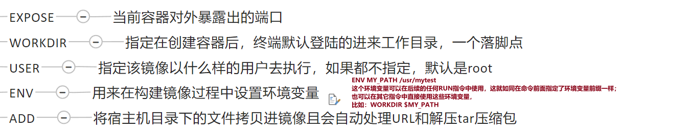
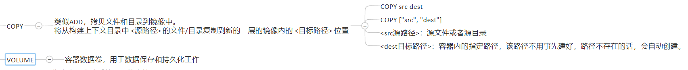

# 03

redis-cli --cluster create 192.168.181.141:6381 192.168.181.141:6382 192.168.181.141:6383 192.168.181.141:6384 192.168.181.141:6385 192.168.181.141:6386 --cluster-replicas 1

## Dockerfile

Dockerfile是用来构建Docker镜像的文本文件，是由一条条构建镜像所需的指令和参数构成的脚本

### 官网
[https://docs.docker.com/engine/reference/builder/](https://docs.docker.com/engine/reference/builder/)

### Dockerfile内容
1、每条保留字指令都必须为大写字母且后面要跟随至少一个参数

2、指令按照从上到下，顺序执行

3、#表示注释

4、每条指令都会创建一个新的镜像层并对镜像进行提交

### 常用保留字指令

### 构建
1、编写Dockerfile文件

2、docker build命令构建镜像

3、docker run依镜像运行容器实例

