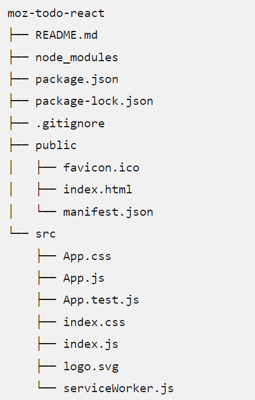

# 入门

react是一个用于构建用户界面的库。

react不是一个框架——它的应用甚至不局限于web开发，可以与其他库一起使用以渲染到特定环境。

为了构建web应用，开发人员将react与ReactDOM结合使用。

React 的主要目标是最大程度地减少开发人员构建 UI 时发生的错误。它通过使用组件——描述部分用户界面的、自包含的逻辑代码段——来实现此目的。

## react如何使用JavaScript？
React 中的许多模式都使用了现代 JavaScript 的功能。React 与 JavaScript 的最大区别在于 JSX 语法的使用上。JSX 是在 JavaScript 语法上的拓展，因此类似于 HTML 的代码可以和 JSX 共存。

例如：
```javascript
const heading = <h1>Mozilla Developer Network</h1>;
```

该heading常量称为JSX表达式，react可以使用它在应用程序渲染`<h1>`标签

```js
const header = (
  <header>
    <h1>Mozilla Developer Network</h1>
  </header>
);
```

浏览器是无法读取直接解析 JSX 的。 header 表达式经过（ Babel 或 Parcel 之类的工具）编译之后是这样的：

```js
const header = React.createElement(
  "header",
  null,
  React.createElement("h1", null, "Mozilla Developer Network"),
);
```

可以跳过编译步骤，并使用 React.createElement() 自己编写 UI。但是，这样做会失去 JSX 的声明性优势，并且代码变得更难以阅读。

## 初始化应用
使用命令行界面（CLI）工具create-react-app，该方法通过安装一些软件包并创建一些软件包来加快开发react应用程序的过程。

要求：

为了使用create-react-app，需要安装Node.js，Node包括npm（Node程序包管理器）和npx（Node程序包运行器）

也可以使用Yarn软件包管理器作为替代方案

### 初始化

`create-react-app`命令接受一个参数：即应用名称。

create-react-app 将为此应用创建一个同名的文件夹，并在其中创建所需文件。

```bash
npx create-react-app moz-todo-react
```

:::info
如果电脑上安装了 yarn 的话，create-react-app 会默认使用 yarn 而非 npm。如果同时安装了 yarn 和 npm，但希望使用 npm 的话，在 create-react-app 的时候需要输入 --use-npm :
```bash
npx create-react-app moz-todo-react --use-npm
```
:::

这句命令创建了一个名为 moz-todo-react 的文件夹，并在此文件夹里做了如下工作：

- 为你的应用程序安装了一些 npm 包；
- 写入 react 应用启动所需要的脚本文件；
- 创建一系列结构化的子文件夹和文件，奠定应用程序的基础架构；
- 如果你的电脑上安装了 git 的话，顺便帮你把 git 仓库也建好。

处理完成之后，可以到moz-todo-react文件夹下，输入`npm start`命令并回车，先前由 create-react-app 创建的脚本会启动一个地服务 localhost:3000，并打开你的默认浏览器来访问这个服务。

### 应用结构


- `src`是react应用源码存放的目录

- `public`包含了开发应用时浏览器会读取的文件，其中最重要的就是index.html。react将目录src中的代码嵌入这个文件，从而浏览器才能运行此文件。

public会在建立并部署此应用的时候更新。

- `package.json`包含了Node.js/npm为了建立该应用程序所管理着的文件信息

## React组件

react中，组件是组成应用程序的可重复利用的模块。组件可大可小，但都只有单一的、明确的功能。

### `<App />`

`src/App.js`，这个文件包含了第一个组件App：
```javascript
import React from "react";
import logo from "./logo.svg";
import "./App.css";

function App() {
  return (
    <div className="App">
      <header className="App-header">
        
        <p>
          Edit <code>src/App.js</code> and save to reload.
        </p>
        <a
          className="App-link"
          href="https://reactjs.org"
          target="_blank"
          rel="noopener noreferrer">
          Learn React
        </a>
      </header>
    </div>
  );
}
export default App;
```

`App.js`主要由三部分组成：顶部的import语句，中间的App组件，以及底部的export语句。大多数react组件都遵循这个模式。

### import语句
`import`语句运行在此脚本中使用其他文件中的代码

```js
import React from "react";
import logo from "./logo.svg";
import "./App.css";
```

第一句引入了react库，这是为了将代码中的JSX语句转为`React.createElement()`，所有的React模块都应该引入React模块，否则会抛错。

第二句引入了`./logo.svg`，以`./`开头，由`.svg`尾——表明是一个本地文件，并且不是JavaScript文件。

（没有指明react模块的路径——表明并非来自本地文件，而是在package.json文件中列为依赖项）

第三行引入了组件所需的CSS文件。与上面两句不同，这里没有将引入的内容赋给任何变量、也没有用到from指令。这种特殊的语法并非原生 JS 的语法 —— 它源自前端资源打包工具 webpack，而 create-react-app 正是基于 webpack 配置而来的。

### App组件

在 import 所需资源之后，定义了一个名为 App 的函数，尽管大部分 JavaScript 社区推崇使用驼峰式命名法，如：“helloWorld”。但 React 组件使用帕斯卡命名法，如“HelloWorld”，来帮助用户辨认一个 JSX 元素是 React 组件而非普通的 HTML 标签。如果将函数名“App”改为“app”，浏览器会显示错误。

```js
function App() {
  return (
    <div className="App">
      <header className="App-header">
        
        <p>
          Edit <code>src/App.js</code> and save to reload.
        </p>
        <a
          className="App-link"
          href="https://reactjs.org"
          target="_blank"
          rel="noopener noreferrer">
          Learn React
        </a>
      </header>
    </div>
  );
}
```
App 方法返回一个 JSX 表达式，这个表达式定义了浏览器最终要渲染的 DOM。

### Export语句
在 App.js 文件的最底部， export default App 语句使得 App 组件能被其他模块使用。

### Interrogating the index

`src/index.js`：这个文件是app 的入口点

```js
import React from "react";
import ReactDOM from "react-dom";
import "./index.css";
import App from "./App";
import * as serviceWorker from "./serviceWorker";

ReactDOM.render(<App />, document.getElementById("root"));

// If you want your app to work offline and load faster, you can change
// unregister() to register() below. Note this comes with some pitfalls.
// Learn more about service workers: https://bit.ly/CRA-PWA
serviceWorker.unregister();
```

src/index.css定义了运用于整个 app 的 global style。

第七行调用 React 的 ReactDOM.render() 函数，并传入两个参数：

- 想要渲染的组件，在这个例子中是` <App />`
- 想要渲染组件所在的 DOM 元素，在这个例子中是带着 root 标签的元素。public/index.html 的代码，可以看到这有一个 `<div>` 元素 在 `<body>` 里。

:::info
在 JSX 中，React 组件和 HTML 元素必须有关闭斜杠（/），如 `<App />`，如果我们写 `<App>` 或者 ` `将会报错。
:::

### Variables and props

下面介绍如何在 JSX 中 使用 variables，并且介绍 props，props 是用来往组件里传入数据的一种方法，传入之后可以用 variable 访问传入的变量。


#### Variables in JSX

```js

```
` `标签的 src 属性值是在大括号中的——{logo}。这是 JSX 识别变量的方式。React 将会识别 {logo}，知道在 app 第二行引入的 logo，然后 React 会读取这个文件它并渲染。

**创建自己的变量**
在 App return 之前，添加 `const subject = 'React';`
```js
function App() {
  const subject = "React";
  return (
    <div className="App">
      <header className="App-header">
        
        <p>Hello, {subject}!</p>
      </header>
    </div>
  );
}
```

#### Component props
**prop** 是任何传入 React 组件的数据。Props 写在组件中，并且像 HTML 属性一样写成 `prop="value"`。


打开 index.js 并且为我们的 `<App/>` 添加第一个 prop

为 `<App/>` 组件添加一个叫 subject 并有着 Clarice 值的 prop。

```js
ReactDOM.render(<App subject="Clarice" />, document.getElementById("root"));
```

改变 App 的函数签名，让它接收 props 作为一个参数。就像其他参数一样，你可以把 props 放在 console.log() 中，让其在浏览器打印出来。

```js
function App(props) {
  const subject = "React";
  console.log(props);
  return (
    // return statement
  );
}
```

输出：
```js
Object { subject: "Clarice" }
```

现在 subject 是 props 之一了，在 App.js 中使用它。用 props.subject 替代原本的 React 字符串。

```js
function App(props) {
  const subject = props.subject;
  return (
    // return statement
  );
}
```

## 总结

在 React 中：

- 组件可以 import 它们需要的模块，并且在文件底部将自身 export，以让其他组件使用。
- 组件是用 PascalCase 也就是帕斯卡命名法命名的。
- 通过把变量放在大括号中，你可以读取 JSX 的变量，如{so}
- 一些 JSX 属性与 HTML 属性不相同，这样就不会与 JavaScript 的保留字相冲突，比如说，在 HTML 中的 class 会在 JSX 中转译为 className。注意这些属性都是驼峰式命名的。
- Props 就像属性一样写在组件里，并且传入组件。
