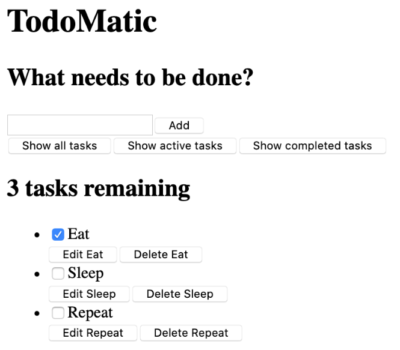

# 入门项目开始

## 清理create-react-app不需要的文件

```bash
# Move into the src directory of your project
cd src
# Delete a few files
rm -- App.test.js App.css logo.svg serviceWorker.js setupTests.js
# Move back up to the root of the project
cd ..
```

## 项目启动代码

使用一个App()函数代替现在的函数，还有一些CSS来改变应用程序的样式。

### JSX

```bash
function App(props) {
  return (
    <div className="todoapp stack-large">
      <h1>TodoMatic</h1>
      <form>
        <h2 className="label-wrapper">
          <label htmlFor="new-todo-input" className="label__lg">
            What needs to be done?
          </label>
        </h2>
        <input
          type="text"
          id="new-todo-input"
          className="input input__lg"
          name="text"
          autoComplete="off"
        />
        <button type="submit" className="btn btn__primary btn__lg">
          Add
        </button>
      </form>
      <div className="filters btn-group stack-exception">
        <button type="button" className="btn toggle-btn" aria-pressed="true">
          <span className="visually-hidden">Show </span>
          <span>all</span>
          <span className="visually-hidden"> tasks</span>
        </button>
        <button type="button" className="btn toggle-btn" aria-pressed="false">
          <span className="visually-hidden">Show </span>
          <span>Active</span>
          <span className="visually-hidden"> tasks</span>
        </button>
        <button type="button" className="btn toggle-btn" aria-pressed="false">
          <span className="visually-hidden">Show </span>
          <span>Completed</span>
          <span className="visually-hidden"> tasks</span>
        </button>
      </div>
      <h2 id="list-heading">3 tasks remaining</h2>
      <ul
        role="list"
        className="todo-list stack-large stack-exception"
        aria-labelledby="list-heading">
        <li className="todo stack-small">
          <div className="c-cb">
            <input id="todo-0" type="checkbox" defaultChecked={true} />
            <label className="todo-label" htmlFor="todo-0">
              Eat
            </label>
          </div>
          <div className="btn-group">
            <button type="button" className="btn">
              Edit <span className="visually-hidden">Eat</span>
            </button>
            <button type="button" className="btn btn__danger">
              Delete <span className="visually-hidden">Eat</span>
            </button>
          </div>
        </li>
        <li className="todo stack-small">
          <div className="c-cb">
            <input id="todo-1" type="checkbox" />
            <label className="todo-label" htmlFor="todo-1">
              Sleep
            </label>
          </div>
          <div className="btn-group">
            <button type="button" className="btn">
              Edit <span className="visually-hidden">Sleep</span>
            </button>
            <button type="button" className="btn btn__danger">
              Delete <span className="visually-hidden">Sleep</span>
            </button>
          </div>
        </li>
        <li className="todo stack-small">
          <div className="c-cb">
            <input id="todo-2" type="checkbox" />
            <label className="todo-label" htmlFor="todo-2">
              Repeat
            </label>
          </div>
          <div className="btn-group">
            <button type="button" className="btn">
              Edit <span className="visually-hidden">Repeat</span>
            </button>
            <button type="button" className="btn btn__danger">
              Delete <span className="visually-hidden">Repeat</span>
            </button>
          </div>
        </li>
      </ul>
    </div>
  );
}
```

把public/index.html，把`<title>`元素的文本更改一下

```html
<title>TodoMatic</title>
```



### 一些属性
```html
<button type="button" className="btn toggle-btn" aria-pressed="true">
  <span className="visually-hidden">Show </span>
  <span>all</span>
  <span className="visually-hidden"> tasks</span>
</button>
```

`aria-pressed`表明，该按钮可以有两种状态。`按压`或`未按压`。可以看作`开`和`关`。设置true意味着该按钮默认是被按下的。


```html
<ul
  role="list"
  className="todo-list stack-large stack-exception"
  aria-labelledby="list-heading"></ul>
```
`role`属性帮助解释一个标签代表哪种元素，默认情况下，`<ul>`被视为一个列表，但下面将要添加样式改变它。

添加`role`将恢复`ul`元素的列表含义。

`aria-labelledby`属性是说，把列表标题当作标签，用来描述它下面的列表的目的。


```html
<input id="todo-0" type="checkbox" defaultChecked="{true}" />
<label className="todo-label" htmlFor="todo-0"> Eat </label>
```
`<input />`标签中的`defaultChecked`属性告诉react最初要检查这个复选框。

`htmlFor`属性对应于HTML中使用的`for`属性。因为 `for` 是一个保留词，不能在 JSX 中使用 `for` 作为属性，所以 React 使用 `htmlFor` 代替。

:::info
要在 JSX 属性中使用布尔值（true 和 false），必须用大括号把它们括起来。如果写 defaultChecked="true"，defaultChecked 的值将是 "true"——一个字符串字面。

在前面的代码片段中使用的 aria-pressed 属性的值是 "true"，因为 aria-pressed 不是像 checked 那样是一个真正的布尔属性。
:::


### 实现样式
将下面的 CSS 代码粘贴到 src/index.css 中，使其取代当前的内容：

```css
/* RESETS */
*,
*::before,
*::after {
  box-sizing: border-box;
}
*:focus {
  outline: 3px dashed #228bec;
  outline-offset: 0;
}
html {
  font: 62.5% / 1.15 sans-serif;
}
h1,
h2 {
  margin-bottom: 0;
}
ul {
  list-style: none;
  padding: 0;
}
button {
  border: none;
  margin: 0;
  padding: 0;
  width: auto;
  overflow: visible;
  background: transparent;
  color: inherit;
  font: inherit;
  line-height: normal;
  -webkit-font-smoothing: inherit;
  -moz-osx-font-smoothing: inherit;
  -webkit-appearance: none;
}
button::-moz-focus-inner {
  border: 0;
}
button,
input,
optgroup,
select,
textarea {
  font-family: inherit;
  font-size: 100%;
  line-height: 1.15;
  margin: 0;
}
button,
input {
  overflow: visible;
}
input[type="text"] {
  border-radius: 0;
}
body {
  width: 100%;
  max-width: 68rem;
  margin: 0 auto;
  font:
    1.6rem/1.25 Arial,
    sans-serif;
  background-color: #f5f5f5;
  color: #4d4d4d;
}
@media screen and (min-width: 620px) {
  body {
    font-size: 1.9rem;
    line-height: 1.31579;
  }
}
/*END RESETS*/
/* GLOBAL STYLES */
.form-group > input[type="text"] {
  display: inline-block;
  margin-top: 0.4rem;
}
.btn {
  padding: 0.8rem 1rem 0.7rem;
  border: 0.2rem solid #4d4d4d;
  cursor: pointer;
  text-transform: capitalize;
}
.btn.toggle-btn {
  border-width: 1px;
  border-color: #d3d3d3;
}
.btn.toggle-btn[aria-pressed="true"] {
  text-decoration: underline;
  border-color: #4d4d4d;
}
.btn__danger {
  color: #fff;
  background-color: #ca3c3c;
  border-color: #bd2130;
}
.btn__filter {
  border-color: lightgrey;
}
.btn__primary {
  color: #fff;
  background-color: #000;
}
.btn-group {
  display: flex;
  justify-content: space-between;
}
.btn-group > * {
  flex: 1 1 49%;
}
.btn-group > * + * {
  margin-left: 0.8rem;
}
.label-wrapper {
  margin: 0;
  flex: 0 0 100%;
  text-align: center;
}
.visually-hidden {
  position: absolute !important;
  height: 1px;
  width: 1px;
  overflow: hidden;
  clip: rect(1px 1px 1px 1px);
  clip: rect(1px, 1px, 1px, 1px);
  white-space: nowrap;
}
[class*="stack"] > * {
  margin-top: 0;
  margin-bottom: 0;
}
.stack-small > * + * {
  margin-top: 1.25rem;
}
.stack-large > * + * {
  margin-top: 2.5rem;
}
@media screen and (min-width: 550px) {
  .stack-small > * + * {
    margin-top: 1.4rem;
  }
  .stack-large > * + * {
    margin-top: 2.8rem;
  }
}
.stack-exception {
  margin-top: 1.2rem;
}
/* END GLOBAL STYLES */
.todoapp {
  background: #fff;
  margin: 2rem 0 4rem 0;
  padding: 1rem;
  position: relative;
  box-shadow:
    0 2px 4px 0 rgba(0, 0, 0, 0.2),
    0 2.5rem 5rem 0 rgba(0, 0, 0, 0.1);
}
@media screen and (min-width: 550px) {
  .todoapp {
    padding: 4rem;
  }
}
.todoapp > * {
  max-width: 50rem;
  margin-left: auto;
  margin-right: auto;
}
.todoapp > form {
  max-width: 100%;
}
.todoapp > h1 {
  display: block;
  max-width: 100%;
  text-align: center;
  margin: 0;
  margin-bottom: 1rem;
}
.label__lg {
  line-height: 1.01567;
  font-weight: 300;
  padding: 0.8rem;
  margin-bottom: 1rem;
  text-align: center;
}
.input__lg {
  padding: 2rem;
  border: 2px solid #000;
}
.input__lg:focus {
  border-color: #4d4d4d;
  box-shadow: inset 0 0 0 2px;
}
[class*="__lg"] {
  display: inline-block;
  width: 100%;
  font-size: 1.9rem;
}
[class*="__lg"]:not(:last-child) {
  margin-bottom: 1rem;
}
@media screen and (min-width: 620px) {
  [class*="__lg"] {
    font-size: 2.4rem;
  }
}
.filters {
  width: 100%;
  margin: unset auto;
}
/* Todo item styles */
.todo {
  display: flex;
  flex-direction: row;
  flex-wrap: wrap;
}
.todo > * {
  flex: 0 0 100%;
}
.todo-text {
  width: 100%;
  min-height: 4.4rem;
  padding: 0.4rem 0.8rem;
  border: 2px solid #565656;
}
.todo-text:focus {
  box-shadow: inset 0 0 0 2px;
}
/* CHECKBOX STYLES */
.c-cb {
  box-sizing: border-box;
  font-family: Arial, sans-serif;
  -webkit-font-smoothing: antialiased;
  font-weight: 400;
  font-size: 1.6rem;
  line-height: 1.25;
  display: block;
  position: relative;
  min-height: 44px;
  padding-left: 40px;
  clear: left;
}
.c-cb > label::before,
.c-cb > input[type="checkbox"] {
  box-sizing: border-box;
  top: -2px;
  left: -2px;
  width: 44px;
  height: 44px;
}
.c-cb > input[type="checkbox"] {
  -webkit-font-smoothing: antialiased;
  cursor: pointer;
  position: absolute;
  z-index: 1;
  margin: 0;
  opacity: 0;
}
.c-cb > label {
  font-size: inherit;
  font-family: inherit;
  line-height: inherit;
  display: inline-block;
  margin-bottom: 0;
  padding: 8px 15px 5px;
  cursor: pointer;
  touch-action: manipulation;
}
.c-cb > label::before {
  content: "";
  position: absolute;
  border: 2px solid currentcolor;
  background: transparent;
}
.c-cb > input[type="checkbox"]:focus + label::before {
  border-width: 4px;
  outline: 3px dashed #228bec;
}
.c-cb > label::after {
  box-sizing: content-box;
  content: "";
  position: absolute;
  top: 11px;
  left: 9px;
  width: 18px;
  height: 7px;
  transform: rotate(-45deg);
  border: solid;
  border-width: 0 0 5px 5px;
  border-top-color: transparent;
  opacity: 0;
  background: transparent;
}
.c-cb > input[type="checkbox"]:checked + label::after {
  opacity: 1;
}
```

## 定义组件

### 编写`<Todo />`
新建一个 component 文件夹，新建了一个叫做 Todo.js 的文件

```bash
mkdir src/components
touch src/components/Todo.js
```

Todo.js中添加：
```js
import React from "react";
```

在Todo组件中添加内容，使用一行代码定义函数并导出它。
```js
export default function Todo() {
  return (
    // …
  );
}
```

将src/App.js的无序列表中复制第一个`<li>`并将其粘贴到Todo.js

```js
export default function Todo() {
  return (
    <li className="todo stack-small">
      <div className="c-cb">
        <input id="todo-0" type="checkbox" defaultChecked={true} />
        <label className="todo-label" htmlFor="todo-0">
          Eat
        </label>
      </div>
      <div className="btn-group">
        <button type="button" className="btn">
          Edit <span className="visually-hidden">Eat</span>
        </button>
        <button type="button" className="btn btn__danger">
          Delete <span className="visually-hidden">Eat</span>
        </button>
      </div>
    </li>
  );
}
```

到目前为止，Todo组件已经完成。

在App.js中，在文件顶部添加以下代码，导入Todo组件：
```js
import Todo from "./components/Todo";
```

导入组件后，可以调用`<Todo />`组件来替换App.js中的所有`<li>`

```js
<ul
  role="list"
  className="todo-list stack-large stack-exception"
  aria-labelledby="list-heading">
  <Todo />
  <Todo />
  <Todo />
</ul>
```


