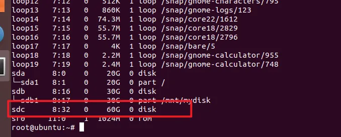

# Linux指令

## Linux系统启动过程

> init程序的类型
> - SysV：init，CentOS 5之前，配置文件：/etc/inittab
> - Upstart：init，CentOS 6，配置文件：/etc/inittab, /etc/init/*.conf
> - Systemd：systemd，CentOS 7，配置文件：/usr/lib/systemd/system、/etc/systemd/system

分为5个阶段：

- 内核的引导
> BIOS开机自检，按照BIOS中设置的启动设备来启动
>
> 操作系统接管硬件以后，读入/boot目录下的内核文件

- 运行 init
> init进程是系统所有进程的起点
>
> init程序首先是需要读取配置文件/etc/inittab

> **运行级别**
> 
>许多程序开机启动，Windows中叫做服务(service)，Linux中叫做守护进程(daemon)
>
>init的一大任务，就是去运行这些开机启动的程序
>
>不同场合需要启动不同的程序，Linux运行为不同的场合，分配不同的开机启动程序，这叫做“运行级别”(runlevel)，也就是说，启动时根据运行级别，确定要运行哪些程序
>

> Linux有7个运行级别：
>
>运行级别0：系统停机状态，系统默认运行级别不能设为0，否则不能正常启动
>
>运行级别1：单用户工作状态，root权限，用于系统维护，禁止远程登录
>
>运行级别2：多用户状态(没有NFS)
>
>运行级别3：完全的多用户状态(有NFS)，登录后进入控制台命令行模式
>
>运行级别4：系统未使用，保留
>
>运行级别5：X11控制台，登录后进入图形GUI模式
>
>运行级别6：系统正常关闭并重启，默认运行级别不能设为6，否则不能正常启动
>


- 系统的初始化

>激活交换分区，检查磁盘，加载硬件模块以及其他一些需要优先执行任务
>
>/etc/rc.d/rc/sysinit
>

- 建立终端

>
>init接下来会打开6个终端，以便用户登录系统
>

- 用户登录系统

>
>- 命令行登录
>
>- ssh登录
>
>- 图形界面登录



### Linux关机

正确流程：sync > shutdown > reboot > hait

```sh
sync 将数据由内存同步到硬盘中。

shutdown 关机指令，你可以man shutdown 来看一下帮助文档。例如你可以运行如下命令关机：

shutdown –h 10 ‘This server will shutdown after 10 mins’ 这个命令告诉大家，计算机将在10分钟后关机，并且会显示在登陆用户的当前屏幕中。

shutdown –h now 立马关机

shutdown –h 20:25 系统会在今天20:25关机

shutdown –h +10 十分钟后关机

shutdown –r now 系统立马重启

shutdown –r +10 系统十分钟后重启

reboot 就是重启，等同于 shutdown –r now

halt 关闭系统，等同于shutdown –h now 和 poweroff
```

## 文件与目录

### ls
列出目录及文件名

```sh
[root@www ~]# ls [-aAdfFhilnrRSt] 目录名称
[root@www ~]# ls [--color={never,auto,always}] 目录名称
[root@www ~]# ls [--full-time] 目录名称
```

### cd 
切换目录

### pwd
显示目前的目录

```sh
[root@www ~]# pwd [-P]
# -P ：显示出确实的路径，而非使用链接 (link) 路径。
```

### mkdir
创建一个新目录
```sh
mkdir [-mp] 目录名称
# -m ：配置文件的权限！直接配置，不需要看默认权限 (umask) 
# -p ：帮助直接将所需要的目录(包含上一级目录)递归创建起来
```

### rmdir
删除一个空目录
```sh
rmdir [-p] 目录名称
# -p：一次空目录
```

### cp
复制文件或目录
```sh
[root@www ~]# cp [-adfilprsu] 来源档(source) 目标档(destination)
[root@www ~]# cp [options] source1 source2 source3 .... directory
# -r：递归持续复制
# -i：若目标已存在，在覆盖时回显询问
# -f：强制
```

### rm
删除文件或目录
```sh
 rm [-fir] 文件或目录
# -r ：递归删除
```

### mv
移动文件与目录，或修改文件与目录的名称
```sh
[root@www ~]# mv [-fiu] source destination
[root@www ~]# mv [options] source1 source2 source3 .... directory
```

### 文件内容查看

#### cat  由第一行开始显示文件内容

#### tac  从最后一行开始显示，可以看出 tac 是 cat 的倒着写

#### nl   显示的时候，顺道输出行号

#### more 一页一页的显示文件内容

#### less 与 more 类似，但是比 more 更好的是，可以往前翻页

#### head 只看头几行
```sh
head [-n number] 文件 
```
默认的情况中，显示前面 10 行


#### tail 只看尾巴几行

```sh
tail [-n number] 文件 
```

## vi/vim


### 命令模式command mode
`i` -- 切换到`输入模式`，在光标当前位置开始输入文本。

`x` -- 删除当前光标所在处的字符。

`:` -- 切换到底线命令模式，以在最底一行输入命令。

`a` -- 进入`插入模式`，在光标下一个位置开始输入文本。

`o：`在当前行的下方插入一个新行，并进入插入模式。

`O` -- 在当前行的上方插入一个新行，并进入插入模式。

`dd` -- **剪切当前行**。

`yy` -- **复制当前行**。

`p（小写）` -- **粘贴剪贴板内容到光标下方**。

`P（大写）`-- **粘贴剪贴板内容到光标上方**。

`u` -- **撤销上一次操作**。

`Ctrl + r` -- 重做上一次撤销的操作。

`:w `-- 保存文件。

`:q `-- 退出 Vim 编辑器。

`:q!` -- 强制退出Vim 编辑器，不保存修改。


### 输入模式insert mode
在命令模式下按下 `i` 就进入了输入模式，使用 `Esc 键`可以返回到普通模式。

`字符按键以及Shift组合`，输入字符

`ENTER，回车键`，换行

`BACK SPACE，退格键`，删除光标前一个字符

`DEL，删除键`，删除光标后一个字符

`方向键`，在文本中移动光标

`HOME/END`，移动光标到行首/行尾

`Page Up/Page Down`，上/下翻页

`Insert`，切换光标为输入/替换模式，光标将变成竖线/下划线

`ESC，退出输入模式`，切换到命令模式

### 命令行模式command-line mode
在命令模式下按下` :（英文冒号）`就进入了底线命令模式。

`:w`：保存文件。

`:q`：退出 Vim 编辑器。

`:wq`：保存文件并退出 Vim 编辑器。

`:q!`：强制退出Vim编辑器，不保存修改。


### 常用

#### 搜索替换
`/word`	向光标之下寻找一个名称为 word 的字符串。

`?word`	向光标之上寻找一个字符串名称为 word 的字符串。

`n`	这个 `n` 是英文按键。代表重复前一个搜寻的动作。

`N`	这个 `N` 是英文按键。与 `n` 刚好相反，为`『反向』进行前一个搜寻动作`。

`:n1,n2s/word1/word2/g`	`n1` 与 `n2` 为数字。在第 `n1` 与 `n2` 行之间寻找 `word1` 这个字符串，并将该字符串取代为 `word2`

`:1,$s/word1/word2/g` 或 `:%s/word1/word2/g`	从`第一行到最后一行`寻找 `word1` 字符串，并将该字符串取代为 `word2`


`:1,$s/word1/word2/gc` 或 `:%s/word1/word2/gc`	从`第一行到最后一行`寻找 `word1` 字符串，并将该字符串取代为 `word2`，且在取代前显示提示字符给用户确认 (confirm) 是否需要取代

#### 环境变更
`:set nu`   显示行号，设定之后，会在每一行的前缀显示该行的行号

`:set nonu`	与 `set nu` 相反，为取消行号


## 磁盘管理命令

### df
检查文件系统的磁盘空间占用情况，可以利用该命令来获取硬盘被占用了多少空间，目前还剩余多少空间等信息

```sh
df [-ahikHTm] [目录或文件名]
```

```sh
# 将系统内所有的文件系统列出来！
[root@www ~]# df
Filesystem      1K-blocks      Used Available Use% Mounted on
/dev/hdc2         9920624   3823112   5585444  41% /
/dev/hdc3         4956316    141376   4559108   4% /home
/dev/hdc1          101086     11126     84741  12% /boot
tmpfs              371332         0    371332   0% /dev/shm
# 将容量结果以易读的容量格式显示出来
[root@www ~]# df -h
Filesystem            Size  Used Avail Use% Mounted on
/dev/hdc2             9.5G  3.7G  5.4G  41% /
/dev/hdc3             4.8G  139M  4.4G   4% /home
/dev/hdc1              99M   11M   83M  12% /boot
tmpfs                 363M     0  363M   0% /dev/shm
# 将 /etc 底下的可用的磁盘容量以易读的容量格式显示
[root@www ~]# df -h /etc
Filesystem            Size  Used Avail Use% Mounted on
/dev/hdc2             9.5G  3.7G  5.4G  41% /
```

### du
是对文件和目录磁盘使用的空间的查看
```sh
du [-ahskm] 文件或目录名称
```

### fdisk

是Linux磁盘分区表操作工具

```sh
fdisk [-l] 装置名称
# -l：输出后面接的装置所有的分区内容。
```

### mkfs
磁盘格式化。磁盘分割完毕后要进行文件系统的格式化
```sh
mkfs [-t 文件系统格式] 装置文件名
# -t：可以接文件系统格式
```

### fsck-磁盘检验
用来检查和维护不一致的文件系统
```sh
fsck [-t 文件系统] [-ACay] 装置名称
```

### 磁盘挂载mount与卸载umount

```sh
mount [-t 文件系统] [-L Label名] [-o 额外选项] [-n]  装置文件名  挂载点

umount [-fn] 装置文件名或挂载点
```


## 参考链接
[https://www.runoob.com/linux/linux-system-boot.html](https://www.runoob.com/linux/linux-system-boot.html)

