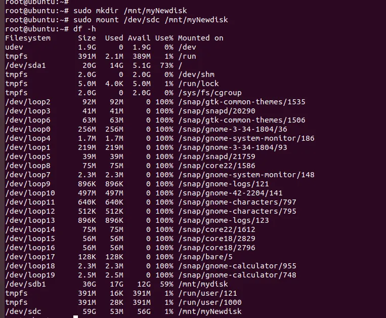

# 虚拟机挂载新添加硬盘

## 步骤

1、查看新添加的硬盘

```
lsblk
```


2、对硬盘分区

```
// 分区硬盘
// 输入 n 创建一个新分区。
// 按回车接受默认的分区编号。
// 按回车接受默认的分区起始和结束。
// 输入 w 保存并退出。
sudo fdisk /dev/sdc
```


3、格式化分区

```
// 格式化分区
sudo mkfs.ext4 /dev/sdc
```


4、挂载

```
// 创建挂载点
sudo mkdir /mnt/myNewdisk
// 挂载硬盘
sudo mount /dev/sdc /mnt/myNewdisk
```

5、验证挂载

```
// 验证挂载
df -h
```


## 设置开机自动挂载

```
// 开机自动挂载（可选）
// 为了让硬盘在每次系统启动时自动挂载，需要将其添加到 /etc/fstab 文件中。首先获取新分区的 UUID
sudo blkid /dev/sdc
// root@ubuntu:~# sudo blkid /dev/sdc
// /dev/sdc: UUID="4cb421cf-1371-4795-a915-c9fb7b265eab" TYPE="ext4"
// 然后编辑 /etc/fstab 文件：
// sudo nano /etc/fstab
在文件末尾添加类似以下内容：
// UUID=xxxxxxxx-xxxx-xxxx-xxxx-xxxxxxxxxxxx /mnt/mydisk ext4 defaults 0 0
// UUID=4cb421cf-1371-4795-a915-c9fb7b265eab /mnt/myNewdisk ext4 defaults 0 0
// 保存并退出。
//UUID=c0a7f7a6-eb3d-4b98-9cdc-39060fd06bbe /mnt/mydisk ext4 defaults 0 0
```