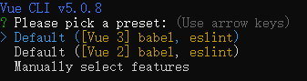
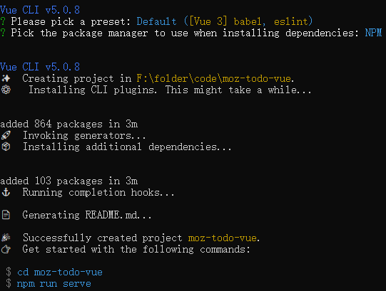

# 入门

Vue是一个现代的JavaScript框架，它为渐进式增强提供了有用的工具。与许多其他框架不同，可以使用Vue来增强现有的HTML。这允许使用Vue作为像jQuery这样库的直接替代品。

也可以使用Vue来编写整个单页应用程序（SPA）。

Vue对客户端路由和状态管理等工具采取“中间立场”方法。虽然Vue核心团队为这些功能维护了建议的库，但它们并没有直接捆绑到Vue中，这允许选择不同的路由/状态管理库。

Vue还提供了编写标记的渐进式方法。像大多数框架一样,Vue运行通过组件创建可重用的标记块。

## 安装

要在现有站点中使用Vue，可以将以下`<script>`元素之一拖放到页面上。这允许你开始在现有站点上使用Vue。

当使用jQuery等库将现有项目迁移到Vue时，这是一个很好的选择。

- 开发脚本
```html
<script src="https://unpkg.com/vue@3/dist/vue.global.js"></script>
```

- 生产脚本
```html
<script src="https://unpkg.com/vue@3/dist/vue.global.prod.js"></script>
```

但上面这种方法有一些局限性。要构建更复杂的应用程序，需要使用Vue npm包。这将允许你使用Vue的高级功能并利用像webpack这样的捆绑器。

为了使使用Vue构建应用程序更容易，有一个CLI来简化开发过程。要使用npm包和CLI，需要安装Node.js 8.11+，npm或yarn

要安装CLI，运行：
```bash
npm install --global @vue/cli
```
或者
```bash
yarn global add @vue/cli
```

安装后，要初始化新项目。可以在要在其中创建项目的目录中打开终端，然后运行`vue create <project-name>`，然后CLI将提供可以使用的项目配置列表

## 初始化

```bash
vue create moz-todo-vue
```

可以通过enter选择默认选项`Default([Vue 3] babel,eslint)`。



然后选择包管理器。



如果在此之后需要使用不同的包管理器，可以在运行`vue create`时传入`--packageManager=<package-manager>`

示例：
```bash
vue create moz-todo-vue --packageManager=npm
```

## 项目结构

- package.json ：此文件包含项目的依赖项列表，以及一些元数据和 eslint 配置。

- yarn.lock ：如果选择 yarn 作为包管理器，则会生成此文件，其中包含项目所需的所有依赖项和子依赖项的列表。

- babel.config.js ：这是 Babel 的配置文件，它将开发代码中使用的现代 JavaScript 功能转换为在生产代码中更跨浏览器兼容的旧语法。

- jsconfig.json ：这是Visual Studio Code的配置文件，为项目结构上的VS Code提供上下文，并协助自动完成。

- public ：此目录包含已发布的静态资产，但在构建过程中不由 Webpack 处理（有一个例外; index.html 得到一些处理）。

- favicon.ico ：这是应用程序的图标。目前，它是 Vue 徽标。

- index.html ：这是应用的模板。

- src ：此目录包含 Vue 应用的核心。

    - main.js ：这是应用程序的入口点。

    - App.vue ：这是 Vue 应用程序中的顶级组件。

    - components ：此目录是保存组件的位置。

    - assets ：此目录用于存储静态资产，如 CSS 和图像。由于这些文件位于源目录中，因此 Webpack 可以处理它们。这意味着可以使用Sass/SCSS或Stylus等预处理器。

### .vue files
与许多前端框架一样，组件是在Vue中构建应用程序的核心部分。这些组件允许将大型应用程序分解为可以单独创建和管理的离散构建基块，并根据需要在彼此之间传输数据。

有些框架鼓励将模块、逻辑和样式代码分成单独的文件，但Vue采取相反的方法，使用单文件组件（SFC），Vue允许将模板、相应的脚本和CSS组合在一个`.vue`里面。

### App.vue
`App.vue`包含三部分：`<template>`、`<style>`和`<style>`，所有单个文件组件共享相同的基本结构。

`<template>`包含组件的所有标记结构和显示逻辑。模板可以包含任何有效的HTML以及一些特定的vue语法。

`<script>`包含组件的所有非显示逻辑。`<script>`标签需要有一个默认的导出JS对象。此对象是本地注册组件、定义组件输入(props)、处理本地状态、定义方法等的地方。

以`App.vue`为例。默认的导出组件的名称设置为组件，App通过将其添加到components属性中来注册HelloWorld组件。

以这种方式注册组件时，将在本地注册它。本地注册的组件只能在注册它们的组件内部使用，因此需要在使用它们的每个组件文件中导入并注册它们。这对于捆绑拆分/树动摇非常有用，因为并非应用中的每个页面都必须需要每个组件。

```js
import HelloWorld from "./components/HelloWorld.vue";

export default {
  name: "App",
  components: {
    //You can register components locally here.
    HelloWorld,
  },
};
```

`<style>` 是为组件编写 CSS 的位置。如果添加一个 scoped 属性 — — `<style scoped>` Vue 会将样式的范围限定在 SFC 的内容上。这类似于 CSS-in-JS 解决方案，但允许您只编写纯 CSS。


