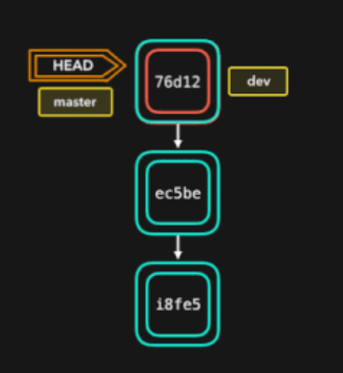

## Git与SVN的区别
git不仅仅是一个版本控制工具，也是个内容管理系统CMS，工作管理系统等。

区别：
1、git分布式，SVN不是。这是git与其他非分布式的版本控制系统，最核心的区别

2、git把内容按元数据方式存储，而SVN是按文件。

3、git分支和SVN的分支不同：分支在SVN中一点都不特别，其实就是版本库中的另外一个目录。

4、Git没有一个全局版本号，而SVN有。

5、Git的内容完整性要优于SVN：Git的内容存储使用的是SHA-1哈希算法。这能确保代码内容的完整性，确保遇到磁盘故障和网络问题时降低对版本库的破坏。


## git配置

git提供了一个叫做git config的工具，专门用来配置或读取相应的工作环境变量。

这些环境变量，决定了git在各个环节的具体工作方式和行为。存放在以下三个不同的地方：

- /etc/gitconfig文件：系统对所有用户都普遍使用的配置。git config时用--system选项，读写这个文件。


- ~/.gitconfig文件：用户目录下的配置文件只适用于该用户。git config时用--global选项，读写这个文件。

- 当前项目的Git目录中的配置文件（也就是工作目录的.git/config文件）：这里的配置仅针对当前项目有效。每一个级别的配置都会覆盖上层的相同配置，所以.git/config里的配置会覆盖/etc/gitconfig中的同名变量

### 用户信息
```bash
git config --global user.name "xx"
git config --global user.email test@xxx.com
```

如果要在某个特定项目中使用其他名字或邮件，只要去掉--global选项重新配置即可

### 文本编辑器

git 默认使用的文本编辑器，一般可能是vi或vim，如果有其他偏好，比如Emacs，可以重新配置：

```bash
git config --global core.editor emacs
```

### 差异分析工具
在解决合并冲突时使用哪种差异分析工具。比如要改用 vimdiff 

```bash
git config --global merge.tool vimdiff
```
Git 可以理解 kdiff3，tkdiff，meld，xxdiff，emerge，vimdiff，gvimdiff，ecmerge，和 opendiff 等合并工具的输出信息。
### 查看配置信息

```bash
git config --list
```

直接查阅某个环境变量的设定，只要把特定的名字跟在后面即可：

```bash
git config user.name
```

## git工作流




## git工作区、暂存区、版本库


`git add`，暂存区的目录树被更新，同时工作区修改的文件内容被写入到对象库中的一个新的对象中，而该对象的ID被记录在暂存区的文件索引中

`git commit`，暂存区的目录树写到版本库中，master分支会做相应的更新。

`git reset HEAD`，暂存区的目录树会被重写，被 master 分支指向的目录树所替换，但是工作区不受影响。

`git rm --cached <file>`，直接从暂存区删除文件，工作区不会做出改变

`git checkout .`，`git checkout -- <file>`，会用暂存区全部或指定的文件替换工作区的文件，这个操作会清除工作区中未添加到暂存区的变动

`git checkout HEAD .`或`git checkout HEAD <file>`，用HEAD指向的master分支中的全部或部分文件替换暂存区和工作区的文件，但不会清除工作区中未提交的改动，也会清除暂存区中未提交的变动

## git创建仓库


