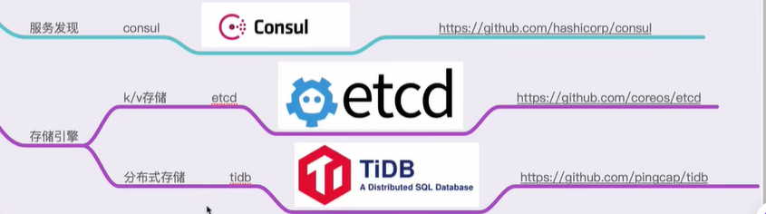

# 一些记录

## (1) go mod命令

| 命令            | 作用                             |
| --------------- | -------------------------------- |
| go mod init     | 生成 go.mod 文件                 |
| go mod download | 下载 go.mod 文件中指明的所有依赖 |
| go mod tidy     | 整理现有的依赖                   |
| go mod graph    | 查看现有的依赖结构               |
| go mod edit     | 编辑 go.mod 文件                 |
| go mod vendor   | 导出项目所有的依赖到vendor目录   |
| go mod verify   | 校验一个模块是否被篡改过         |
| go mod why      | 查看为什么需要依赖某模块         |

## (2) go mod环境变量

可以通过 `go env` 命令来进行查看

```bash
$ go env
GO111MODULE="auto"
GOPROXY="https://proxy.golang.org,direct"
GONOPROXY=""
GOSUMDB="sum.golang.org"
GONOSUMDB=""
GOPRIVATE=""
...
```

```bash
$ go env -w GO111MODULE=on
```

## GOPROXY

这个环境变量主要是用于设置 Go 模块代理（Go module proxy）,其作用是用于使 Go 在后续拉取模块版本时直接通过镜像站点来快速拉取。

GOPROXY 的默认值是：`https://proxy.golang.org,direct`

`proxy.golang.org`国内访问不了,需要设置国内的代理.

-  阿里云
   https://mirrors.aliyun.com/goproxy/ 
-  七牛云
   https://goproxy.cn,direct 

```bash
$ go env -w GOPROXY=https://goproxy.cn,direct
```

```bash
$ go env -w GOPROXY=https://goproxy.cn,https://mirrors.aliyun.com/goproxy/,direct
```

## 后续学习





