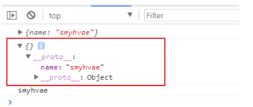

# ES6
ES6 是新的 JS 语法标准。ES6 实际上是一个泛指，泛指 ES 2015 及后续的版本。

现在主流的框架 Vue.js 和 React.js 的默认语法，都是用的 ES6。

ES6 的改进如下：

- ES6 之前的变量提升，会导致程序在运行时有一些不可预测性。而 ES6 中通过 let、const 变量优化了这一点。

- ES6 增加了很多功能，比如：常量、作用域、对象代理、异步处理、类、继承等。这些在 ES5 中想实现，比较复杂，但是 ES6 对它们进行了封装。

- ES6 之前的语法过于松散，实现相同的功能，不同的人可能会写出不同的代码。

ES6 的目标是：让 JS 语言可以编写复杂的大型应用程序，成为企业级开发语言。

## ES5中的严格模式
JS的语法是非常灵活的，比如说，随便写一个变量x，这个变量其实是挂在 windows下面的。这种灵活性在有些情况下，反而是一种缺点，造成了全局污染。因此，ES5还引入了一种严格的运行模式："严格模式"（strict mode）

### 使用
- 针对整个文件：将use strict放在文件的第一行，则整个文件将以严格模式运行。

- 针对单个函数：将use strict放在函数体的第一行，则整个函数以严格模式运行。

### 语法和行为改变
- 必须用var声明变量

- 禁止自定义的函数中的this指向window

- 创建eval作用域

- 对象不能有重名的属性

### 严格模式和普通模式的区别
1、正常模式中，如果一个变量没有声明就赋值，默认是全局变量。严格模式禁止这种写法，全局变量必须显示声明

2、禁止this关键字指向全局对象
```JavaScript
        var foo = function () {
            console.log(this);
        }

        foo();
```
普通模式打印的是window。严格模式下打印的是undefined。

3、 创设eval作用域

4、 禁止使用with语句。因为with语句无法在编译时就确定，属性到底归属哪个对象

5、 构造函数必须通过new实例化对象。
```
        var Cat = function (name) {
            this.name = name;
        }

        Cat('haha');
```
严格模式下报错。

6、 为了让代码更安全，禁止函数内部遍历调用栈

7、 严格模式下无法删除变量

8、 属性相关

普通模式下，对一个对象的只读属性进行赋值，不会报错，只会默默地失败。严格模式下，将报错。

严格模式下，对禁止扩展的对象添加新属性，会报错。

普通模式下，如果对象有多个重名属性，最后赋值的那个属性会覆盖前面的值。严格模式下，这属于语法错误。

普通模式下，如果函数有多个重名的参数，可以用arguments[i]读取。严格模式下，多个重名的参数属于语法错误。

9、函数必须声明在顶层。不允许在非函数的代码块内声明函数

10、新增关键字

为了向将来Javascript的新版本过渡，严格模式新增了一些保留字：implements, interface, let, package, private, protected, public, static, yield。

## ES5中的一些扩展

1、JSON
```javascript
JSON.stringify(obj/arr)
JSON.parse(json)
```

2、Object扩展
**方法一**
```JavaScript
Object.create(prototype, [descriptors])
```
以指定对象为原型，创建新的对象。第二个参数可以为新的对象添加新的属性，并以此属性进行描述。
```javascript
var obj1={username:'smy',age:26}
var obj2={address:'shenzhen'}

obj2=Object.create(obj1)
console.log(obj2)
```


**方法二**

```JavaScript
Object.defineProperties(object, descriptors)
```
为指定对象定义扩展多个属性。

```javascript
    var obj2 = {
        firstName : 'smyh',
        lastName : 'vae'
    };
    Object.defineProperties(obj2, {
        fullName : {
            get : function () {
                return this.firstName + '-' + this.lastName
            },
            set : function (data) {  //监听扩展属性，当扩展属性发生变化的时候自动调用，自动调用后将变化的值作为实参注入到set函数
                var names = data.split('-');
                this.firstName = names[0];
                this.lastName = names[1];
            }
        }
    });
    console.log(obj2.fullName);
    obj2.firstName = 'tim';
    obj2.lastName = 'duncan';
    console.log(obj2.fullName);
    obj2.fullName = 'kobe-bryant';
    console.log(obj2.fullName);
```

3、object的扩展二

obj对象本身就带了两个方法：
```JavaScript
get 属性名(){}用来得到当前属性值的回调函数
set 属性名(){}用来监视当前属性值变化的回调函数
```
```javascript
    var obj = {
        firstName : 'kobe',
        lastName : 'bryant',
        get fullName(){
            return this.firstName + ' ' + this.lastName
        },
        set fullName(data){
            var names = data.split(' ');
            this.firstName = names[0];
            this.lastName = names[1];
        }
    };
    console.log(obj.fullName);
    obj.fullName = 'curry stephen';
    console.log(obj.fullName);
```

4、数组的扩展

以下都是给数组实例使用的。

- 获取value在数组的第一个下标
```javascript
Array.prototype.indexOf(value)
```

- 获取value在数组中的最后一个下标
```JavaScript
Array.prototype.lastIndexOf(value)
```

- 遍历数组
```JavaScript
Array.prototype.forEach(function(item,index){})
```

- 遍历数组返回一个新的数组，返回的是加工之后的新数组
```JavaScript
Array.prototype.map(function(item,index){})
```

- 遍历过滤出一个新的子数组，返回条件为true的值
```JavaScript
Arrya.prototype.filter(function(item,index){})
```

5、函数function的扩展：bind()

改变this的指向，将函数内的this绑定为obj，并将函数返回

```JavaScript
Function.prototype.bind(obj)
```

## ES6：变量let，const和块级作用域

### 变量声明

ES5中使用`var`定义变量

ES6中，新增`let`和`const`来定义变量。

- `let`：定义变量，替代`var`

- `const`：定义常量（定义后，不可修改）

var不具有块级作用域特性

```javascript
{
    var a=1
}

console.log(a)

// 输出：1

```

```JavaScript
var a=1

{
    var a=2
}

console.log(a)

//输出：2
```

var定义的变量容易造成全局污染

`let`具备块级作用域，只在局部起作用

```JavaScript
{
    let a='hello'
}

console.log(a)

// 输出：报错

var a=2
{
    let a=3
}

console.log(a)

// 输出：2
```

`const`定义常量，常量就是值（内存地址）不能变化的量。

```JavaScript
const name='smyhvae'
```

用const声明的常量，只在局部（块级作用域内）起作用；而且，用const声明常量时，必须赋值，否则报错

**let 和 const 的特点**
- 不属于顶层对象 Window

- 不允许重复声明

- 不存在变量提升

- 暂时性死区

- 支持块级作用域

相反， 用var声明的变量：存在变量提升、可以重复声明、没有块级作用域。

**var/let/const 的共同点**
- 全局作用域中定义的变量，可以在函数中使用。

- 函数中声明的变量，只能在函数及其子函数中使用，外部无法使用。

### 暂时性死区DTC

ES6规定：使用let/const声明的变量，会使区块形成封闭的作用域。若在声明之前使用变量，就会报错。

也就是说，在使用let/const声明变量时，编写需要先声明，在使用。这在语法上，称为“暂时性死区”（temporal dead zone，简称TDZ）

DTC其实是一种保护机制，可以让我们养成良好的编程习惯。

### ES5定义常量
`Object.defineProperty`

```JavaScript
// 定义常量PI
Object.defineProperty(window,'PI',{
    value:3.14,
    writable:false
})

console.log(PI)//3.14

PI=6
console.log(PI)//打印结果：3.14，说明修改失败
```

## ES6变量的解构赋值

**解构赋值**

ES6运行按照一一对应的方式，从数组或者对象中提取值，再将提取出来的值赋值给变量

**解构**

分解数据结构

**赋值**

给变量赋值

解构赋值在实际开发中的可以大量减少代码量，并让程序结构更清晰

### 数组解构赋值

ES6之前
```JavaScript
var a=1
var b=2
var c=3
// 或
var a=arr[0]
var b=arr[1]
var c=arr[2]
```

ES6之后
```JavaScript
let [a,b,c]=[1,2,3]

// 未匹配到的情况
// 如果左边多余右边，未匹配的赋值未undefined
// 解构时，左边允许有默认值

let [fool=true]=[]
console.log(foo)//true

let [a,b]=['xx']
console.log(a,b)//xx,undefined

let [a,b='aa']=['xx']
//a:xx,b:aa

let [a,b='aa']=['xx',undefined]
//a:xx,b:undefined

let [a,b='aa']=['xx',null]
//a:xx,b:null
```

undefined：相当于什么都没有

null：相当于有值，但值为null


### 对象的解构赋值
将对象中的值按照属性匹配的方式提取出来，然后赋值给变量。

es6之前
```javascript
var name = json.name;

var age = json.age;

var sex = json.sex;
```

ES6

```JavaScript
const person = { name: 'qianguyihao', age: 28, sex: '男' };
let { name, age, sex } = person; // 对象的结构赋值

console.log(name); // 打印结果：qianguyihao
console.log(age); // 打印结果：28
console.log(sex); // 打印结果：男
```

如果变量在一一对应时，没有找到对应的值，那么，多余的变量会被赋值为 undefined。

**给左边的变量自定义命名**

```JavaScript
const person = { name: 'qianguyihao', age: 28 };
let { name: myName, age: myAge } = person; // 对象的结构赋值

console.log(myName); // 打印结果：qianguyihao
console.log(myAge); // 打印结果：28

console.log(name); // 打印报错：Uncaught ReferenceError: name is not defined
console.log(age); // 打印报错：Uncaught ReferenceError: age is not defined
```

**圆括号的使用**

如果变量 foo 在解构之前就已经定义了，此时再去解构，就会出现问题。

```JavaScript
	let foo = 'haha';
	{ foo } = { foo: 'smyhvae' };
	console.log(foo);
    // 报错


// 要解决报错，只要在解构的语句外边，加一个圆括号即可：
let foo = 'haha';
({ foo } = { foo: 'smyhvae' });
console.log(foo); //输出结果：smyhvae
```

### 字符串结构

```JavaScript
const [a, b, c, d] = 'hello';
console.log(a);
console.log(b);
console.log(c);

console.log(typeof a); //输出结果：string

// h
// e
// l
// string
```

## 箭头函数

语法：

```JavaScript
(参数1, 参数2 ...) => { 函数体 }
```

- 如果有且仅有 1 个形参，则()可以省略

- 如果函数体内有且仅有 1 条语句，则{}可以省略，但前提是，这条语句必须是 return 语句。

定义和调用函数：（ES6 中的写法）

```JavaScript
const fn2 = (a, b) => {
    console.log('haha');
    return a + b;
};

console.log(fn2(1, 2)); //输出结果：3
```

在箭头函数中，如果方法体内只有一句话，且这句话是 return 语句，那就可以把 {}省略。写法如下:
```javascript
const fn2 = (a, b) => a + b;

console.log(fn2(1, 2)); //输出结果：3
```

### 箭头函数的this的指向

ES6 之前的普通函数中：this 指向的是函数被调用的对象（也就是说，谁调用了函数，this 就指向谁）。

而 ES6 的箭头函数中：箭头函数本身不绑定 this，this 指向的是箭头函数定义位置的 this（也就是说，箭头函数在哪个位置定义的，this 就跟这个位置的 this 指向相同）。

```JavaScript
const obj = { name: '千古壹号' };

function fn1() {
    console.log(this); // 第一个 this
    return () => {
        console.log(this); // 第二个 this
    };
}

const fn2 = fn1.call(obj);
fn2();

// obj
// obj
```

上面的代码中，箭头函数是在 fn1()函数里面定义的，所以第二个 this 跟 第一个 this 指向的是同一个位置。又因为，在执行 fn1.call(obj)之后，第一个 this 就指向了 obj，所以第二个 this 也是指向 了 obj。

```JavaScript
var name = '许嵩';
var obj = {
    name: '千古壹号',
    sayHello: () => {
        console.log(this.name);
    },
};

obj.sayHello();

// 许嵩
// 因为 obj 这个对象并不产生作用域， sayHello() 这个箭头函数实际仍然是定义在 window 当中的，所以 这里的 this 指向是 window。


```
### 参数默认值

传统：
```JavaScript
function fn(param) {
    let p = param || 'hello';
    console.log(p);
}
```
函数体内的写法是：如果 param 不存在，就用 hello字符串做兜底。

ES6：
```JavaScript
function fn(param = 'hello') {
    console.log(param);
}
```

```JavaScript
let x = 'smyh';
function fn(x, y = x) {
    console.log(x, y);
}
fn('vae');
// vae
// vae
```

```JavaScript
let x = 'smyh';
function fn(z, y = x) {
    console.log(z, y);
}
fn('vae');
// vae
// smyh
```

## 剩余参数和扩展运算符

### 剩余参数
剩余参数允许将不确定数量的剩余的元素放到一个数组中。

传统写法：

定义方法中，参数要确定个数

```JavaScript
function fn(a,b,c){
    console.log(a)
    console.log(b)
    console.log(c)
    console.log(d)
}
fn(1,2,3)
// 报错
```

ES6写法：
```JavaScript
const fn=(...args)=>{
    console.log(args[0])
    console.log(args[1])
    console.log(args[2])
    console.log(args[3])
}
fn(1,2)
// 1
// 2
// undefined
// undefined
```

args之后不能再加别的参数，否则编译报错。

但可以在前面加：
```JavaScript
function fn(first,...args){
    console.log(first)
    console.log(args)
}
fn(10,20,30)
// 10 [20,30]
```

示例：参数求和
```javascript
const sum=(...args)=>{
    let total=0
    args.forEach(item=>total+=item)
    return total
}
console.log(sum(10,20,30))
// 60
```

示例：解构赋值
```javascript
const students = ['张三', '李四', '王五'];
let [s1, ...s2] = students;

console.log(s1); // '张三'
console.log(s2); // ['李四', '王五']
```

### 扩展运算符（展开语法）
剩余参数是将剩余的元素放到一个数组中；而扩展运算符是将数组或者对象拆分成逗号分隔的参数序列。

```JavaScript
const arr = [10, 20, 30];
...arr // 10, 20, 30      注意，这一行是伪代码，这里用到了扩展运算符
console.log(...arr); // 10 20 30

console.log(10, 20, 30); // 10 20 30
```

#### 数组赋值

```javascript
let arr1 = ['www', 'smyhvae', 'com'];
let arr2 = arr1; // 将 arr1 赋值给 arr2，其实是让 arr2 指向 arr1 的内存地址
console.log('arr1:' + arr1);
console.log('arr2:' + arr2);
console.log('---------------------');

arr2.push('xx'); //往 arr2 里添加一部分内容
console.log('arr1:' + arr1);
console.log('arr2:' + arr2);
// arr1:www,smyhvae,com
// arr2:www,smyhvae,com
// arr1:www,smyhvae,com,xx
// arr2:www,smyhvae,com,xx
```
let arr2 = arr1;其实是让 arr2 指向 arr1 的地址。也就是说，二者指向的是同一个内存地址。

如果不想让 arr1 和 arr2 指向同一个内存地址，可以借助扩展运算符来做：

```JavaScript
let arr1 = ['www', 'smyhvae', 'com'];
let arr2 = [...arr1]; //【重要代码】arr2 会重新开辟内存地址
console.log('arr1:' + arr1);
console.log('arr2:' + arr2);
console.log('---------------------');

arr2.push('你懂得'); //往arr2 里添加一部分内容
console.log('arr1:' + arr1);
console.log('arr2:' + arr2);
// arr1:www,smyhvae,com
// arr2:www,smyhvae,com
// arr1:www,smyhvae,com
// arr2:www,smyhvae,com,xx
```

#### 合并数组
```JavaScript
let arr1 = ['王一', '王二', '王三'];
let arr2 = ['王四', '王五', '王六'];
// ...arr1  // '王一','王二','王三'
// ...arr2  // '王四','王五','王六'

// 方法1
let arr3 = [...arr1, ...arr2];
console.log(arr3); // ["王一", "王二", "王三", "王四", "王五", "王六"]

// 方法2
arr1.push(...arr2);
console.log(arr1); // ["王一", "王二", "王三", "王四", "王五", "王六"]
```


#### 将伪数组或者可遍历对象转换为真正的数组
```JavaScript
const myDivs = document.getElementsByClassName('div');
const divArr = [...myDivs]; // 利用扩展运算符，将伪数组转为真正的数组
```

**另外一种方式，将伪数组转换为真正的数组**
```JavaScript
let arr2=Array.from(arrayLike)
```

## 字符串、数组、对象扩展

### 字符串
- includes(str)：判断是否包含指定的字符串

- startsWith(str)：判断是否以指定字符串开头

- endsWith(str)：判断是否以指定字符串结尾

- repeat(count)：重复指定次数

### Number
二进制与八进制数值表示法: 二进制用`0b`, 八进制用`0o`。

```JavaScript
console.log(0b1010); //10
console.log(0o56); //46
```

- Number.isFinite(i)：判断是否为有限大的数。比如Infinity这种无穷大的数，返回的就是 false。

- Number.isNaN(i)：判断是否为 NaN。

- Number.isInteger(i)：判断是否为整数。

- Number.parseInt(str)：将字符串转换为对应的数值。

- Math.trunc(i)：去除小数部分。

### 数组

- Array.from()

- find()

- findIndex()

### 对象

- Object.is(v1,v2)：判断两个数据是否完全相等，底层是通过字符串来判断的

```JavaScript
console.log(0 == -0);
console.log(NaN == NaN);
// true
// false
```
NaN和任何值都不相等

```JavaScript
console.log(Object.is(0, -0));
console.log(Object.is(NaN, NaN));
// false
// true
```

- Object.assign()：浅拷贝

-`__proto__`属性
```JavaScript
let obj1 = { name: 'smyhvae' };
let obj2 = {};

obj2.__proto__ = obj1;

console.log(obj1);
console.log(obj2);
console.log(obj2.name);
```


## Set数据结构

ES6 提供了 新的数据结构 Set。Set 类似于数组，但成员的值都是唯一的，没有重复的值。

Set 本身就是一个构造函数，可通过 new Set() 生成一个 Set 的实例。

```JavaScript
const set1 = new Set();
console.log(set1.size); // 打印结果：0
```

可以接收一个数组作为参数，实现数组去重：
```JavaScript
const set2 = new Set(['张三', '李四', '王五', '张三']); // 注意，这个数组里有重复的值

// 注意，这里的 set2 并不是数组，而是一个单纯的 Set 数据结构
console.log(set2); // {"张三", "李四", "王五"}

// 通过扩展运算符，拿到 set 中的元素（用逗号分隔的序列）
// ...set2 //  "张三", "李四", "王五"

// 注意，到这一步，才获取到了真正的数组
console.log([...set2]); // ["张三", "李四", "王五"]
```
