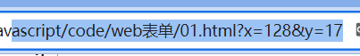
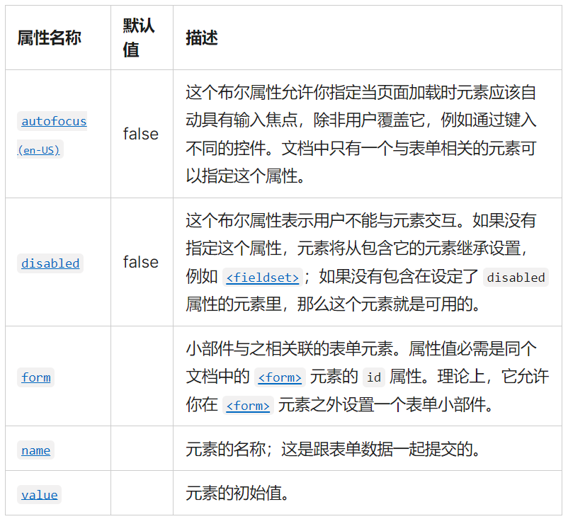
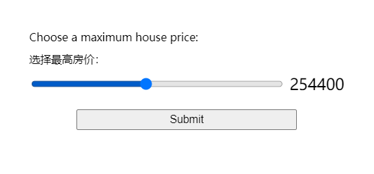
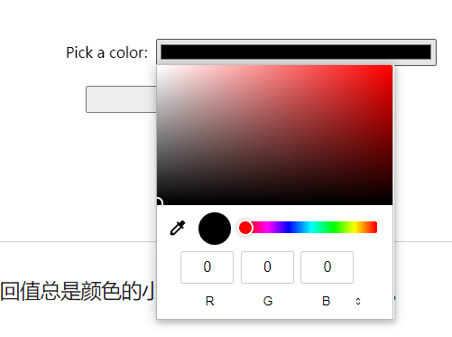

# web表单

## 第一个表单
```html
    <form action="/my-handling-form-page" method="post">
        <ul>
            <li>
                <label for="name">Name:</label>
                <input type="text" id="name" name="user_name" />
            </li>
            <li>
                <label for="mail">E-mail:</label>
                <input type="email" id="mail" name="user_email" />
            </li>
            <li>
                <label for="msg">Message:</label>
                <textarea id="msg" name="user_message"></textarea>
            </li>
            <li class="button">
                <button type="submit">Send your message</button>
            </li>
        </ul>
    </form>
```

其中`<label>`标签使用for属性，是将标签链接到表单控件的一种正规方式。这个属性引用对应的表单控件的id。

`<input>`的默认值使用value属性。
```html
<input type="text" value="by default element is filled with this text"/>
```
`<textarea>`默认值是在元素开始和结束标记之间放置默认值。
```html
<textarea>
by default this element is filled with this text
</textarea>
```

## 表单的元素

### `<from>`元素

`<form>` 元素按照一定的格式定义了表单和确定表单行为的属性。当想要创建一个 HTML 表单时，都必须从这个元素开始，然后把所有内容都放在里面。

### `<fieldset>` 和 `<legend>` 元素

`<fieldset>`元素是一种方便的用于创建具有相同目的的小部件组的方式，出于样式和语义目的

可以在`<fieldset>`开口标签后加上一个 `<legend>`元素来给`<fieldset>` 标上标签。

 `<legend>`的文本内容正式地描述了`<fieldset>`里所含有部件的用途。

示例：
```html
<form>
  <fieldset>
    <legend>Fruit juice size</legend>
    <p>
      <input type="radio" name="size" id="size_1" value="small" />
      <label for="size_1">Small</label>
    </p>
    <p>
      <input type="radio" name="size" id="size_2" value="medium" />
      <label for="size_2">Medium</label>
    </p>
    <p>
      <input type="radio" name="size" id="size_3" value="large" />
      <label for="size_3">Large</label>
    </p>
  </fieldset>
</form>
```

效果图：


当有一组单选按钮时，应该将它们嵌套在`<fieldset>`元素中。

还有其他用例，一般来说，`<fieldset>`元素也可以用来对表单进行分段。

### `<label>`元素

`<label>` 元素是为 HTML 表单小部件定义标签的正式方法。
```html
<label for="name">Name:</label> <input type="text" id="name" name="user_name" />
```
`<label>` 标签与 `<input>` 通过他们各自的for 属性和 id 属性正确相关联（label 的 for 属性和它对应的小部件的 id 属性）

**标签也可点击**
正确设置标签的另一个好处是可以在所有浏览器中单击标签来激活相应的小部件。

**多个标签**
在多个标签的情况下，应该将一个小部件和它的标签嵌套在一个`<label>`元素中。

```html
<p>Required fields are followed by <abbr title="required">*</abbr>.</p>

<!--这样写：-->
<div>
  <label for="username">Name:</label>
  <input type="text" name="username" />
  <label for="username"><abbr title="required">*</abbr></label>
</div>

<!--但是这样写会更好：-->
<div>
  <label for="username">
    <span>Name:</span>
    <input id="username" type="text" name="username" />
    <abbr title="required">*</abbr>
  </label>
</div>

<!--但最好的可能是这样：-->
<div>
  <label for="username">Name: <abbr title="required">*</abbr></label>
  <input id="username" type="text" name="username" />
</div>
```

### 用于表单的通用HTML结构

用`<div>`元素包装标签和它的小部件是很常见的做法。

`<p>`元素也经常被使用，HTML列表也是如此

除了`<fieldset>`元素之外，使用HTML标题如`<h1>`,`<h2>`和分段如`<section>`来构造一个复杂的表单也是一种常见的做法

## 原生表单部件

### 文本输入框
通用规范：

- 可以被标记为readonly（用户不能修改输入值）、disabled（输入中永远不会与表单数据的其余部分一起发送）

- 可以有一个 placeholder；这是文本输入框中出现的文本，用来简略描述输入框的目的。

- 可以使用 size （框的物理尺寸）和 maxlength（可以输入的最大字符数）进行限制。

- 如果浏览器支持，可以拼写检查（spellcheck属性）


可以通过设置`type`属性，来接收多种类型的数据。

- 设置为`text`。单行文本框。不设置type或设置成浏览器中位置的值，也会回落到text。如果输入带有换行符的文本，浏览器会在发送数据之前删除这些换行符。

- 设置为`password`。密码框。会模糊输入到字段中的值（例如，用点或星号）。

- 设置为`hidden`。隐藏内容。用于创建对用户不可见的表单部件，但在发送表单时，会与其他的表单数据一起被发送到服务器。

- 设置为`checkbox`。复选框。相关的复选框元素应该使用具有相同值的name属性。包含checked属性使复选框在页面加载时自动被选中。点击复选框或其相关联的标签也将自动翻转复选框的状态（选中、取消选中）。

```html
<fieldset>
  <legend>Choose all the vegetables you like to eat</legend>
  <ul>
    <li>
      <label for="carrots">Carrots</label>
      <input
        type="checkbox"
        id="carrots"
        name="vegetable"
        value="carrots"
        checked />
    </li>
    <li>
      <label for="peas">Peas</label>
      <input type="checkbox" id="peas" name="vegetable" value="peas" />
    </li>
    <li>
      <label for="cabbage">Cabbage</label>
      <input type="checkbox" id="cabbage" name="vegetable" value="cabbage" />
    </li>
  </ul>
</fieldset>
```

- 设置为`radio`。单选按钮。几个单选按钮可以连接在一起。如果它们的 name 属性共享相同的值，那么它们将被认为属于同一组的按钮。同一组中只有一个按钮可以同时被选；这意味着当其中一个被选中时，所有其他的都将自动未选中。如果没有选中任何一个，那么整个单选按钮池就被认为处于未知状态，并且没有以表单的形式发送任何值。

### 按钮

HTML表单中，有三种按钮：

- Submit。将表单数据发送到服务器。对于 `<button>` 元素，省略 type 属性（或是一个无效的 type 值）的结果就是一个提交按钮。

```html
<button type="submit">This is a <strong>submit button</strong></button>

<input type="submit" value="This is a submit button" />
```

- Reset。将所有表单小部件重新设置为它们的默认值。

```html
<button type="reset">This is a <strong>reset button</strong></button>

<input type="reset" value="This is a reset button" />
```

- Anonymous。没有自动生效的按钮，但是可以使用 JavaScript 代码进行定制。

```html
<button type="button">This is an <strong>anonymous button</strong></button>

<input type="button" value="This is an anonymous button" />
```

### 图像按钮

渲染的方式与 `` 几乎完全相同。只是在用户点击它时，图像按钮的行为与提交（submit）按钮相同。

图像按钮是使用 type 属性值设置为 image 的 `<input>` 元素创建的。这个元素支持与 `` 元素相同的属性，和其他表单按钮支持的所有属性。

```html
<input type="image" alt="Click me!" src="my-img.png" width="80" height="30" />
```

如果使用图像按钮来提交表单，不会提交它的值；而是提交在图像上单击处的 X 和 Y 坐标（坐标是相对于图像的，这意味着图像的左上角表示坐标 (0, 0)），坐标被发送为两个键/值对：

- X 值键是 name 属性的值，后面是字符串“.x”。

- Y 值键是 name 属性的值，后面是字符串“.y”。

```html
    <form method="get">
        <input type="image" alt="Click me!" src="../images/pic2.jpg" width="80" height="30" />
    </form>
```



### 文件选择器
可以将`<input>`元素的type属性设置为file。

被接受的文件类型可以使用accept属性来约束。

如果想让用户选择多个文件，可以通过添加multiple属性来实现。

```html
<input type="file" name="file" id="file" accept="image/*" multiple />
```

在一些移动终端上，文件选择器可以访问由设备相机和麦克风直接获取的图片、视频、音频。只需要设置accept属性即可。

```html
<input type="file" accept="image/*;capture=camera" />
<input type="file" accept="video/*;capture=camcorder" />
<input type="file" accept="audio/*;capture=microphone" />
```

### 通用属性


## HTML5的输入类型
### E-mail 地址字段
将 type 属性设置为 email 就可以使用这种控件
```html
<input type="email" id="email" name="email" />
```

当使用了这种 type 类型时，用户需要输入一个合法的电子邮件地址，任何其他输入都会使得浏览器在表单提交时显示错误信息。

可以搭配使用 multiple (en-US) 属性，以允许在同一个 email 输入框中输入多个电子邮件地址，以英文逗号分隔

```html
<input type="email" id="email" name="email" multiple />
```

### 客户端验证

email 与其他较新的 input 类型一样，提供了内置的客户端错误验证，在数据被发送到服务器之前由浏览器执行。它是引导用户准确填写表格的一个有用的辅助工具，可以节省时间：可以立即知道数据是否正确，而不需要等待服务器返回结果。

注意，在默认限制条件下，a@b 也是一个合法的电子邮件地址，因为 email input 类型默认也允许内部网络的电子邮件地址。

为了实现不同的验证行为，可以使用 pattern 属性，而且可以自定义错误信息

### 查询字段
查询字段（Search fields）旨在用于在页面和应用程序上创建搜索框。将 type 属性设置为 search 就可以使用这种控件

```html
<input type="search" id="search" name="search" />
```

text 字段和 search 字段的主要区别是浏览器赋予它们的外观显示。

search 字段的值可以自动地保存下来，在同一网站的自动完成框中复用输入，这样的特性倾向于在大多数现代浏览器中自动进行。

### 电话号码字段
在 type 属性中使用 tel 值，即可创建一个专门用于输入电话号码的文本域

```html
<input type="tel" id="tel" name="tel" />
```

### URL 字段
在 type 属性值中使用 url，即可创建一个用于输入网址的文本字段

```html
<input type="url" id="url" name="url" />
```

它为字段添加了特殊的验证约束。浏览器会在没有协议（例如 http:）输入或网址格式不对的情况下报告错误。

### 数字字段

用于输入数字的控件可以由 type 为 number 的 `<input>` 元素创建。这个控件外观与文本域类似，但只允许浮点数输入，并通常以旋转器（spinner）的形式提供按钮来增加和减少控件的值。

使用 number input 类型，可以使用 min 和 max 属性控制允许输入的最小值和最大值。


也可以使用 step 属性来设定每次按下 spinner 按钮增加或减少的值。默认情况下，number input 类型只允许整数值输入，为了允许浮点数输入，要指定 `step="any"`。如果省略了此值，step 会默认为 1，意味着只有自然数是有效的输入。

```html
<input type="number" name="age" id="age" min="1" max="10" step="2" />
<input type="number" name="change" id="pennies" min="0" max="1" step="0.01" />
```

### 滑块控件

另外一种选择数字的方式是使用滑块（slider）。



从使用上来说，滑块的准确性不如文本字段。因此，它们被用来挑选精确值不一定那么重要的数字。

在 `<input>` 元素中使用 `range` 作为属性 type 的值，就可以创建一个滑块，滑块可以通过鼠标、触摸，或用键盘的方向键移动。

正确配置滑块组件非常重要。推荐分别配置 `min` 、`max`  和 `step`  属性来设置滑块的最小值、最大值和增量值。

```html
<label for="price">Choose a maximum house price: </label>
<input
  type="range"
  name="price"
  id="price"
  min="50000"
  max="500000"
  step="100"
  value="250000" />
<output class="price-output" for="price"></output>
```

使用滑块的一个问题是，它们不提供任何种类的视觉反馈来说明当前的值是什么。这是我们附加了一个包含当前值输出的 `<output>` 元素的原因。你可以在任何元素内显示一个输入值或一个计算的输出值，但是 `<output>` 是特殊的，就像 `<label>` 那样，它可以指定 for 属性，允许你将它与输出值来自的一个或多个元素联系起来。

要真正显示当前值，并在其变化时更新，必须使用 JavaScript:
```js
const price = document.querySelector("#price");
const output = document.querySelector(".price-output");

output.textContent = price.value;

price.addEventListener("input", () => {
  output.textContent = price.value;
});
```

### 日期和时间选择器

日期和时间控件可由 `<input>` 元素和一个合适的 type 属性值来创建，该值取决于要收集的类型（日期、时间、还是以上全部）。

在浏览器不支持的情况下会自动回退为 `<select>` 元素

**datetime-local**
`<input type="datetime-local">` 创建了显示和选择一个没有特定时区信息的日期和时间的控件。
```html
<input type="datetime-local" name="datetime" id="datetime" />
```

**month**
`<input type="month">` 创建了显示和选择带有年份信息的某个月的控件。
```html
<input type="month" name="month" id="month" />
```

**time**
`<input type="time">` 创建了显示和选择时间的控件。时间可能会以 12 小时制显示，但一定会以 24 小时制形式返回。
```html
<input type="time" name="time" id="time" />
```

**week**
`<input type="week">` 创建了显示和选择一年中特定编号周的控件。

一周以周一开始，一直运行到周日结束。另外，每年的第一周总会包含那一年首个星期四，其中可能不包括当年的第一天，也可能包括前一年的最后几天。
```html
<input type="week" name="week" id="week" />
```

**限制日期/时间值**
所有的日期和时间控件总可以由 min  和 max 属性控制，可由 step 属性进一步做控制，具体值随着 input 类型的不同而产生变化。
```html
<label for="myDate">When are you available this summer?</label>
<input
  type="date"
  name="myDate"
  min="2013-06-01"
  max="2013-08-31"
  step="7"
  id="myDate" />
```


### 颜色选择器控件

用于输入颜色的控件可以由 type 为 color 的 `<input>` 元素创建

```html
<input type="color" name="color" id="color" />
```
在支持的情况下，点击一个颜色控件将倾向于显示操作系统的默认颜色选择功能，以便真正做出选择。



## 其他表单控件
### 多行文本域

多行文本域使用 `<textarea>` 元素指定，而不是使用 `<input>` 元素。

```html
<textarea cols="30" rows="8"></textarea>
```

`<textarea>` 元素和普通的单行文本域的主要区别是，用户可以在要提交的数据中包含硬换行（如按下回车键产生）。

**控制多行渲染**
`<textarea>` 接受三种属性来控制其多行渲染行为：

- cols
指定文本控件的可见宽度（列），单位为字符的宽度。这实际上是起始宽度，因为它可以通过调整 `<textarea> `的大小来改变，也可以用 CSS 重写。如果没有指定，默认值是 20。

- rows
指定文本控件的可见行数。这实际上是起始高度，因为它可以通过调整 `<textarea> `的大小来改变，也可以用 CSS 重写。如果没有指定，默认值是 2。

- wrap
指定如何控制文本换行。取值可能为 soft（默认值），意味着提交的文字没有换行，而浏览器中渲染的文字有换行；hard（使用此属性必须指定 cols 的值），意味着提交的文字和浏览器中渲染的文字都有换行；和 off，停止任何换行行为。

**控制文本域可缩放性**
`<textarea>` 的缩放能力由 CSS resize 属性控制，其可能的值如下：

- both：默认值——允许横向和纵向缩放行为。
- horizontal：只允许横向水平缩放行为。
- vertical：只允许纵向竖直缩放行为。
- none：不允许缩放行为。
- block 和 inline：实验性的值，仅允许以 block 或 inline 方向缩放，如何变化取决于文字的方向，请参阅处理不同文字方向以了解更多内容。

### 下拉控件

下拉菜单是一种简单地让用户从许多不同选项中进行选择的控件，不占用用户界面太多空间。HTML 有两种下拉内容：一种是选择框、另外一种是自动补全框。这两种情况下的交互是相同的——一旦被激活，浏览器就会显示可供用户选择的值的列表。


