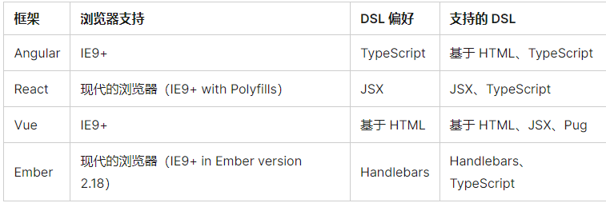

# 客户端框架介绍
现代 JavaScript 框架的到来加快了打造高度动态化和交互性强的应用程序的速度。框架就是提供该如何构建应用程序的意见的库。这些意见能使应用具有可预测性和同质性。可预测性让软件能在扩展到很大规模的同时仍保持可维护性。可预测性和可维护性对于一个软件的长久健康运行是十分重要的。

## 框架

目前公认的“四大框架”

- Ember

2011年12月发布。

- Angular

是个开源web应用程序框架，正式发布于2016年9月14日。

是一种基于组件的框架，使用声明式的HTML模板。在应用构建时，框架的编译器将 HTML 模板转换为优化好的 JavaScript 指令，这一过程对开发者是透明的。Angular 使用 TypeScript，它是 JavaScript 的超集。

- Vue

在学习了 AngularJS 的源码之后，Evan You（尤雨溪）在 2014 年第一次发布 Vue。

Vue，就像 AngularJS，用它自己的代码拓展了 HTML。除此之外，它还主要依赖于现代的、标准化的 JavaScript。

- React

Facebook 在 2013 年发布了 React。在当时 React 已经被用于 Facebook 内部用来解决许多问题。严格来说 React 本身并不是框架，而是一个用来渲染用户界面组件的库。

因为 React 和 ReactDOM 被经常放在一起使用，通俗地讲，React 可以被理解为是一个 JavaScript 框架。

React 用类似 HTML 的语法的 JSX 拓展了 JavaScript。

## 框架的好处

JavaScript 框架都提供了一种更具以声明性的方式地编写用户界面的方法。也就是说，它们允许你编写描述用户界面的代码，然后框架将你编写的描述用户界面的代码通过在幕后的 DOM 显现出来。

- 工具

由于此模块中的每个框架都有一个庞大而活跃的社区，因此每个框架的体系都提供了工具来改善开发体验。这些工具让诸如添加测试（确保你的应用表现应有的行为）和 linting（确保你的代码没有错误且排版统一）变得更加容易。

- 组件化

大多数框架都鼓励开发者将其用户界面的不同部分抽象为组件（components）——可维护、可重用且可以相互通信的代码块。与给定组件相关的所有代码都可以存在于一个文件（或几个特定文件）中，因此身为开发者的你就可以轻松地知道去哪里修改目标组件。

- 路由

可以使用 JavaScript 和浏览器的原生功能来实现路由功能，但是流行的、活跃开发的框架具有配套库，使路由功能在开发过程中更直观。

## 如何选择？

每一个都在定期改进或变化，各有利弊。选择合适的框架是一个依赖于团队和项目的过程

1、框架支持哪些浏览器？

2、框架使用哪些领域特定语言？

3、该框架是否有强大的社区和良好的文档（和其他支持）可用？

下表提供了每个框架提供的浏览器支持以及它的 DSL 语言 的简要描述。 广义上，领域专用语言（DSL）是与软件开发的特定领域相关的编程语言。在框架的环境中，DSL 是 JavaScript 或 HTML 的变体，使让使用该框架开发变得更容易。

