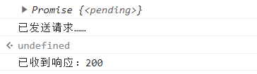
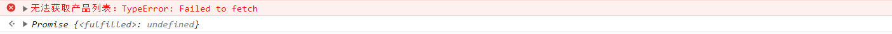
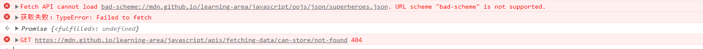
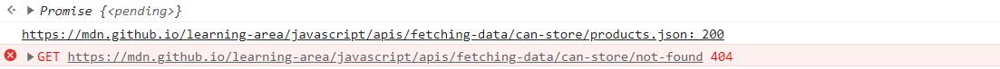

# 异步
浏览器提供的许多功能可能需要很长时间完成，因此需要异步完成

## 同步编程
耗时同步函数的问题：当函数运行时，程序没有任何反应，用户也不能输入、点击任何东西

## 事件处理程序
事件处理程序是异步编程的一种形式：提供的函数（事件处理程序）将在事件发生时被调用（而不是立即调用）

## 回调
事件处理程序是一种特殊类型的回调函数。

回调函数是一个被传递到另一个函数中的会在适当的时候被调用的函数。

回调函数曾经是JavaScript中实现异步函数的主要方式。

回调函数本事需要调用其他接收回调函数的函数时，代码非常难以理解。

同步代码：
```
function doStep1(init) {
  return init + 1;
}
function doStep2(init) {
  return init + 2;
}
function doStep3(init) {
  return init + 3;
}
function doOperation() {
  let result = 0;
  result = doStep1(result);
  result = doStep2(result);
  result = doStep3(result);
  console.log(`结果：${result}`);
}
doOperation();
```

基于回调：
```
function doStep1(init, callback) {
  const result = init + 1;
  callback(result);
}
function doStep2(init, callback) {
  const result = init + 2;
  callback(result);
}
function doStep3(init, callback) {
  const result = init + 3;
  callback(result);
}
function doOperation() {
  doStep1(0, (result1) => {
    doStep2(result1, (result2) => {
      doStep3(result2, (result3) => {
        console.log(`结果：${result3}`);
      });
    });
  });
}
doOperation();
```
得到深度嵌套的doOperation()函数，难以阅读和调式，处理错误也非常困难

由于以上原因，大多数现代异步API都不使用回调。

JavaScript异步编程的基础是Promise

## Promise
Promise是现代JavaScript中异步编程的基础，是一个由异步函数返回的可以指示当前操作所处的状态的对象。

在Promise返回给调用者的时候，操作往往还没有完成，但Promise对象可以使得在操作最终完成时对其进行处理。

在基于 Promise 的 API 中，异步函数会启动操作并返回 Promise 对象。然后，可以将处理函数附加到 Promise 对象上，当操作完成时（成功或失败），这些处理函数将被执行。
### 使用fetch()的API
fetch()，是一个现代的，基于Promise的，用于替代XMLHttpRequest的方法
```
const fetchPromise = fetch(
  "https://mdn.github.io/learning-area/javascript/apis/fetching-data/can-store/products.json",
);

console.log(fetchPromise);

fetchPromise.then((response) => {
  console.log(`已收到响应：${response.status}`);
});

console.log("已发送请求……");
```


### 链式使用Promise
```
const fetchPromise = fetch(
  "https://mdn.github.io/learning-area/javascript/apis/fetching-data/can-store/products.json",
);

fetchPromise.then((response) => {
  const jsonPromise = response.json();
  jsonPromise.then((json) => {
    console.log(json[0].name);
  });
});
```
Promise的优雅之处在于then()本身也会返回一个Promise，这个Promise将指示then()中调用的异步函数的完成状态，上面的代码可改写成：
```
const fetchPromise = fetch(
  "https://mdn.github.io/learning-area/javascript/apis/fetching-data/can-store/products.json",
);

fetchPromise
  .then((response) => {
    return response.json();
  })
  .then((json) => {
    console.log(json[0].name);
  });
```
可以直接返回json()返回的Promise，并在该返回值上调用第二个then()，这被称为Promise链，意味着当需要连续进行异步函数调用时，可以避免不断嵌套带来的缩进增加

通过状态码检查服务器是否接受并处理了请求
```
const fetchPromise = fetch(
  "https://mdn.github.io/learning-area/javascript/apis/fetching-data/can-store/products.json",
);

fetchPromise
  .then((response) => {
    if (!response.ok) {
      throw new Error(`HTTP error: ${response.status}`);
    }
    return response.json();
  })
  .then((json) => {
    console.log(json[0].name);
  });
```

### 错误捕获
Promise对象提供了catch()方法来支持错误处理。

当异步操作成功，传递给then()的处理函数被调用；

当异步操作失败，传递给catch()的处理函数被调用。

如果将catch()添加到Promise链的末尾，就可以在任何异步函数失败时被调用。所以可以将一个操作实现为几个连续的异步函数调用，并在一个地方处理所有错误。

```
const fetchPromise = fetch(
  "bad-scheme://mdn.github.io/learning-area/javascript/apis/fetching-data/can-store/products.json",
);

fetchPromise
  .then((response) => {
    if (!response.ok) {
      throw new Error(`HTTP 请求错误：${response.status}`);
    }
    return response.json();
  })
  .then((json) => {
    console.log(json[0].name);
  })
  .catch((error) => {
    console.error(`无法获取产品列表：${error}`);
  });
```


### Promise术语
Promise有三种状态：
1、待定pending：初始状态，既没有被兑现，也没有被拒绝。这是调用fetch()返回Promise时的状态，此时请求还在进行中；

2、已兑现fulfilled：意味着操作成功完成。当Promise完成时，它的then()处理函数被调用；

3、已拒绝rejected：意味着操作失败。当一个Promise失败时，catch()处理函数被调用

有时候用已敲定settled这个词来同时表示已兑换fulfilled和已拒绝rejected两种情况

### 合并使用多个Promise
当操作由几个异步函数组成，并且需要在开始下一个函数之前完成之前每一个函数时，需要Promise链。

但在其他一些情况下，需要合并多个异步函数的调用。
有时需要所有的Promise都得到实现，但它们并不互相影响。在这种情况下，将它们一起启动然后在它们全部被兑现后得到通知会更有效率。这里需要Promise.all()方法。它接收一个promise数组，并返回一个单一的promise。
- 当且仅当数组中所有的promise都被兑现时，才会通知then()处理函数并提供一个包含所有响应的数组，数组中响应的顺序与被传入all()的Promise的顺序相同。
- 会被拒绝——如果数组中有任何一个promise被拒绝，catch()处理函数都被调用，并提供被拒绝的promise所抛出的错误。

```
const fetchPromise1 = fetch(
  "https://mdn.github.io/learning-area/javascript/apis/fetching-data/can-store/products.json",
);
const fetchPromise2 = fetch(
  "https://mdn.github.io/learning-area/javascript/apis/fetching-data/can-store/not-found",
);
const fetchPromise3 = fetch(
  "https://mdn.github.io/learning-area/javascript/oojs/json/superheroes.json",
);

Promise.all([fetchPromise1, fetchPromise2, fetchPromise3])
  .then((responses) => {
    for (const response of responses) {
      console.log(`${response.url}：${response.status}`);
    }
  })
  .catch((error) => {
    console.error(`获取失败：${error}`);
  });
```


```
const fetchPromise1 = fetch(
  "https://mdn.github.io/learning-area/javascript/apis/fetching-data/can-store/products.json",
);
const fetchPromise2 = fetch(
  "https://mdn.github.io/learning-area/javascript/apis/fetching-data/can-store/not-found",
);
const fetchPromise3 = fetch(
  "bad-scheme://mdn.github.io/learning-area/javascript/oojs/json/superheroes.json",
);

Promise.all([fetchPromise1, fetchPromise2, fetchPromise3])
  .then((responses) => {
    for (const response of responses) {
      console.log(`${response.url}：${response.status}`);
    }
  })
  .catch((error) => {
    console.error(`获取失败：${error}`);
  });
```




**有时需要等待一组promise中的某一个promise的执行，而不关心是哪一个**，使用`Promise.any()`

在Promise数组中的任何一个被兑现，就会被兑现，所有Promise都被拒绝，它也会被拒绝。

```
const fetchPromise1 = fetch(
  "https://mdn.github.io/learning-area/javascript/apis/fetching-data/can-store/products.json",
);
const fetchPromise2 = fetch(
  "https://mdn.github.io/learning-area/javascript/apis/fetching-data/can-store/not-found",
);
const fetchPromise3 = fetch(
  "https://mdn.github.io/learning-area/javascript/oojs/json/superheroes.json",
);

Promise.any([fetchPromise1, fetchPromise2, fetchPromise3])
  .then((response) => {
    console.log(`${response.url}：${response.status}`);
  })
  .catch((error) => {
    console.error(`获取失败：${error}`);
  });
```


这种情况下，无法预测哪个获取请求会先被兑现。

### async和await
async关键字提供了一种更简单的方法来处理基于异步Promise的代码。
在一个函数的开头添加async，就可以使其成为一个异步函数。

```
async function myFunction() {
  // 这是一个异步函数
}
```

异步函数中，可以在调用一个返回Promise的函数之前使用await关键字。使得代码在该点上等待，直到Promise被完成，这时Promise的响应被当作返回值，或者被拒绝的响应被作为错误抛出。

```
async function fetchProducts() {
  try {
    // 在这一行之后，我们的函数将等待 `fetch()` 调用完成
    // 调用 `fetch()` 将返回一个“响应”或抛出一个错误
    const response = await fetch(
      "https://mdn.github.io/learning-area/javascript/apis/fetching-data/can-store/products.json",
    );
    if (!response.ok) {
      throw new Error(`HTTP 请求错误：${response.status}`);
    }
    // 在这一行之后，我们的函数将等待 `response.json()` 的调用完成
    // `response.json()` 调用将返回 JSON 对象或抛出一个错误
    const json = await response.json();
    console.log(json[0].name);
  } catch (error) {
    console.error(`无法获取产品列表：${error}`);
  }
}

fetchProducts();
```

```
async function fetchProducts() {
  try {
    const response = await fetch(
      "https://mdn.github.io/learning-area/javascript/apis/fetching-data/can-store/products.json",
    );
    if (!response.ok) {
      throw new Error(`HTTP 请求错误：${response.status}`);
    }
    const json = await response.json();
    return json;
  } catch (error) {
    console.error(`无法获取产品列表：${error}`);
  }
}

const jsonPromise = fetchProducts();
jsonPromise.then((json) => console.log(json[0].name));
```

## 实现基于Promise的API
实现基于promise的API是，会使用事件、普通回调，或者消息传递模型来包裹一个异步操作。使用一个promise对象来合理的处理操作的成功或者失败。

### 实现alarm() API

以被唤醒人的名字和一个在人被唤醒前以毫秒为单位的延迟作为参数。延迟之后，本函数发送一个包含需要被唤醒人名字的“Wake up!”的消息。

**setTimeout()包裹**
使用 setTimeout() 来实现 alarm() 函数。

setTimeout() 以一个回调函数和一个以毫秒为单位的延迟作为参数。

当调用 setTimeout() 时，它将启动一个设置为给定延迟的计时器，当时间过期时，它就会调用给定的回调函数。

```
<button id="set-alarm">Set alarm</button>
<div id="output"></div>


//js
const output = document.querySelector("#output");
const button = document.querySelector("#set-alarm");

function setAlarm() {
  window.setTimeout(() => {
    output.textContent = "Wake up!";
  }, 1000);
}

button.addEventListener("click", setAlarm);
```

**Promise()构造器**
Promise() 构造器使用单个函数作为参数。

把这个函数称作执行器（executor）。当创建一个新的 promise 的时候需要实现这个执行器。

这个执行器本身采用两个参数，这两个参数都是函数，通常被称作 resolve 和 reject。

在执行器实现里，调用原始的异步函数。
如果异步函数成功了，就调用 resolve，如果失败了，就调用 reject。
如果执行器函数抛出了一个错误，reject 会被自动调用。可以将任何类型的单个参数传递到 resolve 和 reject 中。

```
function alarm(person, delay) {
  return new Promise((resolve, reject) => {
    if (delay < 0) {
      throw new Error("Alarm delay must not be negative");
    }
    window.setTimeout(() => {
      resolve(`Wake up, ${person}!`);
    }, delay);
  });
}
```

**使用alarm()API**
```
const name = document.querySelector("#name");
const delay = document.querySelector("#delay");
const button = document.querySelector("#set-alarm");
const output = document.querySelector("#output");

function alarm(person, delay) {
  return new Promise((resolve, reject) => {
    if (delay < 0) {
      throw new Error("Alarm delay must not be negative");
    }
    window.setTimeout(() => {
      resolve(`Wake up, ${person}!`);
    }, delay);
  });
}

button.addEventListener("click", () => {
  alarm(name.value, delay.value)
    .then((message) => (output.textContent = message))
    .catch((error) => (output.textContent = `Couldn't set alarm: ${error}`));
});
```

**使用async和await**
```
const name = document.querySelector("#name");
const delay = document.querySelector("#delay");
const button = document.querySelector("#set-alarm");
const output = document.querySelector("#output");

function alarm(person, delay) {
  return new Promise((resolve, reject) => {
    if (delay < 0) {
      throw new Error("Alarm delay must not be negative");
    }
    window.setTimeout(() => {
      resolve(`Wake up, ${person}!`);
    }, delay);
  });
}

button.addEventListener("click", async () => {
  try {
    const message = await alarm(name.value, delay.value);
    output.textContent = message;
  } catch (error) {
    output.textContent = `Couldn't set alarm: ${error}`;
  }
});
```

## workers
workers使能够在单独执行线程中运行一些任务

workers给了在不同线程中运行某些任务的能力，因此可以启动任务，然后继续其他的处理。

但对于多线程代码，不知道线程什么时候将会被挂起，其他线程将会得到运行的机会。因此，如果两个线程都可以访问相同的变量，那会导致Bug。

为了避免web中这些问题，主代码和worker代码永远不能直接访问彼此的变量。

Workers 和主代码运行在完全分离的环境中，只有通过相互发送消息来进行交互。特别是，这意味着 workers 不能访问 DOM（窗口、文档、页面元素等等）。

有三种不同类型的 workers：

- dedicated workers：它由一个脚本实例使用

- shared workers：可以由运行在不同窗口中的多个不同脚本共享

- service workers：Service worker 的行为就像代理服务器，缓存资源以便于 web 应用程序可以在用户离线时工作

**dedicated workers示例**

```
// 在 "generate.js" 中创建一个新的 worker
const worker = new Worker("./generate.js");

// 当用户点击 "Generate primes" 时，给 worker 发送一条消息。
// 消息中的 command 属性是 "generate", 还包含另外一个属性 "quota"，即要生成的质数。
document.querySelector("#generate").addEventListener("click", () => {
  const quota = document.querySelector("#quota").value;
  worker.postMessage({
    command: "generate",
    quota: quota,
  });
});

// 当 worker 给主线程回发一条消息时，为用户更新 output 框，包含生成的质数（从 message 中获取）。
worker.addEventListener("message", (message) => {
  document.querySelector(
    "#output",
  ).textContent = `Finished generating ${message.data} primes!`;
});

document.querySelector("#reload").addEventListener("click", () => {
  document.querySelector("#user-input").value =
    'Try typing in here immediately after pressing "Generate primes"';
  document.location.reload();
});


// 监听主线程中的消息。
// 如果消息中的 command 是 "generate"，则调用 `generatePrimse()`
addEventListener("message", (message) => {
  if (message.data.command === "generate") {
    generatePrimes(message.data.quota);
  }
});

// 生成质数 (非常低效)
function generatePrimes(quota) {
  function isPrime(n) {
    for (let c = 2; c <= Math.sqrt(n); ++c) {
      if (n % c === 0) {
        return false;
      }
    }
    return true;
  }

  const primes = [];
  const maximum = 1000000;

  while (primes.length < quota) {
    const candidate = Math.floor(Math.random() * (maximum + 1));
    if (isPrime(candidate)) {
      primes.push(candidate);
    }
  }

  // 完成后给主线程发送一条包含我们生成的质数数量的消息消息。
  postMessage(primes.length);
}
```
