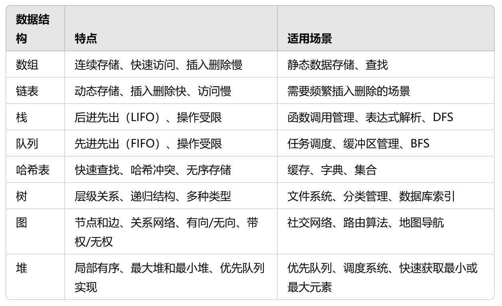
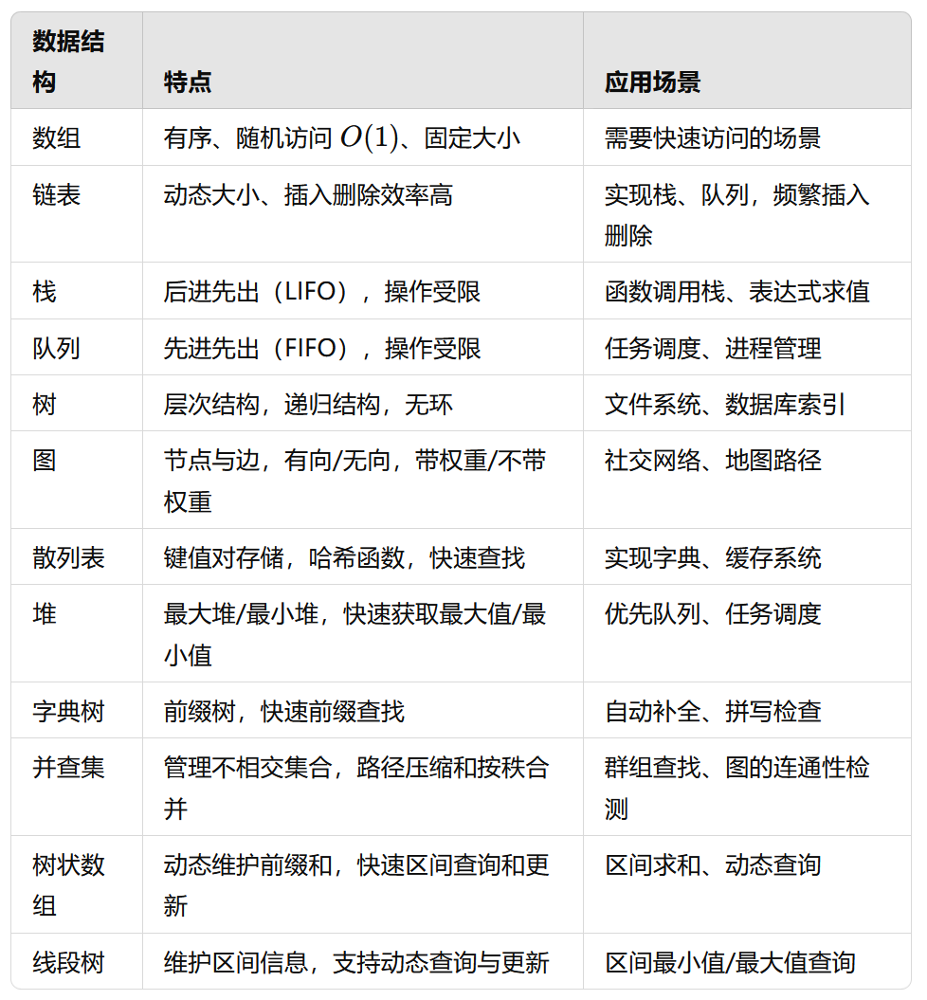

# 代码1

## 链表的指针问题

### 如何初始化链表和它的指针

```python
class ListNode:
    def __init__(self,val=0,next=None):
        self.val=val
        self.next=next

#虚拟头节点
dummy=ListNode(-1)
p=dummy
#中间移动p指针
p.next=xx
p=p.next
# 最后返回
dummy.next()

#题目给一个链表，怎么表示它的指针？
#假设链表是  head:ListNode
p=head
```

### 优先级队列（二叉堆）heapq
最小元素heap[0]
```python
import heapq
pq=[]

heapq.heappush(pq,xxx)

heapq.heappop(pq)

# 如果插入的是个链表
# 需要写一个方法
class ListNode:
    def __init__(self,val=0,next=None):
        self.val=val
        self.next=next
    def __lt__(self,other):
        return self.val<other.val
# 或者这样写__lt__方法：
ListNode.__lt__=lambda a,b:a.val<b.val

heapq.heappush(pq,head)

node=heapq.heappop()
```

### 快慢指针
1、链表中点

fast走两步，slow走一步，fast到终点，slow到中点
```python
def middleNode(head:ListNode)->ListNode:
    slow=head
    fast=head
    while fast and fast.next:
        slow=slow.next
        fast=fast.next.next
    return slow
```

2、链表是否有环
只要fast和slow相遇，就表明有环
```python
def hasCycle(head:ListNode)->ListNode:
    slow=head
    fast=head
    while fast and fast.next:
        slow=slow.next
        fast=fast.next.next
        if slow==fast:
            return True
    return False
```

3、环的起点


```python
def detectCycle(head:ListNode)->ListNode:
    fast,slow=head,head
    while fast and fast.next:
        fast=fast.next.next
        slow=slow.next
        if fast==slow:
            break
    if not fast or not fast.next:
        return None
    slow=head
    while slow!=fast:
        fast=fast.next
        slow=slow.next
    return slow
```

4、两条链表相交


```python
def getIntersectionNode(headA:ListNode,headB:ListNode)->ListNode:
    p1,p2=headA,headB
    while p1!=p2:
        if p1==None:
            p1=headB
        else:
            p1=p1.next
        
        if p2==None:
            p2=headA
        else:
            p2=p2.next
    return p1
```

解法2：让指针到交点的距离相等
```python
def getIntersectionNode(headA:ListNode,headB:ListNode)->ListNode:
    lenA,lenB=0,0
    p1,p2=headA,headB
    while p1:
        lenA+=1
        p1=p1.next
    while p2:
        lenB+=1
        p2=p2.next

    p1,p2=headA,headB
    if lenA>lenB:
        for i in range(lenA-lenB):
            p1=p1.next
    else:
        for i in range(lenB-lenA):
            p2=p2.next
    # 1、不相交，同时走到尾部空指针
    # 2、相交，走到两条链表的相交点
    while p1!=p2:
        p1=p1.next
        p2=p2.next
    return p1
```

### 数组双指针（最长回文子串）
输入：s="babad"
输出："bab"或"aba"

回文串的长度可能是奇数，也可能是偶数，写一个**从中心向两端扩散的双指针**方法

```python
def longestPalindrome(s:str)->str:
    res=""
    for i in range(len(s)):
        # 以s[i]为中心的最长回文子串
        s1=palindrom(s,i,i)
        # 以s[i]和s[i+1]为中心的最长回文子串
        s2=palindrom(s,i,i+1)
        res=res if len(res) > len(s1) else s1
        res=res if len(res) > len(s2) else s2
    return res

def palindrom(s,l,r):
    while (l>=0 and r<len(s) and s[l]==s[r]):
        l-=1
        r+=1
    return s[l+1:r]
```

## 二叉树问题

### 遍历框架

```python
def traverse(root):
    if root is None:
        return
    
    # 前序位置
    traverse(root.left)
    # 中序位置
    traverse(root.right)
    # 后序位置
```

### 二叉树最大深度
1、遍历思路

用一个外部变量记录每个节点所在的深度，取最大值

```python
res=0
depth=0

def maxDepth(root:TreeNode)->int:
    traverse(root)
    return res

def traverse(root:TreeNode)->None:
    global res,depth
    if not root:
        return
    
    depth+=1
    if not root.left and not root.right:
        res=max(res,depth)
    
    traverse(root.left)
    traverse(root.right)

    depth-=1
```

2、分解思路：最大深度=左右子树的最大深度+本身的1

```python
def maxDepth(root:TreeNode)->int:
    if not root:
        return 0
    left_max=maxDepth(root.left)
    right_max=maxDepth(root.right)

    res=max(left_max,right_max)+1

    return res
```

### 层序遍历框架
1、

```python
def levelTraverse(root:TreeNode):
    if not root:
        return
    q=deque()
    q.append(root)
    # 从上到下遍历二叉树的每一层
    while q:
        sz=len(q)
        for i in range(sz):
            cur=q.popleft()
            # 将下一层节点放入队列
            if cur.left:
                q.append(cur.left)
            if cur.right:
                q.append(cur.right)
```

2、

```python
class Solution:
    res:List[List[int]]=[]
    def levelTraverse(self,root:TreeNode)->List[List[int]]:
        if not root:
            return self.res
        self.traverse(root,0)
        return self.res
    
    def traverse(self,root:TreeNode,depth:int)->None:
        if not root:
            return
        # 看看是否已经存储depth层的节点了
        if len(self.res)<=depth:
            self.res.append([])
        self.res[depth].append(root.val)
        self.traverse(root.left,depth+1)
        self.traverse(root.right,depth+1)
```

3、
```python
class Solution:
    res=[]
    def levelTraverse(self,root:TreeNode)->List[List[int]]:
        if not root:
            return self.res
        nodes=[root]
        self.traverse(nodes)
        return self.res
    
    def traverse(self,curLevelNodes:List[TreeNode])->None:
        if not curLevelNodes:
            return
        nodeValues=[]
        nextLevelNodes=[]
        for node in curLevelNodes:
            nodeValues.append(node.val)
            if node.left:
                nextLevelNodes.append(node.left)
            if node.right:
                nextLevelNodes.append(node.right)
        self.res.append(nodeValues)
        self.traverse(nextLevelNodes)
```
