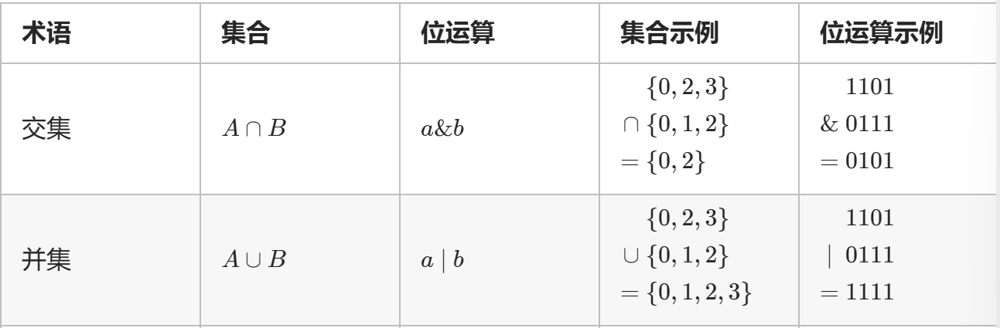
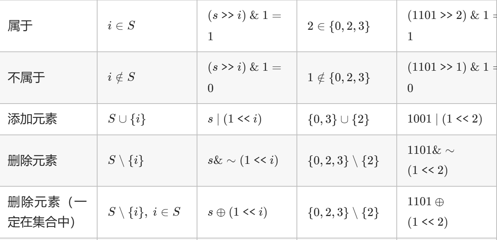
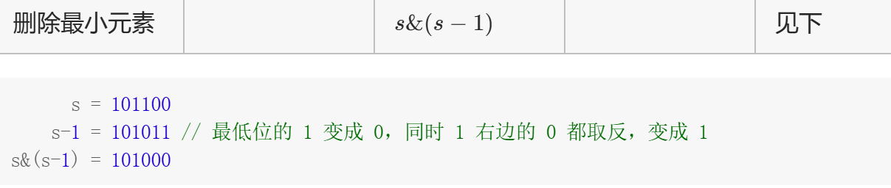
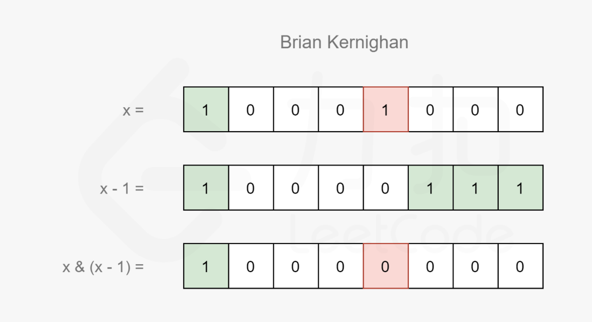
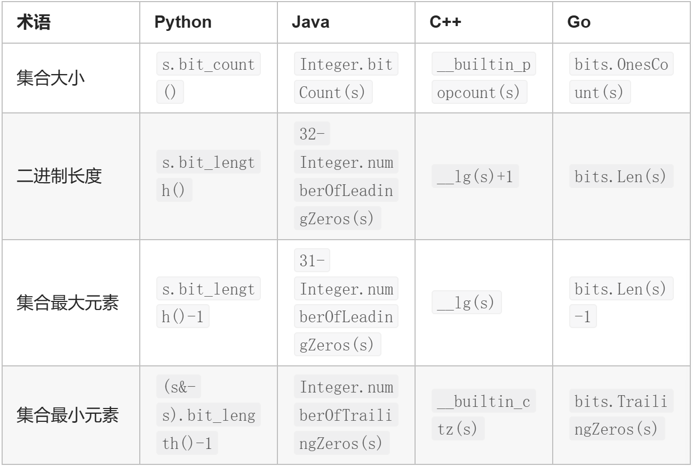

# 位运算

## 集合

集合可以用二进制表示，二进制从低到高第i位为1表示i在集合中，为0表示i不在集合中。

如集合`{0,2,3}`可以用二进制数`1101(2)`表示，反过来，二进制数`1101(2)`对应着集合`{0,2,3}`



### 移位运算

`>>`表示右移，`<<`表示左移。

> 左移i位相当于乘以`2的i次方`，右移i位相当于除以`2的i次方`





关于删除最小元素，可参考[leetcode 461 题解](https://leetcode.cn/problems/hamming-distance/solutions/797339/yi-ming-ju-chi-by-leetcode-solution-u1w7/)方法三：Brian Kernighan算法

> 该算法可以被描述位一个结论：记$f(x)$表示x和x-1进行`与运算`所得的结果，即（$f(x)=x&(x-1)$），那么$f(x)$恰为x删去其二进制表示中最右侧的1的结果



### 函数



### 代码

#### 遍历集合

元素范围0~n-1，枚举范围中的元素i，判断i是否在集合中

```py
for i in range(n):
    if (s>>i) & 1 : # i在s中
    # 处理i的逻辑
```

也可以直接遍历集合s中的元素：不断计算集合最小元素、去掉最小元素，直到集合为空

```py
# 在计算机中，负数是通过补码表示的。负数的补码计算方式是：取原数的二进制表示，按位取反，加1
# t & -t 的关键在于：正数 t 和它的补码 -t 在二进制表示中有特定的性质：原数 t 和补码 -t 只有最低位的 1 是相同的，其它位都不同，进行按位与运算时，只有最低位的 1 会保留下来，其它位都变成 0。

t=s
while t:
    lowbit=t&-t
    # ^= 是按位异或操作。它会将 t 的最低位的 1 移除
    t^=lowbit
    i=lowbit.bit_length()-1
    # 处理i的逻辑
```

#### 枚举集合

枚举所有集合：设元素范围从0~n-1，从空集到全集

```py
for s in range(1<<n):
    # 处理s的逻辑
```

枚举非空集合：设集合为s，从大到小枚举s的所有非空子集sub

```py
sub=s
while sub:
    # 处理sub的逻辑
    sub=(sub-1)&s
```

枚举子集（包含空集）：从大到小枚举 s 的所有子集 sub

```py
sub = s
while True:
    # 处理 sub 的逻辑
    sub = (sub - 1) & s
    if sub == s:
        break
```

枚举超集：如果T是S的子集，那么称S是T的超集

```py
s = t
while s < (1 << n):
    # 处理 s 的逻辑
    s = (s + 1) | t
```

## 参考

[https://leetcode.cn/circle/discuss/CaOJ45/](https://leetcode.cn/circle/discuss/CaOJ45/)