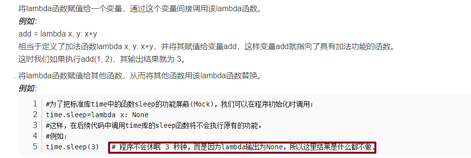

# 常用操作

## str
- 排序

  ```
  st="dca"
  print(sorted(st))
  // acd
  ```

- 26个字母和ASCII转换

  ```
  ord()：把字符传入括号中作为参数，返回ASCII
  chr()：将数组作为参数传入，返回字符值
  ```
## set
```
set()

set.add()

set.remove() // 不存在会报错

set.discard() // 移除元素，不存在不会报错

set.pop() // 随机删除集合中的一个元素

len(set)

s.clear()

x in set // 判断是否存在某个元素 

a={x for x in "abcdef"}
```

```python
l=[2,1,4,6,9,8]
print(set(l))
#output:{1, 2, 4, 6, 8, 9}
```

## list
```
del list[2]

len(list)

list1+list2

max()

min()

list.count(x)

list.index(x) //第一个匹配的索引位置

list.insert()

list.pop([index=-1]) //移除列表中的一个元素（默认最后一个元素）

list.remove(obj)

list.reverse()

list.clear()

list.sort(key=None,reverse=False)
```

### 二维列表排序

```python
intervals.sort(key=lambda x: x[0])
```

sorted()函数是Python的内置函数，具体形式为sorted(iterable, cmp=None, key=None, reverse=False)，其中iterable是可迭代对象，包括列表、元组、字典、字符串；cmp代表比较函数；key代表迭代对象中的某个属性，如某个元素的下标；reverse代表升序或者降序


### zip

*grid 会将 grid 中的每个列表作为单独的参数传递给 zip() 函数。这样，zip(*grid) 就会返回一个迭代器，其中每个元素都是一个元组，包含来自 grid 中每个列表的相应位置的元素。这相当于将 grid 矩阵转置（将行变为列，将列变为行）

```python
gird=[[1,2,4],[3,3,1]]
print(gird)
print(*gird)
print(*zip(*gird))
[[1, 2, 4], [3, 3, 1]]
[1, 2, 4] [3, 3, 1]
(1, 3) (2, 3) (4, 1)
```

```python
a = ("John", "Charles", "Mike")
b = ("Jenny", "Christy", "Monica")
x = zip(a, b)
print(tuple(x))
(('John', 'Jenny'), ('Charles', 'Christy'), ('Mike', 'Monica'))
```

# lambda

lambda的语法形式
	lambda [arg1 [,arg2,…argn]]:expression
	其中lambda是关键字；
	[arg…] 是参数列表,可以是多个，也可以是一个；
	expression 是一个参数表达式，表达式中出现的参数需要在[arg…]中有定义，并且表达式只能是单行的，只能有一个表达式。

输入是传入到参数列表[arg1 [,arg2,…argn]]的值，输出是根据表达式expression计算得到的值。

```
lambda x, y: x*y			# 函数输入是x和y，输出是它们的积x*y
lambda:None					# 函数没有输入参数，输出是None
lambda *args: sum(args)		# 输入是任意个数参数，输出是它们的和(隐性要求输入参数必须能进行算术运算)
lambda **kwargs: 1			# 输入是任意键值对参数，输出是1
```



# 元组
```
()

tup1=()
```

只包含一个元素，后加逗号


```
tup1[0]=22 //不合法操作

del tup1

len()

max()

min()

tuple(iterable)
```

元组不可变是指元组所指向的内存中的内容不可变

# 字典
```
tinydict={key1:value1,key2:value2}

键唯一，值不唯一

emptydict={}

emptydict=dict()

len(dict)

dict[key]

del dict[key]

dict.clear()

键必须不可变，可以用数字，字符串或元组充当，不能用列表

str(dict)

dict.get(key)
```

## heap——堆队列

堆是一个二叉树

每个父节点的值都只会小于或等于所有孩子节点的值

对于所有的k，都有`heap[k]<=heap[2*k+1]`和`heap[k]<=heap[2*k+2]`

最小元素heap[0]


- heapq.**heappush**(*heap*, *item*)

  将 *item* 的值加入 *heap* 中，保持堆的不变性。

- heapq.**heappop**(*heap*)

  弹出并返回 *heap* 的最小的元素，保持堆的不变性。如果堆为空，抛出 [`IndexError`](https://docs.python.org/zh-cn/3/library/exceptions.html#IndexError) 。使用 `heap[0]` ，可以只访问最小的元素而不弹出它。

- heapq.**heappushpop**(*heap*, *item*)

  将 *item* 放入堆中，然后弹出并返回 *heap* 的最小元素。该组合操作比先调用 [`heappush()`](https://docs.python.org/zh-cn/3/library/heapq.html#heapq.heappush) 再调用 [`heappop()`](https://docs.python.org/zh-cn/3/library/heapq.html#heapq.heappop) 运行起来更有效率。

- heapq.**heapify**(*x*)

  将list *x* 转换成堆，原地，线性时间内。

- heapq.**heapreplace**(*heap*, *item*)

  弹出并返回 *heap* 中最小的一项，同时推入新的 *item*。 堆的大小不变。 如果堆为空则引发 [`IndexError`](https://docs.python.org/zh-cn/3/library/exceptions.html#IndexError)。这个单步骤操作比 [`heappop()`](https://docs.python.org/zh-cn/3/library/heapq.html#heapq.heappop) 加 [`heappush()`](https://docs.python.org/zh-cn/3/library/heapq.html#heapq.heappush) 更高效，并且在使用固定大小的堆时更为适宜。 pop/push 组合总是会从堆中返回一个元素并将其替换为 *item*。返回的值可能会比添加的 *item* 更大。 如果不希望如此，可考虑改用 [`heappushpop()`](https://docs.python.org/zh-cn/3/library/heapq.html#heapq.heappushpop)。 它的 push/pop 组合会返回两个值中较小的一个，将较大的值留在堆中。
  
## 打印数字的二进制表示
```python
number = 13

# ✅ 将数字格式化为二进制 (in base 2)
string = f'{number:b}'
print(string)  # 👉️ 1101

# ✅ 将整数转换为前缀为 0b 的二进制字符串
string = bin(number)
print(string)  # 👉️ 0b1101

# ✅ 将整数转换为前缀为 0x 的小写十六进制字符串
string = hex(number)
print(string)  # 👉️ 0xd
```