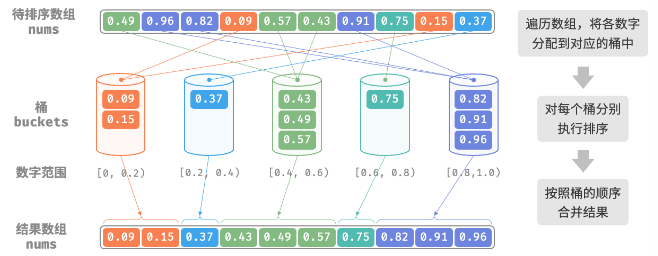
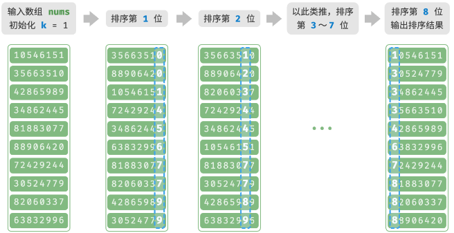
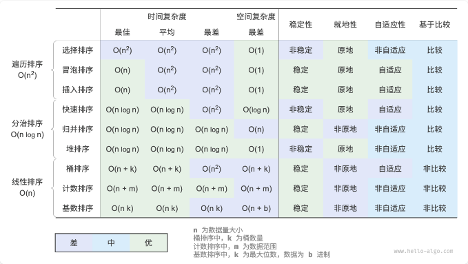

# 排序算法

## 排序算法评价维度

- 运行效率：时间复杂度、总体操作数

- 就地性：原地排序在原数组上直接操作实现排序，无需借助额外的辅助空间，节省内存。通常，原地排序的数据搬运操作少，运行速度也更快。

- 稳定性：稳定排序在完成排序后，相等元素在数组中的相对顺序不变。

- 自适应性：自适应排序的时间复杂度会受到输入数据的影响，即最佳时间复杂度、最差时间复杂度、平均时间复杂度并不完全相等。

- 是否基于比较：基于比较的排序依赖比较运算符（`>`，`=`，`<`）来判断元素的相对顺序，从而排序整个数组理论最优时间复杂度为`O(nlogn)`。而非比较排序不使用比较运算符，时间复杂度可达`O(n)`，但其通用性相对较差。

## 选择排序

循环，每轮从未排序区间选择最小的元素，放到已排序区间的末尾

```python
def select_sort(nums:list[int]):
    n=len(nums)
    # 外循环：未排序区间[i,n-1]
    for i in range(n-1):
        # 内循环：寻找最小元素
        k=i
        for j in range(i+1,n):
            if nums[j]<nums[k]:
                k=j
        nums[i],nums[k]=nums[k],nums[i]
```

### 特性

- 时间复杂度`O(n平方)`、非自适应性排序

- 空间复杂度`O(1)`、原地排序

- 非稳定性排序

## 冒泡排序

连续比较与交换相邻元素实现排序

> 如果"左元素 > 右元素"就交换，最终最大元素被移动到最右端

```python
def bubble_sort(nums:list[int]):
    n=len(nums)
    # 外循环: [0,i]
    for i in range(n-1,0,-1):
        # 内循环：把未排序区间中的最大元素交换到最右端
        for j in range(i):
            if nums[j]>nums[j+1]:
                nums[j],nums[j+1]=nums[j+1],nums[j]
```

### 优化

如果某一轮冒泡没有执行交换操作，说明已完成排序

```python
def bubble_sort_with_flag(nums:list[int]):
    n=len(nums)
    # 外循环：未排序区间 [0,i]
    for i in range(n-1,0,-1):
        flag=False
        # 内循环：把未排序区间中的最大元素交换到最右端
        for j in range(i):
            if nums[j]>nums[j+1]:
                nums[j],nums[j+1]=nums[j+1],nums[j]
                flag=True
        if not flag:
            break
```

### 特性

- 时间复杂度`O(n平方)`、自适应排序

- 空间复杂度`O(1)`、原地排序

- 稳定排序

## 插入排序

在未排序区间选择一个基准元素，将该元素与其左侧已排序区间的元素逐一比较大小，并将该元素插入到正确的位置

```python
def insertion_sort(nums:list[int]):
    # 外循环：已排序区间为[0, i-1]
    for i in range(1,len(nums)):
        # 基准元素
        base=nums[i]
        j=i-1
        # 内循环：将base插入已排序区间[0,i-1]中的正确位置
        while j>=0 and nums[j]>base:
            nums[j+1]=nums[j] # nums[j]向右移
            j-=1
        nums[j+1]=base # 将base放置到正确位置
```

### 特性

- 时间复杂度`O(n平方)`、自适应排序

- 空间复杂度`O(1)`、原地排序

- 稳定排序

### 优势

快速排序时间复杂度`O(nlogn)`，虽然插入排序时间复杂度更改，**但在数据量较小的情况下，插入排序通常更快**

## 快速排序

是一种基于分治策略的排序算法，运行高效，应用广泛

核心操作是**哨兵划分**，目标是：选择数组中的某个元素作为“基准数”，将所有小于基准数的元素移到其左侧，大于基准数的元素移到其右侧

```python
def partition(self,nums:list[int],left:int,right:int)->int:
    # 以nums[left]为基准数
    i,j=left,right
    while i<j:
        # 从右到左寻找首个小于基准数的元素
        while i<j and nums[j]>=nums[left]:
            j-=1
        # 从左向右寻找首个大于基准数的元素
        while i<j and nums[i]<=nums[left]:
            i+=1
        # 元素交换
        nums[i],nums[j]=nums[j],nums[i]
    # 基准数交换到两子数组的分界线
    nums[i],nums[left]=nums[left],nums[i]
    return i # 返回基准数的索引


def quick_sort(self,nums:list[int],left:int,right:int):
    # 子数组长度为1时终止递归
    if left>=right:
        return
    # 哨兵划分
    privot=self.partition(nums,left,right)
    self.quick_sort(nums,left,privot-1)
    self.quick_sort(nums,privot+1,right)
```

### 特性

- 时间复杂度`O(nlogn)`、自适应性排序

- 空间复杂度`O(n)`、原地排序

- 非稳定性排序

### 基准数优化

快速排序在某些输入下的时间效率可能降低。

极端例子，输入数组完全倒序，选择最左端元素作为基准数，在哨兵划分后，基准数被交换到最右端，导致左子数组长度为 n-1，右子数组长度为 0，这样递归，每轮哨兵划分都有一个子数组长度为 0，分治策略失效，退化为“冒泡排序”的近似形式

**可以优化哨兵划分中的基准数的选取策略**

1、随机选取一个元素，但运气不好，每次都选到不理想的基准数，效率依旧不高；

2、`在数组中选取三个候选元素（通常是数组的首、尾、中点元素），并将这三个候选元素的中位数作为基准数`。

```python
 """选取三个候选元素的中位数"""
def media_three(self,nums:list[int],left:int,mid:int,right:int)->int:
    l,m,r=nums[left],nums[mid],nums[right]
    if (l<=m<=r) or (r<=m<=l):
        return mid # m在l,r之间
    if (m<=l<=r) or (r<=l<=m):
        return  left # l在m,r之间
    return right

def partition(self,nums:list[int],left:int,right:int)->int:
    med=self.media_three(nums,left,(left+right)//2,right)
    # 中位数交换到数组最左端
    nums[left],nums[med]=nums[med],nums[left]

    i,j=left,right
    while i<j:
        while i<j and nums[j]>=nums[left]:
            j-=1
        while i<j and nums[i]<=nums[left]:
            i+=1
        nums[i],nums[j]=nums[j],nums[i]
    nums[i],nums[left]=nums[left],nums[i]
    return i
```

### 尾递归优化

在某些情况下，快速排序可能占用空间较多

比如对于完全有序的输入数组，递归中的子数组长度为 m，每轮哨兵划分操作都将产生长度为 0 的左子数组和长度为 m-1 的右子数组，意味着每一层递归调用减少的问题规模非常小（只减少一个元素），递归树的高度会达到 n-1，此时需要占用`O(n)`大小的栈帧空间

为了防止栈帧空间的累积，可以在每轮哨兵排序完成后，比较两个子数组的长度，仅对`较短的子数组`进行递归。较短数组的长度不会超过`n/2`，因此可以确保递归深度不超过`logn`，从而将最差空间复杂度优化至`O(n)`

```python
def quick_sort(self,nums:list[int],left:int,right:int):
    while left<right:
        privot=selft.partition(nums,left,right)
        # 对两个子数组中较短的那个执行快速排序
        if privot - left < right - privot:
            # 递归排序左子数组
            self.quick_sort(nums,left,privot-1)
            left=privot+1 # 剩余未排序区间[privot+1,right]
        else:
            # 递归排序右子数组
            self.quick_sort(nums,privot+1,right)
            right=privot-1 # 剩余未排序数组[left,privot-1]
```

## 归并排序

是一种基于分治策略的排序算法

包含划分和合并阶段：

1、划分阶段：通过递归不断地将数组从中点处分开，将长数组的排序问题转换为短数组的排序问题；

2、合并阶段：当子数组的长度为 1 时终止划分，开始合并，持续地将左右两个较短的有序数组合并为一个较长的有序数组，直至结束

```python
def merge(nums:list[int],left:int,mid:int,right:int):
    # 左子区间[left,mid]，右子区间[mid+1,right]
    # 创建临时数组 tmp，用于存放合并后的结果
    tmp=[0]*(right-left+1)
    # 初始化左子数组和右子数组的起始索引
    i,j,k=left,mid+1,0
    # 左右都有元素，比较，将较小元素复制到临时数组中
    while i<=mid and j<=right:
        if nums[i]<=nums[j]:
            tmp[k]=nums[i]
            i+=1
        else:
            tmp[k]=nums[i]
            j+=1
        k+=1
    # 将左右子数组的剩余元素复制到临时数组中
    while i<=mid:
        tmp[k]=nums[j]
        i+=1
        k+=1
    while j<=right:
        tmp[k]=nums[j]
        j+=1
        k+=1
    # 把临时数组tmp中的元素复制回原数组nums的对应区间
    for k in range(0,len(tmp)):
        nums[left+k]=tmp[k]

def merge_sort(nums:list[int],left:int,right:int):
    # 终止条件
    if left>=right:
        return
    # 划分阶段
    mid=(left+right)//2
    merge_sort(nums,left,mid) # 递归左子数组
    merge_sort(nums,mid+1,right) # 递归右子数组
    # 合并阶段
    merge(nums,left,mid,right)
```

### 特性

- 时间复杂度`O(nlogn)`、非自适应排序

- 空间复杂度`O(n)`、非原地排序

- 稳定排序

### 链表排序

对应链表，归并排序相较于其他排序算法具有显著优势，可以将链表排序任务的控制复杂度优化至`O(1)`

## 堆排序

### 堆

堆 heap 是一种满足特定条件的完全二叉树，主要可分为两种类型

- 小顶堆 min heap：任意节点的值小于等于子节点的值。

- 大顶堆 max heap：任意节点的值大于等于子节点的值。

特性：

- 最底层节点靠左天聪，其他层的节点都被填满

- 二叉树的根节点称为“堆顶”，底层最靠右的节点称为“堆底”

- 大顶堆，堆顶元素最大；小顶堆，堆顶元素最小

### 堆的常用操作

堆通常用于实现优先队列，大顶堆相当于元素按从大到小的顺序出队的优先队列

使用角度来看，可以将“优先队列”和“堆”看作等价的数据结构

常用操作：

- 入堆

- 堆顶元素出堆

- 访问堆顶元素

- 获取堆的元素数量

- 判断堆是否为空

```python
# python的heapq模块默认实现小顶堆
# 考虑将“元素取负”后再入堆，这样就可以将大小关系颠倒，从而实现大顶堆

# 初始化小顶堆
min_heap, flag = [], 1
# 初始化大顶堆
max_heap, flag = [], -1

# 元素入堆
heapq.heappush(max_heap, flag * 1)
heapq.heappush(max_heap, flag * 3)
heapq.heappush(max_heap, flag * 2)
heapq.heappush(max_heap, flag * 5)
heapq.heappush(max_heap, flag * 4)

# 获取堆顶元素
peek: int = flag * max_heap[0] # 5

# 堆顶元素出堆
# 出堆元素会形成一个从大到小的序列
val = flag * heapq.heappop(max_heap) # 5
val = flag * heapq.heappop(max_heap) # 4
val = flag * heapq.heappop(max_heap) # 3
val = flag * heapq.heappop(max_heap) # 2
val = flag * heapq.heappop(max_heap) # 1

# 获取堆大小
size: int = len(max_heap)

# 判断堆是否为空
is_empty: bool = not max_heap

# 输入列表并建堆
min_heap: list[int] = [1, 3, 2, 5, 4]
heapq.heapify(min_heap)
```

### 堆的实现——大顶堆

存储：堆是一种完全二叉树，完全二叉树非常适合用数组来表示

使用数组表示二叉树时，元素代表节点值，索引代表节点在二叉树中的位置，节点指针通过索引映射公式来实现

给定索引 i，左子节点`2i+1`，右子节点`2i+2`

```python
def left(self,i:int)->int:
    return 2 * i + 1

def right(self,i:int)->int:
    return 2 * i + 2

def parent(self,i:int)->int:
    return (i-1)//2

# 访问堆顶
def peek(self)->int:
    return self.max_heap[0]

# 元素入堆，先添加到堆底
# 堆的成立条件可能被破坏，需要修复从插入节点到根节点的路径上的各个节点
# 称为堆化heapify
def push(self,val:int):
    self.max_heap.append(val)
    # 从底至顶堆化
    self.sift_up(self.size()-1)

def sift_up(self,i:int):
    # 从节点i开始堆化
    while True:
        p=self.parent(i)
        if p<0 or self.max_heap[i] <= self.max_heap[p]:
            break
        self.swap(i,p)
        i=p

# 堆顶元素出堆
# 交换堆顶元素与堆底元素
# 交换之后，删除堆底，然后从根节点，从顶至底执行堆化
def pop(self)->int:
    if self.is_empty():
        raise IndexError("堆为空")
    self.swap(0,self.size()-1)
    val=self.max_heap.pop()
    # 从顶至底堆化
    self.sift_down(0)
    return val

def sift_down(self,i:int):
    while True:
        l,r,ma=self.left(i),self.right(i),i
        if l<self.size() and self.max_heap[l]>self.max_heap[ma]:
            ma=l
        if r<self.size() and self.max_heap[r]>self.max_heap[ma]:
            ma=r
        if ma==i:
            break
        self.swap(i,ma)
        # 循环向下堆化
        i=ma
```

### 堆排序

基于堆数据结构实现的高效排序算法

可以利用已经“建堆操作”和“元素出堆操作”实现堆排序：

1、输入数组并建立小顶堆，此时最小元素位于堆顶

2、不断执行出堆操作，依次记录出堆位置，即可得到从小到大排序的序列

```python
def heap_sort(nums:list[int]):
    for i in range(len(nums)//2 - 1 , -1, -1):
        sift_down(nums,len(nums),i)
    for i in range(len(nums) - 1, 0, -1):
        nums[0],nums[i]=nums[i],nums[0]
        sift_down(nums,i,0)
```

### 特性

- 时间复杂度`O(nlogn)`、非自适应排序

- 空间复杂度`O(1)`、原地排序

- 非稳定性排序

## 桶排序

桶排序 bucket sort 是分治策略的一个典型应用。

通过设置一些具有大小顺序的桶，每个桶对应一个数据范围，将数据平均分配到各个桶中；然后，在每个桶内部分别执行排序；最终按照桶的顺序将所有数据合并

### 算法流程

考虑一个长度为 n 的数组，其元素范围是`[0,1)`内的浮点数。

1、初始化 k 个桶，将 n 个元素分配到 k 个桶中

2、对每个桶分别执行排序

3、按照桶从小到大的顺序合并结果



```python
def bucket_sort(nums:list[float]):
    # 初始化k=n/2个桶，预期向每个桶分配2个元素
    buckets=[[] for _ in range(k)]
    # 将元素分配到各个桶中
    for num in nums:
        # 输入的数据范围是[0,1)，使用num*k映射到索引范围[0,k-1]
        i=int(num*k)
        # 将num添加到桶i
        buckets[i].append(num)
    # 对各个桶执行排序
    for bucket in buckets:
        bucket.sort()
    # 遍历合并结果
    i=0
    for bucket in buckets:
        for num in bucket:
            nums[i]=num
            i+=1
```

### 特性

桶排序适用于处理体量很大的数据。

例如，输入 100 万个元素，由于空间限制，系统内存无法一次性加载所有数据。此时可以将数据分为 1000 个桶，然后分别对每个桶进行排序，最后将结果合并。

- 时间复杂度为`O(n+k)`：假设元素在各个桶内平均分布，那么每个桶内的元素数量为`n/k`，假设排序单个桶使用`O(n/k log n/k)`，则排序所有桶使用`O(n log n/k)`，当桶数量 k 比较大时，时间复杂度趋于`O(n)`，合并结果时需要遍历所有桶和元素，花费`O(n+k)`时间

- 自适应排序

- 空间复杂度为`O(n+k)`、非原地排序

### 如何平均分配

桶排序的时间复杂度理论上可以达到 O(n)，关键在于将元素均匀分配到各个桶中，因为实际数据往往不是均匀分配的。

为实现平均分配，可以预先设定一条大致的分界线，将数据粗略地分到 3 个桶中。

分配完毕后，再将商品较多的桶继续划分为 3 个桶，直至所有桶中的元素数量大致相等。

如果提前知道数据的概率分布，可以根据数据概率分布设置每个桶的分界线

## 计数排序

通过统计元素数量来实现排序，通常应用于整数数组

### 流程

给定一个长度为 n 的数组 nums，其中的元素都是非负整数

1、遍历数组，找出其中的最大数字，记为 m，然后创建一个长度为`m+1`的辅助数组 counter

2、借助 counter 统计 nums 中各数字的出现次数，其中`counter[num]`对应数字 num 的出现次数。统计的方法，只需要遍历 nums

3、遍历 counter，根据各数字出现次数从小到大顺序填入 nums

```python
def counting_sort_naive(nums:list[int]):
    # 统计数字最大元素m
    m=0
    for num in nums:
        m=max(m,num)
    counter=[0]*(m+1)
    for num in nums:
        counter[num]+=1
    i=0
    for num in range(m+1):
        for _ in range(counter[num]):
            nums[i]=num
            i+=1
```

### 完整实现

如果输入数据是对象，按照对象的某一属性排序， 就无法按照上述步骤还原数组

此时可以先计算 counter 的前缀和，索引 i 的前缀和`prefix[i]`等于数组前 i 个元素之和

`prefix[num]-1`代表元素 num 在结果数组 res 中最后一次出现的索引

这样可以知道各个元素应该出现在结果数组的哪个位置

然后就可以倒序遍历原数组 nums 的每个元素 num，在每轮迭代中执行：

1、将 num 填入数组 res 的索引`prefix[num]-1`处

2、令前缀和`prefix[num]`减小 1，从而得到下次放置 num 的索引

```python
def counting_sort(nums: list[int]):
    """计数排序"""
    # 完整实现，可排序对象，并且是稳定排序
    # 1. 统计数组最大元素 m
    m = max(nums)
    # 2. 统计各数字的出现次数
    # counter[num] 代表 num 的出现次数
    counter = [0] * (m + 1)
    for num in nums:
        counter[num] += 1
    # 3. 求 counter 的前缀和，将“出现次数”转换为“尾索引”
    # 即 counter[num]-1 是 num 在 res 中最后一次出现的索引
    for i in range(m):
        counter[i + 1] += counter[i]
    # 4. 倒序遍历 nums ，将各元素填入结果数组 res
    # 初始化数组 res 用于记录结果
    n = len(nums)
    res = [0] * n
    for i in range(n - 1, -1, -1):
        num = nums[i]
        res[counter[num] - 1] = num  # 将 num 放置到对应索引处
        counter[num] -= 1  # 令前缀和自减 1 ，得到下次放置 num 的索引
    # 使用结果数组 res 覆盖原数组 nums
    for i in range(n):
        nums[i] = res[i]
```

### 特性

- 时间复杂度为`O(n+m)`、非自适应排序

- 空间复杂度为`O(n+m)`、非原地排序

- 稳定排序

### 局限性

1、计数排序只适用于非负整数

2、计数排序适用于数据量大但数据范围较小的情况

## 基数排序

核心思想与计数排序一致，也通过统计个数来实现排序。在此基础上，基数排序利用数字各位之间的递进关系，依次对每一位进行排序，从而得到最终的排序结果。

### 流程

1、初始化位数 k=1

2、对第 k 位执行计数排序。完成后，数据根据第 k 位从小到大排序

3、将 k 增加 1，然后返回步骤 2，继续迭代，直到所有位都排序完成后结束



```python
def digit(num:int,exp:int)->int:
    """获取元素num的第k位，其中exp=10^(k-1)"""
    return (num//exp)%10

def counting_sort_digit(nums:list[int],exp:int):
    """根据nums第k位排序"""
    # 十进制的位范围为0~9，因此需要长度为10的桶数组
    counter=[0]*10
    n=len(nums)
    # 统计0~9的出现次数
    for i in range(n):
        d=digit(nums[i],exp)
        counter[d]+=1
    # 求前缀和，将出现个数转换为数组索引
    for i in range(1,10):
        counter[i]+=counter[i-1]
    # 倒序遍历，根据桶内统计结果，将各元素填入res
    res=[0]*n
    for i in range(n-1,-1,-1):
        #
        d=digit(nums[i],exp)
        # 获取d在数组中的索引
        j=counter[d]-1
        # 将当前元素填入索引j
        res[j]=nums[i]
        # 将d的数量减1
        counter[d]-=1
    # 使用结果覆盖原数组nums
    for i in range(n):
        nums[i]=res[i]

def radix_sort(nums:list[int]):
    m=max(nums)
    exp=1
    while exp<=m:
        # 对数组元素的第k位执行计数排序
        # k=1 -> exp=1
        # k=2 -> exp=19
        # 即 exp=10^(k-1)
        counting_sort_digit(nums,exp)
        exp*=10
```

### 特性

基数排序适用于数值范围较大的情况，但前提是数据必须可以表示为固定位数的格式，且位数不能过大

- 时间复杂度`O(nk)`、非自适应排序

- 空间复杂度`O(n+d)`、非原地排序

- 稳定排序

### 最高位优先 Most Significant Digit first 法

MSD：从左往右

### 最低位优先 Least Significant Digit first 法

LSD：从右往左

## 总结



## 参考

[https://www.hello-algo.com/chapter_sorting/sorting_algorithm/](https://www.hello-algo.com/chapter_sorting/sorting_algorithm/)
