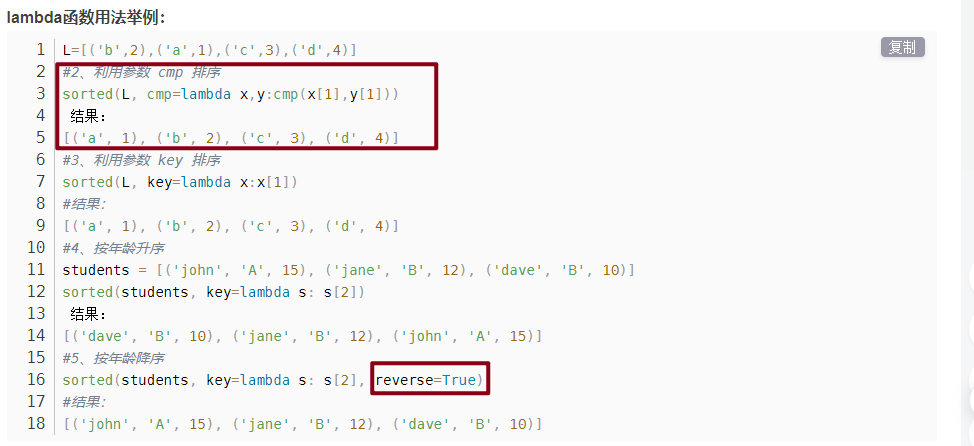

# python 数据结构

## str

### 排序

```python
st="dca"
print(sorted(st))
# ['a','c','d']
```

### 26 个字母和 ASCII 转换

```python
# ord()：把字符传入括号中作为参数，返回ASCII
# chr()：将数组作为参数传入，返回字符值

counts = [0] * 26
for ch in st:
    counts[ord(ch) - ord("a")] += 1
```

## set

```
set()

set.add()

set.remove() // 不存在会报错

set.discard() // 移除元素，不存在不会报错

set.pop() // 随机删除集合中的一个元素

len(set)

s.clear()

x in set // 判断是否存在某个元素

a={x for x in "abcdef"}
```

```python
l=[2,1,4,6,9,8]
print(set(l))
#output:{1, 2, 4, 6, 8, 9}
```

## list

```
del list[2]

len(list)

list1+list2

max()

min()

list.count(x)

list.index(x) //第一个匹配的索引位置

list.insert()

list.pop([index=-1]) //移除列表中的一个元素（默认最后一个元素）

list.remove(obj)

list.reverse()

list.clear()

list.sort(key=None,reverse=False)
```

### 二维列表排序

```python
intervals.sort(key=lambda x: x[0])
```

sorted()函数是 Python 的内置函数，具体形式为 sorted(iterable, cmp=None, key=None, reverse=False)，其中 iterable 是可迭代对象，包括列表、元组、字典、字符串；cmp 代表比较函数；key 代表迭代对象中的某个属性，如某个元素的下标；reverse 代表升序或者降序




### zip

*grid 会将 grid 中的每个列表作为单独的参数传递给 zip() 函数。这样，zip(*grid) 就会返回一个迭代器，其中每个元素都是一个元组，包含来自 grid 中每个列表的相应位置的元素。这相当于将 grid 矩阵转置（将行变为列，将列变为行）

```python
gird=[[1,2,4],[3,3,1]]
print(gird)
print(*gird)
print(*zip(*gird))
[[1, 2, 4], [3, 3, 1]]
[1, 2, 4] [3, 3, 1]
(1, 3) (2, 3) (4, 1)
```

```python
a = ("John", "Charles", "Mike")
b = ("Jenny", "Christy", "Monica")
x = zip(a, b)
print(tuple(x))
(('John', 'Jenny'), ('Charles', 'Christy'), ('Mike', 'Monica'))
```

### list 当堆栈使用

```python
>>> stack = [3, 4, 5]
>>> stack.append(6)
>>> stack.append(7)
>>> stack
[3, 4, 5, 6, 7]
>>> stack.pop()
7
>>> stack
[3, 4, 5, 6]
>>> stack.pop()
6
>>> stack.pop()
5
>>> stack
[3, 4]
```

### list 当队列

```python
>>> from collections import deque
>>> queue = deque(["Eric", "John", "Michael"])
>>> queue.append("Terry")           # Terry arrives
>>> queue.append("Graham")          # Graham arrives
>>> queue.popleft()                 # The first to arrive now leaves
'Eric'
>>> queue.popleft()                 # The second to arrive now leaves
'John'
>>> queue                           # Remaining queue in order of arrival
deque(['Michael', 'Terry', 'Graham'])
```

### queue

[https://docs.python.org/zh-cn/3/library/queue.html](https://docs.python.org/zh-cn/3/library/queue.html)

```python
import queue
q=queue.Queue()
q.put(1)
q.qsize()
q.empty()
q.get()//移除并返回一个
```

## lambda

lambda 的语法形式
lambda [arg1 [,arg2,…argn]]:expression
其中 lambda 是关键字；
[arg…] 是参数列表,可以是多个，也可以是一个；
expression 是一个参数表达式，表达式中出现的参数需要在[arg…]中有定义，并且表达式只能是单行的，只能有一个表达式。

输入是传入到参数列表[arg1 [,arg2,…argn]]的值，输出是根据表达式 expression 计算得到的值。

```
lambda x, y: x*y			# 函数输入是x和y，输出是它们的积x*y
lambda:None					# 函数没有输入参数，输出是None
lambda *args: sum(args)		# 输入是任意个数参数，输出是它们的和(隐性要求输入参数必须能进行算术运算)
lambda **kwargs: 1			# 输入是任意键值对参数，输出是1
```


## 元组

```
()

tup1=()
```

只包含一个元素，后加逗号


```
tup1[0]=22 //不合法操作

del tup1

len()

max()

min()

tuple(iterable)
```

元组不可变是指元组所指向的内存中的内容不可变

## 字典

```
tinydict={key1:value1,key2:value2}

键唯一，值不唯一

emptydict={}

emptydict=dict()

len(dict)

dict[key]

del dict[key]

dict.clear()

键必须不可变，可以用数字，字符串或元组充当，不能用列表

str(dict)

dict.get(key)
```

## PriorityQueue

```python
from queue import PriorityQueue
pq=PriorityQueue()
# 插入,越小优先级越高
pq.put(xx)
# 队首取出
pq.get()
# 是否为满
pq.full()
# 是否为空
pq.empty()
```

自定义类插入进队列

```python
class Task:
  def __init__(self,name:str,age:int):
    self.name=name
    self.age=age
# 需要自定义比较
  def __lt__(self,other):
    # 从大到小排序
    return self.age>other.age

task1=Task('a',1)
pq.put(task1)
```

## heap——堆队列

堆是一个二叉树

每个父节点的值都只会小于或等于所有孩子节点的值

对于所有的 k，都有`heap[k]<=heap[2*k+1]`和`heap[k]<=heap[2*k+2]`

最小元素 heap[0]

- heapq.**heappush**(_heap_, _item_)

  将 _item_ 的值加入 _heap_ 中，保持堆的不变性。

- heapq.**heappop**(_heap_)

  弹出并返回 _heap_ 的最小的元素，保持堆的不变性。如果堆为空，抛出 [`IndexError`](https://docs.python.org/zh-cn/3/library/exceptions.html#IndexError) 。使用 `heap[0]` ，可以只访问最小的元素而不弹出它。

- heapq.**heappushpop**(_heap_, _item_)

  将 _item_ 放入堆中，然后弹出并返回 _heap_ 的最小元素。该组合操作比先调用 [`heappush()`](https://docs.python.org/zh-cn/3/library/heapq.html#heapq.heappush) 再调用 [`heappop()`](https://docs.python.org/zh-cn/3/library/heapq.html#heapq.heappop) 运行起来更有效率。

- heapq.**heapify**(_x_)

  将 list _x_ 转换成堆，原地，线性时间内。

- heapq.**heapreplace**(_heap_, _item_)

  弹出并返回 _heap_ 中最小的一项，同时推入新的 _item_。 堆的大小不变。 如果堆为空则引发 [`IndexError`](https://docs.python.org/zh-cn/3/library/exceptions.html#IndexError)。这个单步骤操作比 [`heappop()`](https://docs.python.org/zh-cn/3/library/heapq.html#heapq.heappop) 加 [`heappush()`](https://docs.python.org/zh-cn/3/library/heapq.html#heapq.heappush) 更高效，并且在使用固定大小的堆时更为适宜。 pop/push 组合总是会从堆中返回一个元素并将其替换为 _item_。返回的值可能会比添加的 _item_ 更大。 如果不希望如此，可考虑改用 [`heappushpop()`](https://docs.python.org/zh-cn/3/library/heapq.html#heapq.heappushpop)。 它的 push/pop 组合会返回两个值中较小的一个，将较大的值留在堆中。

## collections 之 OrderedDict

摘自：[https://zhuanlan.zhihu.com/p/110407087](https://zhuanlan.zhihu.com/p/110407087)

导入

```python
from collections import OrderedDict
od=OrderedDict()
```

OrderedDict 是记住键首次插入顺序的字典。如果新条目覆盖现有条目，则原始插入位置保持不变。

```python
od['name'] = 'egon'
od['age'] = 18
od['gender'] = 'male'
print(od) # OrderedDict([('name', 'egon'), ('age', 18), ('gender', 'male')])

od['age']=19
print(od) # OrderedDict([('name', 'egon'), ('age', 19), ('gender', 'male')])
```

​ 删除条目并重新插入会将其移动到末尾。

```python
del od['age']

od['age']=20
print(od) # OrderedDict([('name', 'egon'), ('gender', 'male'), ('age', 20)])
```

### popitem(last=True)

调用有序字典的 popitem()方法会删除并返回(key, value)对。如果 last 为真，则以 LIFO(后进先出)顺序返回这些键值对，如果为假，则以 FIFO(先进先出)顺序返回。

```python
from collections import OrderedDict

od=OrderedDict()

od['k1']='egon'
od['k2']='tom'
od['k3']='jack'

print(od.popitem(last=False))
print(od.popitem(last=False))
print(od.popitem(last=False))
'''
('k1', 'egon')
('k2', 'tom')
('k3', 'jack')
'''
```

### move_to_end(key, last=True)

该方法用于将一个已存在的 key 移动到有序字典的任一端。如果 last 为 True（默认值），则移动到末尾，如果 last 为 False，则移动到开头。如果 key 不存在，引发 KeyError

```python
from collections import OrderedDict

od = OrderedDict()

od = OrderedDict.fromkeys('abcde')
od.move_to_end('b')
print(''.join(od.keys())) # acdeb

od.move_to_end('b', last=False)
print(''.join(od.keys())) # bacde
```

### OrderDict 对象之间的相等性判断

​ OrderedDict 对象之间的相等性判断是顺序敏感的

判断：`od1 == od2`
底层实现相当于：`list(od1.items()) == list(od2.items())`
OrderedDict 对象与其他映射对象之间的相等性测试与常规字典类似，对顺序不敏感，所以我们可以在使用常规字典的任何位置替换为 OrderedDict 对象，并不会影响使用。

```python
od1=OrderedDict()
od2=OrderedDict()
od3=OrderedDict()

od1['k1']=111
od1['k2']=222
od1['k3']=333


od2['k1']=111
od2['k2']=222
od2['k3']=333

od3['k1']=111
od3['k3']=333
od3['k2']=222

print(od1 == od2) # OrderDict之间的相等判断，即list(od1.items())==list(od2.items())，所以结果为True
print(od1 == od3) # OrderDict之间的相等判断，即list(od1.items())==list(od3.items())，所以结果为False

d={'k1':111,'k3':333,'k2':222} # 定义常规字典

print(od1 == d) # OrderDict对象与常规字典比较，对顺序不敏感，所以结果为True
```

### OrderedDict 构造函数和 update()

​ OrderedDict 构造函数和 update()方法都可以接受关键字参数，但是它们的顺序丢失，因为 OrderedDict 构造函数和 update()方法都属于 Python 的函数调用，而 Python 的函数调用语义使用常规无序字典传递关键字参数。请在 python2 中测试

```python
from collections import OrderedDict
od1=OrderedDict(x=1,y=2,z=3)
print(od1) # 顺序错乱：OrderedDict([('y', 2), ('x', 1), ('z', 3)])


od2=OrderedDict()
od2.update(a=1)
od2.update(b=2)
od2.update(c=3)
print(od2) # 顺序正常：OrderedDict([('a', 1), ('b', 2), ('c', 3)])


od3=OrderedDict()
od3.update(d=4,e=5,f=6)
print(od3) # 顺序错乱：OrderedDict([('e', 5), ('d', 4), ('f', 6)])
```

### OrderedDict 与 sort 结合

​
由于有序字典会记住其插入顺序，因此可以与排序结合使用以创建排序字典：

```bash
>>>
>>> # 标准未排序的常规字典
>>> d = {'banana': 3, 'apple': 4, 'pear': 1, 'orange': 2}

>>> # 按照key排序的字典
>>> OrderedDict(sorted(d.items(), key=lambda t: t[0]))
OrderedDict([('apple', 4), ('banana', 3), ('orange', 2), ('pear', 1)])

>>> # 按照value排序的字典
>>> OrderedDict(sorted(d.items(), key=lambda t: t[1]))
OrderedDict([('pear', 1), ('orange', 2), ('banana', 3), ('apple', 4)])

>>> # 按照key的长度排序的字典
>>> OrderedDict(sorted(d.items(), key=lambda t: len(t[0])))
OrderedDict([('pear', 1), ('apple', 4), ('orange', 2), ('banana', 3)])
```

### 自定义 OrderDict 变体

​ 我们通过继承 OrderDict 类来实现在原有的基础之上上定制化我们的子类（即 OrderDict 变体）。

​ 比如我们在用新条目覆盖现有条目时，我们不想像 OrderDict 原先那样保留原始的插入位置，而是将覆盖的条目移动到结尾，实现如下

```python
class LastUpdatedOrderedDict(OrderedDict):
    'Store items in the order the keys were last added'

    def __setitem__(self, key, value):
        if key in self:
            del self[key]
        OrderedDict.__setitem__(self, key, value)

od5=LastUpdatedOrderedDict()
od5['k1']=111
od5['k2']=222
od5['k3']=333
print(od5) # LastUpdatedOrderedDict([('k1', 111), ('k2', 222), ('k3', 333)])

od5['k2']=2222222222
print(od5) # 覆盖的值跑到末尾，LastUpdatedOrderedDict([('k1', 111), ('k3', 333), ('k2', 2222222222)])
```

### OrderDict 与 collections.Counter 结合

​ 有序字典可以与 Counter 类结合，以便计数器记住首次遇到的顺序元素：

```python
from collections import OrderedDict,Counter

class OrderedCounter(Counter, OrderedDict):
    'Counter that remembers the order elements are first encountered'
    def __repr__(self):
        print('====>')
        return '%s(%r)' % (self.__class__.__name__, OrderedDict(self))
    def __reduce__(self):
        return self.__class__, (OrderedDict(self),)


c1 = Counter(['bbb','ccc','aaa','aaa','ccc'])
print(c1)  # 顺序错乱：Counter({'ccc': 2, 'aaa': 2, 'bbb': 1})

c2=OrderedCounter(['bbb','ccc','aaa','aaa','ccc'])
print(c2)  # 顺序保持原有：OrderedCounter(OrderedDict([('bbb', 1), ('ccc', 2), ('aaa', 2)]))
```

## 打印数字的二进制表示

```python
number = 13

# ✅ 将数字格式化为二进制 (in base 2)
string = f'{number:b}'
print(string)  # 👉️ 1101

# ✅ 将整数转换为前缀为 0b 的二进制字符串
string = bin(number)
print(string)  # 👉️ 0b1101

# ✅ 将整数转换为前缀为 0x 的小写十六进制字符串
string = hex(number)
print(string)  # 👉️ 0xd
```
