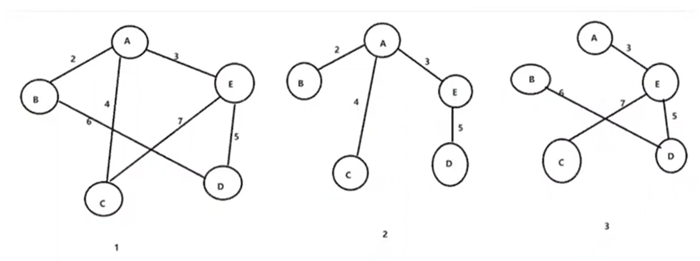

# 最小生成树

## 什么是最小生成树

最小生成树（minimum spanning tree）

> 对于一个图而言，可以生成很多树
> 
> 生成树是将原图的全部顶点以最少的边连通的子图，对于有n个顶点的连通图，生成树有n-1条边
> 
> 
> 对于一个带权连通图，生成树不同，树中各边上权值总和也不同，权值总和最小的生成树则称为图的最小生成树
> 

### 最小生成树算法

1、Prim Native implementation  O(V2)

> 稠密图

2、Prim PQ implementation  O(ElogV)

> 稀疏图

3、Kruskal UF implementation  O(ElogE)（或者更大范围ElogV，E<=V2）

> 稀疏图

## Prim 算法

Prim算法是解决最小生成树的常用算法

它采取贪心策略，从指定的顶点开始寻找最小权值的邻接点

图`G=<V,E>`，初始时$S=\{V_0\}$，把与$V_0$相邻接，且边的权值最小的顶点加入到S。不断地把S中的顶点与V-S中顶点的最小权值边加入，直到所有顶点都已加入到S中。

方法1：使用pq每次找出最近的下一个点

方法2：暴力扫所有点找出最近的下一个顶点，此顶点进入set，同时对所有通过顶点的点做edge relaxiation

| | dense稠密图E=V2 | sparse稀疏图E<<V2 |
|---|:---:|---:|
| prim实现方法 | adjacent matrix O(V2) | adjacent list O(ElogV) |

