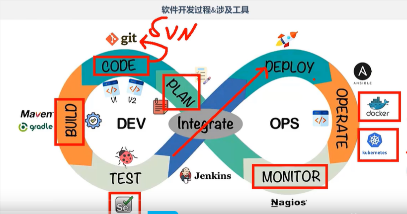
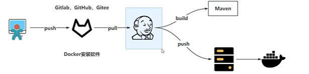
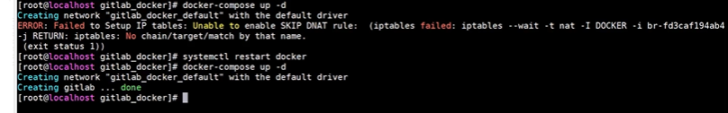
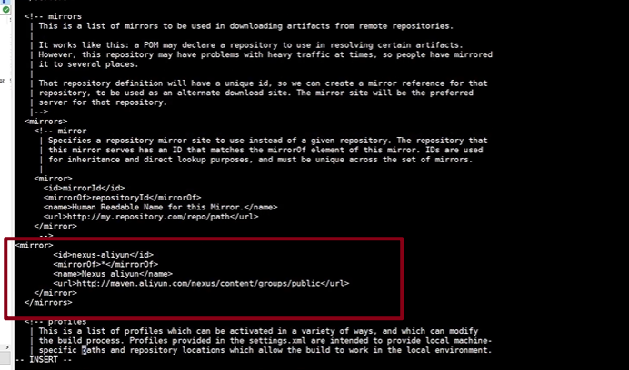
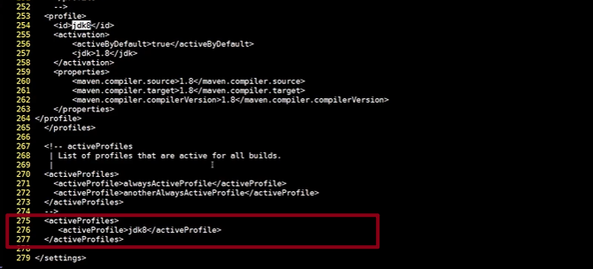

# DevOps

软件开发：
- 开发团队：从头开始设计和整体系统的构建
- 运维团队：将开发团队的Code进行测试后部署上线，希望系统稳定安全运行

运维团队需要向开发团队反馈需要修复的BUG以及一些需要返工的任务。

两个团队协商，生命周期变长。

——————

现在的互联网现状，更推崇敏捷式开发，这样就导致项目的迭代速度更快，但是由于开发团队与运维团队的沟通问题，会导致新版本上线的时间成本很高，这违背看敏捷式开发最初的目的

让开发团队和运维团队整合成一个团队，协同应对一套软件，这就被称为——DevOps

DevOPs：Development & Operations 的缩写，也就是开发&运维

其实QA测试团队也是参与其中的。



DevOps强调的是高效组织团队之间如何通过自动化的工具写作和沟通来完成软件的生命周期管理，从而更快、更频繁的交付更稳定的软件

自动化的工具写作和沟通来完成软件的声明周期管理。





## docker && docker-compose --> gitlab安装

CentOS
```bash
yum install docker

docker version

yum install docker-compose

docker-compose version
```

关闭防火墙

```bash
systemctl stop firewalld
```

创建docker目录
```bash
[root@localhost ~]# cd /usr/local/
[root@localhost local]# ls
bin  etc  games  include  lib  lib64  libexec  LICENSE  sbin  share  src
[root@localhost local]# mkdir docker
[root@localhost local]# ls
bin     etc    include  lib64    LICENSE  share
docker  games  lib      libexec  sbin     src
```

docker目录下创建gitlab目录
```bash
[root@localhost docker]# mkdir gitlab_docker
[root@localhost docker]# cd gitlab_docker/
[root@localhost gitlab_docker]# 
```

创建配置文件
```bash
[root@localhost gitlab_docker]# vim docker-compose.yml
```

查看docker状态，启动docker
```bash
[root@localhost gitlab_docker]# systemctl status docker
● docker.service - Docker Application Container Engine
   Loaded: loaded (/usr/lib/systemd/system/docker.service; disabled; vendor preset: disabled)
   Active: inactive (dead)
     Docs: http://docs.docker.com
[root@localhost gitlab_docker]# systemctl start docker
# 搜索gitlab
[root@localhost gitlab_docker]# docker search gitlab
INDEX       NAME                                               DESCRIPTION                                     STARS     OFFICIAL   AUTOMATED
docker.io   docker.io/bitnami/gitlab-runner                                                                    32                   
docker.io   docker.io/drud/gitlab-ce                                                                           18                   
docker.io   docker.io/rapidfort/gitlab-ce                                                                      12                   
docker.io   docker.io/alpinelinux/gitlab                       Alpine Linux based Gitlab image                 6                    
docker.io   docker.io/alpinelinux/gitlab-runner                Alpine Linux gitlab-runner (supports more ...   4                    
docker.io   docker.io/alpinelinux/gitlab-runner-helper         Helper image container gitlab-runner-helpe...   4                    
docker.io   docker.io/bitnami/gitlab-runner-helper                                                             3                    
docker.io   docker.io/okteto/gitlab                                                                            2                    
docker.io   docker.io/accurics/gitlab-connector                                                                0                    
docker.io   docker.io/alpinelinux/gitlab-shell                 Alpine Linux based gitlab-shell image, pro...   0                    
docker.io   docker.io/avenga/gitlab-job                                                                        0                    
docker.io   docker.io/corpusops/gitlabtools                    https://github.com/corpusops/docker-gitlab...   0                    
docker.io   docker.io/domjudge/gitlabci                                                                        0                    
docker.io   docker.io/drud/gitlab-backups                                                                      0                    
docker.io   docker.io/gromacs/gitlab-runner                                                                    0                    
docker.io   docker.io/itisfoundation/gitlab-runner-docker                                                      0                    
docker.io   docker.io/jitesoft/gitlab-ci-runner                  Image inheriting from the gitlab runner....   0                    
docker.io   docker.io/osuosl/gitlab-runner-helper                                                              0                    
docker.io   docker.io/pnnlmiscscripts/gitlab-runner-operator                                                   0                    
docker.io   docker.io/ustclug/gitlab                           Dockrized GitLab used by LUG@USTC               0                    
docker.io   docker.io/vulhub/gitlab                                                                            0                    
docker.io   docker.io/vulhub/gitlab-cve-2016-9086              gitlab cve-2016-9086                            0                    [OK]
docker.io   docker.io/wodby/gitlab                             Alpine-based GitLab CE container image          0                    
docker.io   docker.io/wodby/gitlab-nginx                       Nginx for GitLab CE container image             0                    
docker.io   docker.io/wodby/gitlab-runner                                                                      0                    
```

拉取gitlab
```bash
[root@localhost gitlab_docker]# docker pull gitlab/gitlab-ce:latest
```

查看
```bash
docker images
```

编辑docker-compose.yml文件
```yml
version: '3.1'
services:
    gitlab:
        image: 'gitlab/gitlab-ce:latest'
        container_name: gitlab
        # docker启动，gitlab启动
        restart: always
        environment:
            GITLAB_OMNIBUS_CONFIG: | 
            # 宿主机IP
                external_url 'http://192.168.107.232:8989'   
                gitlab_rails['gitlab_shell_ssh_port'] = 2224
        ports:
            - '8989:8989'
            - '2224:2224'
        volumes:
            - './config:/etc/gitlab'
            - './logs:/var/log/gitlab'
            - './data:/var/opt/gitlab'
```

启动
```bash
docker-compose up -d
```



图中的错误重启docker即可

`docker-compose up -d`启动成功之后，可以在浏览器通过8989端口访问

- 查看内部日志指令
```bash
docker-compose logs -f
```

进入容器内部查看密码
```bash
docker exec -it gitlab bash
cat /etc/gitlab/initial_root_password
# 文件里有默认的密码
```
登录进去之后，可以用户那里修改密码

## maven安装配置

克隆虚拟机，修改网卡信息

```bash
vim /etc/sysconfig/network-scripts/ifcfg-ens33
# 重启网卡
systemctl restart network
```

下载jdk8，maven

```bash
# 后面的目录是安装到哪里
tar -zxvf jdk-8u231-linux-x64.tar.gz -C /usr/local

tar -zxvf apache-maven-3.6.3-bin.tar.gz -C /usr/local
```

```bash
cd /usr/local

# 名字太长，可以修改
mv jdk1.8.0_231/ jdk/

mv apache-maven-3.6.3/ maven/

cd maven/

cd conf/

vim setting.xml

# 添加阿里云仓库地址

# JDK8编译插件配置settings.xml

# 开启一下JDK8
```






:::tip
vim里面`:set nu`指令可以显示文件的行
:::

## docker

docker依赖项安装
```bash
yum -y install yum-utils device-mapper-persistent-data lvm2
```

设置阿里云镜像

```bash
yum-config-manager --add-repo http://mirrors.aliyun.com/docker-ce/linux/centos/docker-ce.repo

```

安装docker

```bash
yum -y install docker-ce
```

启动docker并设置开机自启
```bash
systemctl start docker

systemctl enable docker
```

测试安装成功
```bash
docker version
```

docker-compose安装

在github上搜索docker/compose，下载已发布的压缩文件
docker-compose-Linux-x86_64
(本事就是一个可执行文件，但没有执行权限)

设置可执行权限
```bash
chmod +x docker-compose-Linux-x86_64

# 改个名字
mv docker-compose-Linux-x86_64 docker-compose

# 放到PATH  
echo $PATH

mv docker-compose /usr/bin

# 放到PATH之后任何位置可以执行
docker-compose version
```

