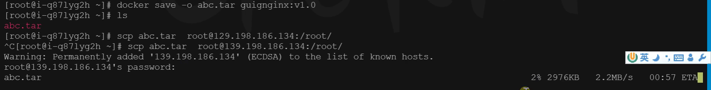

# docker

## docker安装（centos）
[https://docs.docker.com/engine/install/centos/](https://docs.docker.com/engine/install/centos/)

- 移除相关包
```bash
sudo yum remove docker \
                  docker-client \
                  docker-client-latest \
                  docker-common \
                  docker-latest \
                  docker-latest-logrotate \
                  docker-logrotate \
                  docker-engine
```

- 配置yum源
```bash
sudo yum install -y yum-utils
sudo yum-config-manager \
--add-repo \
http://mirrors.aliyun.com/docker-ce/linux/centos/docker-ce.repo
```

- 安装docker
```bash
sudo yum install -y docker-ce docker-ce-cli containerd.io


#以下是在安装k8s的时候使用
yum install -y docker-ce-20.10.7 docker-ce-cli-20.10.7  containerd.io-1.4.6
```

- 启动
```bash
systemctl enable docker --now
```

报错找到的解决办法：[https://blog.csdn.net/weixin_42672605/article/details/127748458](https://blog.csdn.net/weixin_42672605/article/details/127748458)

## 基础命令

- 找镜像

[docker hub](http://hub.docker.com/)

```bash
docker pull nginx  #下载最新版

镜像名:版本名（标签）

docker pull nginx:1.20.1


docker pull redis  #下载最新
docker pull redis:6.2.4

## 下载来的镜像都在本地
docker images  #查看所有镜像

redis = redis:latest

docker rmi 镜像名:版本号/镜像id
```

- 启动
```bash
docker run [OPTIONS] IMAGE [COMMAND] [ARG...]

【docker run  设置项   镜像名  】 镜像启动运行的命令（镜像里面默认有的，一般不会写）

# -d：后台运行
# --restart=always: 开机自启
docker run --name=mynginx   -d  --restart=always -p  88:80   nginx
# 88:80是主机到docker里面nginx的映射

# 查看正在运行的容器
docker ps
# 查看所有
docker ps -a
# 删除停止的容器
docker rm  容器id/名字
docker rm -f mynginx   #强制删除正在运行中的

#停止容器
docker stop 容器id/名字
#再次启动
docker start 容器id/名字

#应用开机自启
docker update 容器id/名字 --restart=always
```

- 修改

1、进容器内部修改
```bash
# 进入容器内部的系统，修改容器内容
docker exec -it 容器id  /bin/bash
```

2、挂载数据到外部修改

目的是将docker容器中的某个目录，挂载到主机的某个目录
-v 后的内容就是指挂载内容，ro指的是主机可修改，但是容器内部不能修改。rw指的是容器内部也可以改

```bash
docker run --name=mynginx   \
-d  --restart=always \
-p  88:80 -v /data/html:/usr/share/nginx/html:ro  \
nginx

# 修改页面只需要去 主机的 /data/html
```

- 提交改变
```bash
docker commit [OPTIONS] CONTAINER [REPOSITORY[:TAG]]

docker commit -a "leifengyang"  -m "首页变化" 341d81f7504f guignginx:v1.0

```


1、镜像传输
```bash
# 将镜像保存成压缩包
docker save -o abc.tar guignginx:v1.0

# 别的机器加载这个镜像
docker load -i abc.tar
# 离线安装
```
本地打包后传输到另一个机器



- 推送远程仓库

```bash
docker tag local-image:tagname new-repo:tagname
docker push new-repo:tagname
```


```bash
# 把旧镜像的名字，改成仓库要求的新版名字
docker tag guignginx:v1.0 leifengyang/guignginx:v1.0

# 登录到docker hub
docker login       


docker logout（推送完成镜像后退出）

# 推送
docker push leifengyang/guignginx:v1.0

# 别的机器下载
docker pull leifengyang/guignginx:v1.0
```

- 其他

```bash
# 看日志排错
docker logs 容器名/id   排错

# 进入容器的控制台
docker exec -it 容器id /bin/bash

# docker 经常修改nginx配置文件
docker run -d -p 80:80 \
-v /data/html:/usr/share/nginx/html:ro \
-v /data/conf/nginx.conf:/etc/nginx/nginx.conf \
--name mynginx-02 \
nginx


#把容器指定位置的东西复制出来 
docker cp 5eff66eec7e1:/etc/nginx/nginx.conf  /data/conf/nginx.conf
#把外面的内容复制到容器里面
docker cp  /data/conf/nginx.conf  5eff66eec7e1:/etc/nginx/nginx.conf
```
