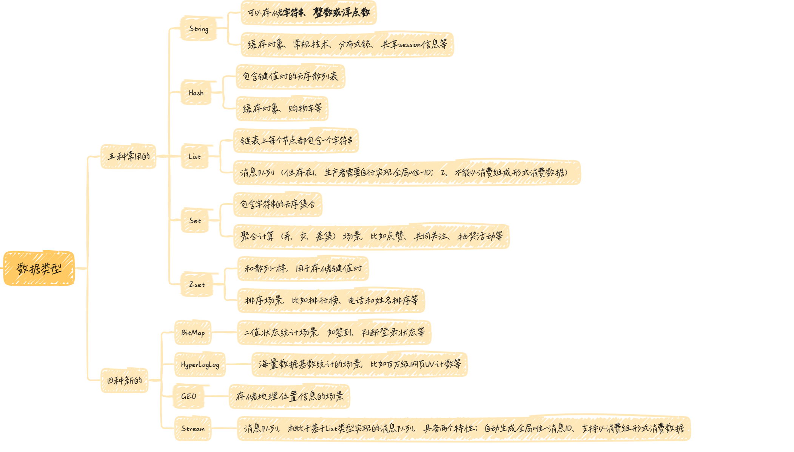
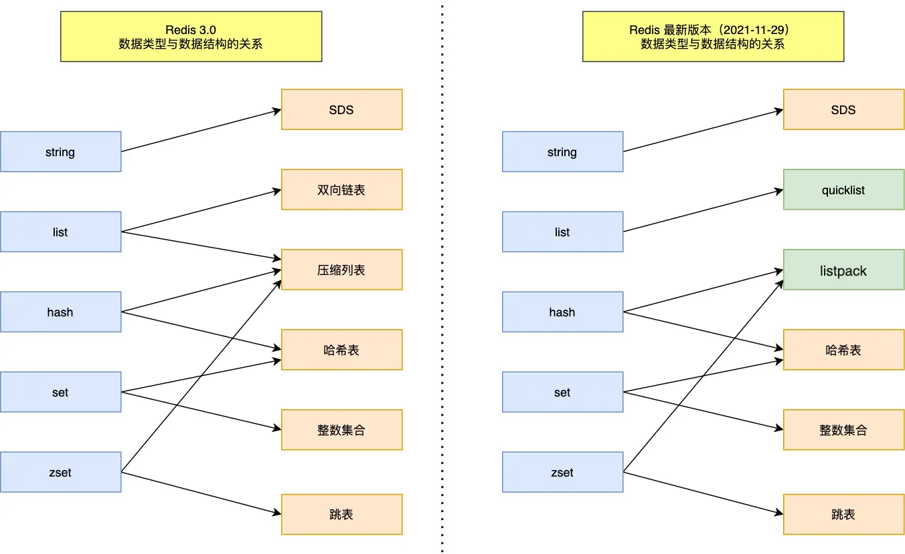
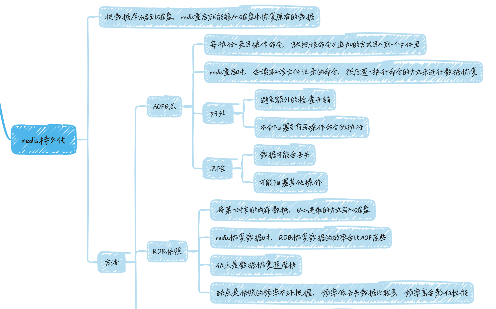
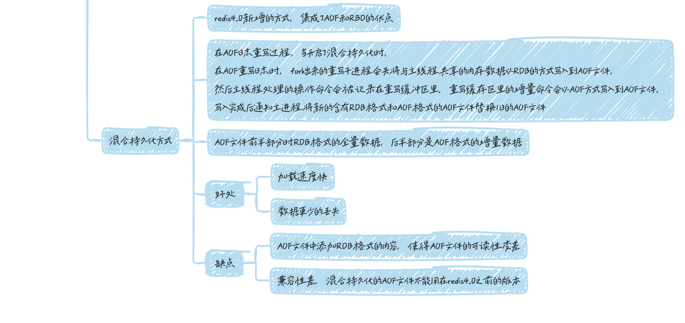
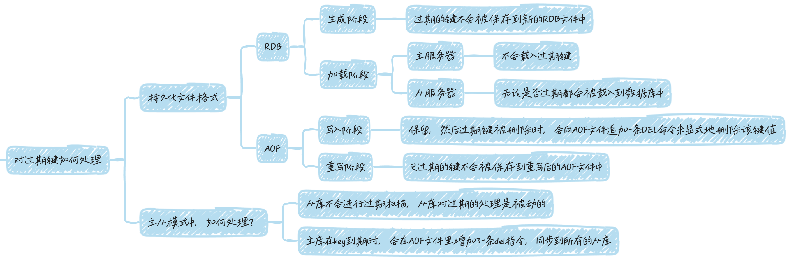
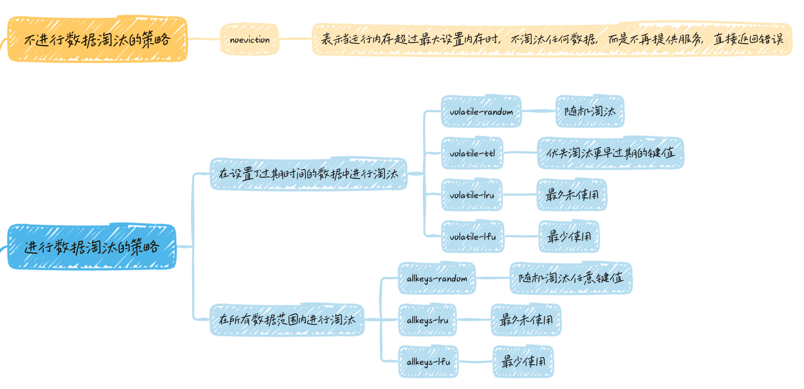
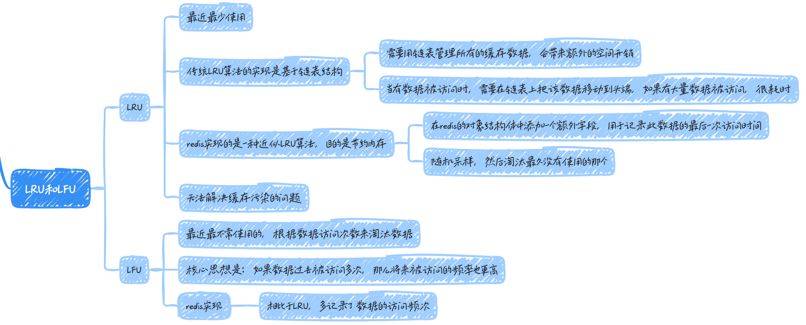
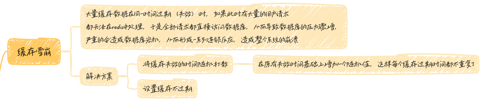
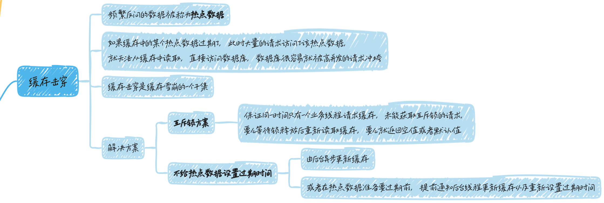
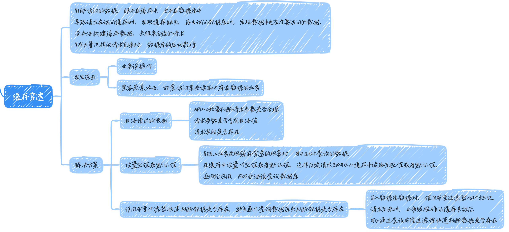

# Redis

## 是什么？

Redis是一种基于内存的数据库，对数据的读写操作都是在内存中完成的，因此`读写速度非常快`，常用于缓存，消息队列、分布式锁等场景

提供了多种数据类型来支持不同的业务场景

- String

- Hash

- List

- Set（集合）

- Zset（有序集合）

- Bitmaps（位图）

- HyperLogLog（基数统计）

- GEO（地理信息）

- Stream（流）

并且对数据类型的操作都是原子性的，因为执行命令由单线程负责，不存在并发竞争的问题

除此之外，Redis还支持事务、持久化、Lua脚本、多种集群方案（主从复制模式、哨兵模式、切片集群模式）、发布/订阅模式，内存淘汰机制、过期删除机制等等

### 和Memcached有什么区别？

Memcached也是基于内存的数据

共同点是：

1、都是基于内存的数据库，一般都用来当作缓存使用；

2、都有过期策略；

3、两者的性能都非常高

区别是：

1、redis支持的数据类型更丰富，Memcached只支持最简单的key-value数据类型；

2、redis支持数据的持久化，可以将内存中的数据保持在磁盘中，重启的时候可以再次加载进行使用，而Memcached没有持久化的功能，数据全存在内存之中，Memcached重启之后，之前的数据全部丢失；

3、redis原生支持集群模式，Memcached没有原生的集群模式，需要依靠客户端来实现往集群中分片写入数据；

4、redis支持发布订阅模型、Lua脚本、事务等功能，而Memcached不支持；

### 为什么使用redis作为MySQL的缓存

1、高性能

2、高并发

> 单台设备的redis的QPS（Query Per Second，每秒钟处理完请求的次数）是MySQL的10倍，redis单机的QPS能轻松破10w，而MySQL单机的QPS很难破1w

## redis数据结构

### 数据类型

### 数据类型实现

- SDS：简单动态字符串。

> - 不仅可以保存文本数据，还可以保存二进制数据
> 
> - 获取字符串长度的时间复杂度是O(1)
> 
> - redis的SDS API是安全的，拼接字符串不会照成缓存区溢出
> 

## redis持久化

## redis集群实现服务的高可用

### 主从复制
一主多从模式：将主服务器的数据同步到多台从redis服务器上，主从服务器之间采用**读写分离**的方式

主服务器可以进行读写操作，发生写操作时自动将写操作同步给从服务器，而从服务器一般是只读，并接受主服务器同步过来写操作命令，然后执行这条命令

主从服务器之间的命令复制是异步进行的

> 所以无法实现强一致性保证（主从数据时时刻刻保持一致），数据不一致是难以避免的

### 哨兵模式

redis主从服务时，存在问题：当redis的主从服务器出现故障宕机时，需要手动进行恢复

为了解决这个问题，redis增加了哨兵模式（Redis Sentinel），因为哨兵模式做到了可以监控主从服务器，并且提供主从节点故障转移的功能

### 切片集群
当redis缓存数据量大到一台服务器无法缓存时，就需要使用redis切片集群（redis cluster）方案

> 它将数据分布在不同的服务器上，以此来降低系统对单节点的依赖，从而提高redis服务的读写性能

采用哈希槽，来处理数据和节点之间的映射关系。

## 过期删除与内存淘汰

redis可以对key设置过期时间，把该 key 带上过期时间存储到一个过期字典（expires dict）中，需要有机制将已过期的键值对删除

1、惰性删除：不主动删除过期键，每次从数据库访问key时，都检测key是否过期，如果过期则删除该key

> 优点：对CPU时间最友好
> 
> 缺点：一定的内存空间浪费

2、定期删除：每隔一段时间随机从数据库中取出一定数量的key进行检查，并删除其中的过期key

> 优点：减少了过期键对空间的无效占用
> 
> 缺点：难以确定删除操作执行的时长和频率

redis选择惰性删除+定期删除两种策略配合使用

### 持久化时，对过期键如何处理？

### 内存淘汰策略

### LRU和LFU

## 缓存设计

### 缓存雪崩

### 缓存击穿

### 缓存穿透

## 参考

[https://xiaolincoding.com/redis/base/redis_interview.html#%E4%BB%80%E4%B9%88%E6%98%AF-redis](https://xiaolincoding.com/redis/base/redis_interview.html#%E4%BB%80%E4%B9%88%E6%98%AF-redis)