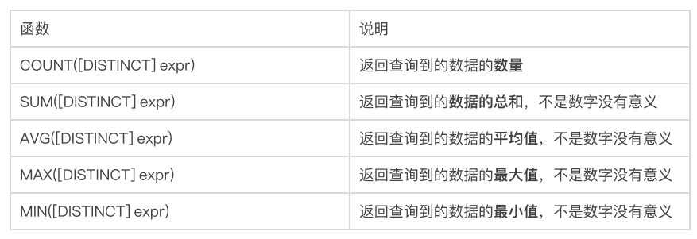
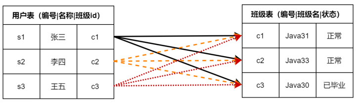
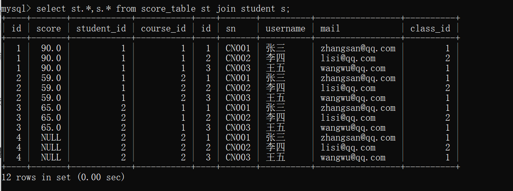
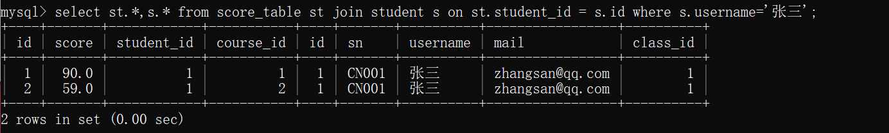
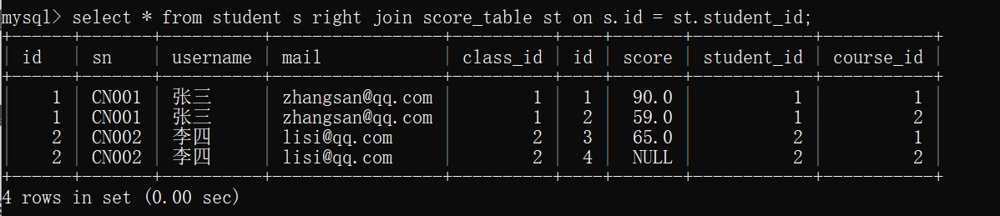
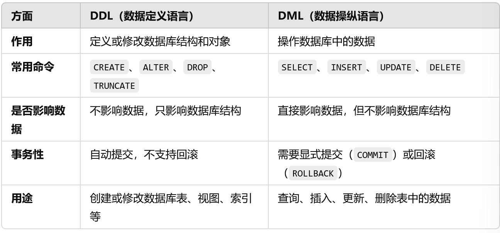

# 数据库指令

## 聚合查询



### 查询第二大
```sh
select max(salary) as second_highest from xx where salary < (select max(salary) from xx)
```

### ifnull函数
接受两个参数，如果不是NULL，则返回第一参数，否则返回第二个参数

```sh
IFNULL(expression1,expression2)
```

```sh
select ifnull(english,0) from score;
# 如果成绩为NULL，返回0
```

## 分组查询
> group by

### 分组条件查询having

```sh
select * from xx group by name having count(name)>1;
```

### 关键字执行顺序

> group by > having > order by > limit


## 联合查询

### 笛卡尔积

笛卡尔积成为直积，表示为`X*Y`，如果A表有m行，B表有n行，A和B做笛卡尔积，结果为`m*n`行，

### 内连接



比较两个或多个表之间的共有数据，然后返回

> 语法：
>
> select * from t1 join t2 [on 过滤条件] [where 过滤条件]

内连接的写法：

- select * from t1 join t2;

- select * from t1 inner join t2;

- select * from t1 cross join t2;

- select * from t1,t2;

#### 内连接查询（笛卡尔积）
```sh
select st.*,s.* from score_table st join student s;
```


#### 使用on过滤无效条件，再使用where过滤
```sh
select st.*,s.* from score_table st join student s on st.student_id = s.id where s.username='张三';
```



#### 内连接查询的问题
> 有的数据可能只在一张表有，另一张表还没填充，使用内连接会遗漏掉这条数据

### 外连接

外连接包括内连接和其他至少一张表的所有满足条件的信息，外连接包括：

- 左（外）连接

- 右（外）连接

#### 外连接语法
- 左连接语法
> select * from t1 left join t2 [on 连接条件]
>
> 左连接以左边的表为主查询数据

- 右连接语法
> select * from t1 right join t2 [on 连接条件]
> 
> 右连接以右边的表为主查询数据

#### 示例

```sh
select * from student s left join score_table st on s.id = st.student_id;
```


```sh
select * from student s right join score_table st on s.id = st.student_id;
```


#### 左连接和右连接的区别

left join ：返回包括`左表中的所有记录`和`右表中连接字段相等的记录`

right join ：返回包括`右表中的所有记录`和`左表中连接字段相等的记录`

#### on和where的区别

`on`是连接两个表时的笛卡尔积形成中间表的约束条件

`where`是在有`on`条件的select语句中过滤中间表的约束条件，在没有`on`的单表查询中，是限制物理表或中间表记录的约束条件

> - 内连接的on可以省略，外连接的不能省略
>
> - on在内连接和外连接的执行效果不同
>
> - 在外连接中on和where不同
>
> 在外连接中若是有多个查询条件，应将查询条件写在where中，而不是写在on，在on中一般情况下只需要写一个笛卡尔积，无效数据的过滤条件即可

### 自连接

是指在同一张表连接自身进行查询

#### 示例

```sh
select st1.score 英语，st2.score 计算机 from score_table st1, score_table st2 where st1.student_id=st2.student_id and st1.score>st2.score;
```


### 子查询
是指嵌入在其他sql语句中的select语句，也叫嵌套查询

#### 示例
```sh
select * from score_table where course_id in (select id from course where name='计算机' or name='英语');
```


### 合并查询
合并查询用于合并结果集相同的两张（多张）表，他又两个关键字

- union

- union all

#### union的使用
> 查询id小于3 和名字为“英语”的课程
```sh
select * from course where id<3
union
select * from course where name='英语';

# 或者使用 or 来实现
select * from course where id<3 or name='英语';
```

#### union all的使用
用于取得两个结果集的并集，当使用该操作符时，不会去掉结果集中的重复行

> 查询id小于3，或者名字为“英语”的课程

```sh
select * from course where id<3
union all
select * from course where name='英语';
```

#### union和union all的区别

union：对两个结果集进行并集操作，不包括重复行，同时进行默认规则的排序

union all：对两个结果集进行并集操作，包括重复行，不进行排序


## DDL和DML

### DDL
Data Definition Language，数据定义语言

DDL用于定义和管理数据库的结构和架构，例如创建、修改或删除数据库中的表、索引、视图等对象

常见的DDL命令有：

- CREATE：用于创建新的数据库对象，例如表、数据、视图、索引

```
CREATE TABLE
CREATE DATABASE
CREATE VIEW
CREATE INDEX
```

- ALTER：用于修改数据库对象的结构，例如添加、修改或删除表的列

- DROP：用于删除数据库对象，例如删除表、数据库

- TRUNCATE：用于快速清空表中的数据，但不会删除表结构

特点：

- DDL命令一旦执行，对数据库结构的更改是自动提交的（即不需要COMMIT）

- DDL操作通常不可逆，因此要谨慎使用

### DML

Data Manipulation Language，数据操纵语言

DML用于对数据库中的数据进行增删改查等操作，不涉及数据库结构的修改

常见的DML命令有：

- SELECT：用于查询数据库中的数据

- INSERT：用于向数据库中插入新数据

- UPDATE：用于修改数据库中的数据

- DELETE：用于删除数据库中的数据

特点：

- DML操作会对数据进行操作，但不会改变数据库的结构

- DML操作通常是事务性的，需要通过`COMMIT`提交或`ROLLBACK`回滚

### 区别



## 参考链接
[https://cloud.tencent.cn/developer/article/2094775?from=15425](https://cloud.tencent.cn/developer/article/2094775?from=15425)
