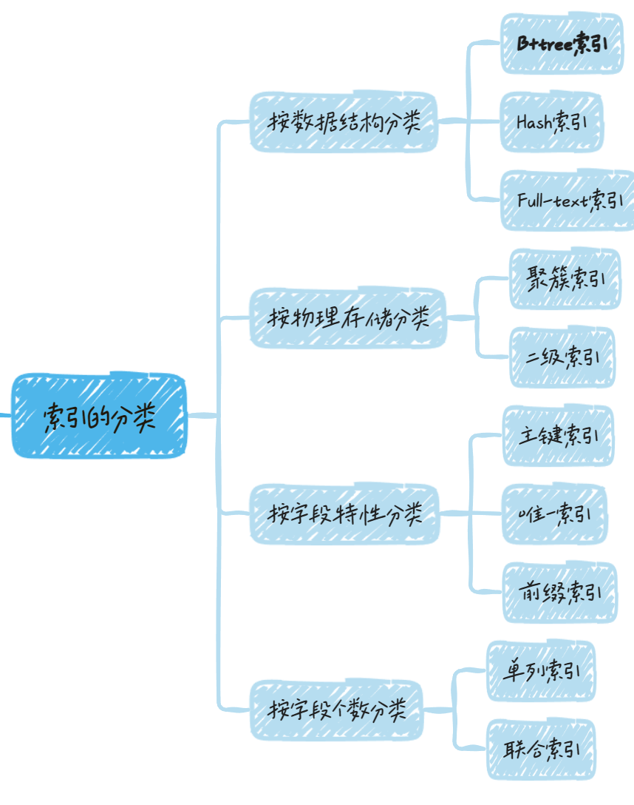
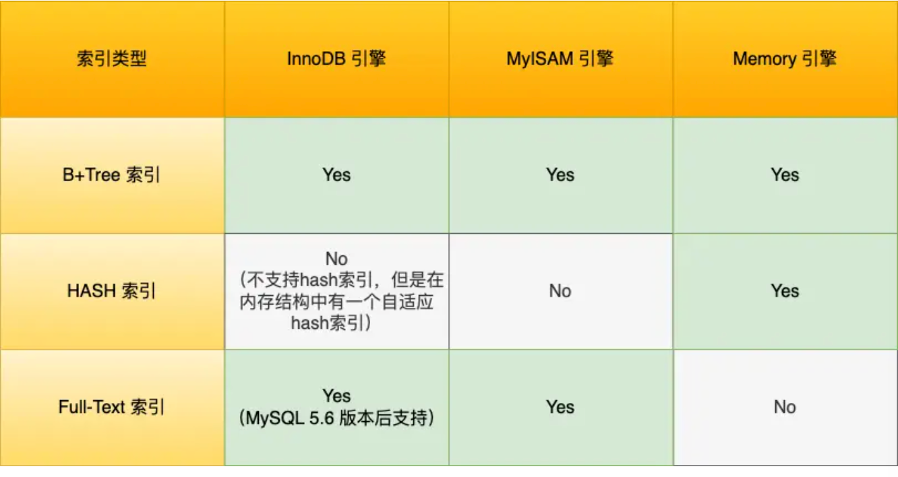

# 数据库索引

## 什么是索引？

**索引的定义就是帮助存储引擎快速获取数据的一种数据结构，形象的说就是索引是数据的目录。**

> 存储引擎，就是如何存储数据、如何为存储的数据建立索引和如何更新、查询数据等技术的实现方法。MySQL的存储引擎有`MyISAM`、`InnoDB`、`Memory`，其中`InnoDB`是在MySQL5.5之后成为默认的存储引擎

索引是一种数据结构，用于快速定位关键字对应的记录，类比字典中的目录索引，`通过索引可以快速定位到所需要的内容`

在数据库中，索引通常用于数据的查找、排序、分组和连接等操作，减少数据库扫描数据的次数，从而提高数据库的查询效率

## 索引分类

### 存储结构角度分类

#### B-Tree索引

是MySQL默认的索引类型，适用于全键值、键值范围查找和排序查询，可以支持多种查询方式，B-Tree索引`按照节点的数量和层级关系构建索引`，每个节点存储多个键值，包括叶子节点和非叶子节点

#### Hash索引

适用于等值查询，不支持范围查询和排序操作。Hash索引是通过`哈希函数计算索引列值的散列值`，将散列值映射到索引表中的一个地址上，因此`哈希索引查询速度快，但只适用于精确匹配查询`。MySQL中只有Memory存储引擎支持Hash索引。

## 参考

[https://www.tizi365.com/question/3047.html](https://www.tizi365.com/question/3047.html)

[https://xiaolincoding.com/mysql/index/index_interview.html#%E4%BB%80%E4%B9%88%E6%98%AF%E7%B4%A2%E5%BC%95](https://xiaolincoding.com/mysql/index/index_interview.html#%E4%BB%80%E4%B9%88%E6%98%AF%E7%B4%A2%E5%BC%95)