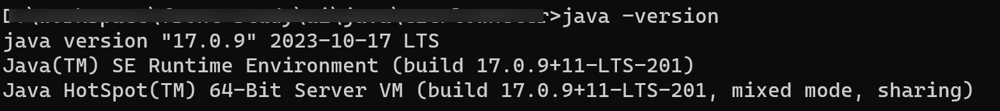
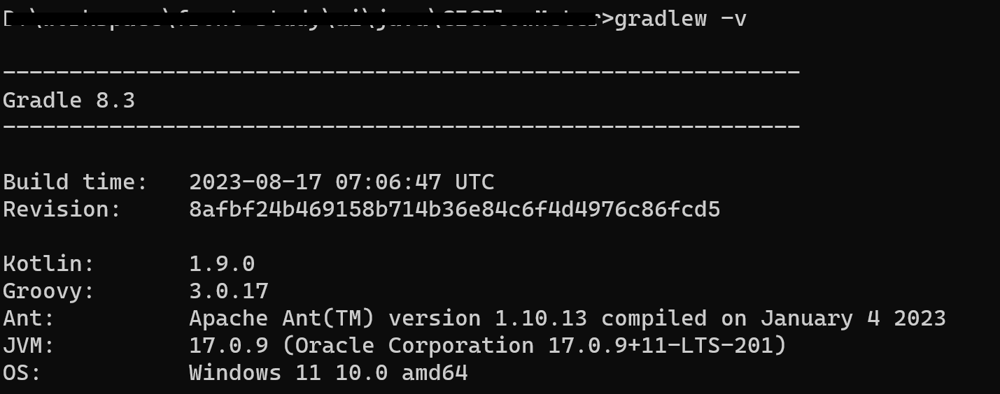
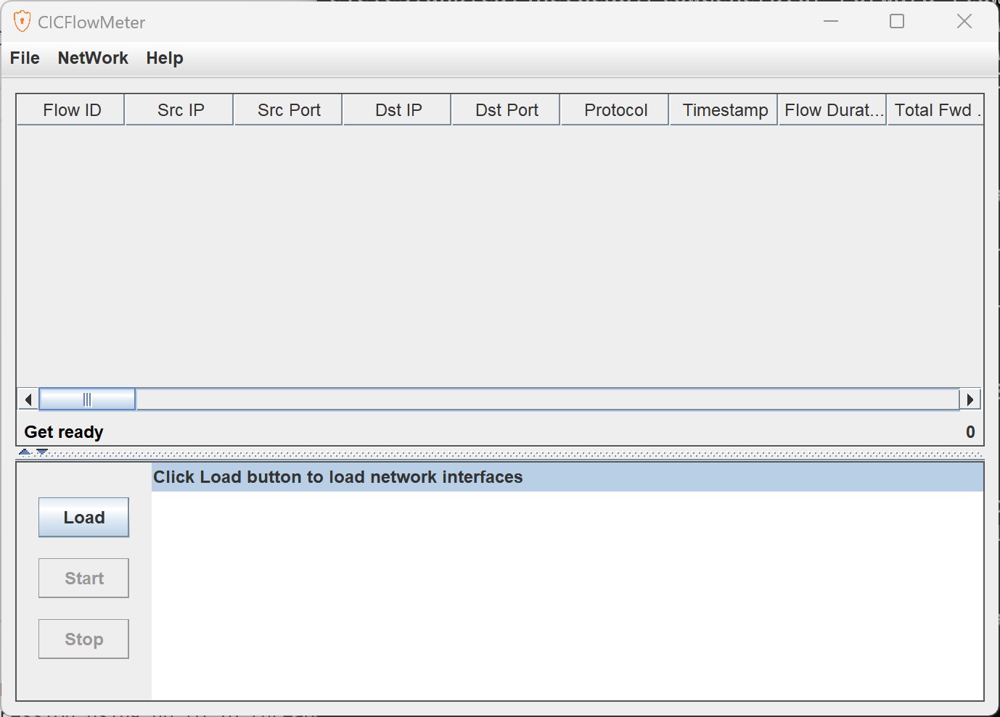
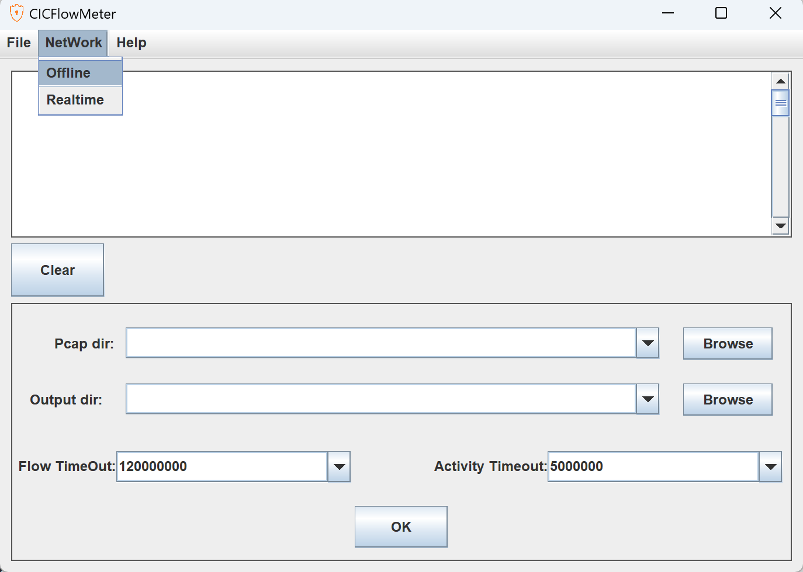

# CICFlowMeter使用

> Java版本的编译运行过程记录，附更改过后的build.gradle

## 整体流程

1、代码下载

```sh
git clone https://github.com/ahlashkari/CICFlowMeter.git
```

2、IDEA 打开所在目录

- 使用代码提示的方式，控制台进入`project/jnetpcap/win/jnetpcap-1.4.r1425`目录，运行对用指令

```sh
mvn install:install-file -Dfile=jnetpcap.jar -DgroupId=org.jnetpcap -DartifactId=jnetpcap -Dversion=1.4.1 -Dpackaging=jar
```

> 此处我遇到的问题是我的环境未安装maven，所以直接去mavn官网下载maven并配置环境变量

> maven下载地址：[https://maven.apache.org/download.cgi](https://maven.apache.org/download.cgi)

> 然后配置bin目录到系统环境变量中

最后就可以执行上述命令

3、运行`gradlew execute`

> 此处的问题是gradle版本低，不适配我的Java版本，以及build.gradle文件里的内容不兼容新版本

> 首先修改 `gradle-wrapper.properties`：

```
distributionUrl=https\://services.gradle.org/distributions/gradle-7.5-all.zip
```

> 接着，下载新版本gradle，下载地址：[https://gradle.org/releases/](https://gradle.org/releases/)

> 同样，配置gradle的系统环境变量

> 然后，将build.gradle文件中的内容改为如下：

```
apply plugin: 'java'
apply plugin: 'maven-publish'
apply plugin: 'application'

group = 'cic.unb.ca'
version = '4.0'
description = """CICFlowMeterV4"""

sourceCompatibility = 1.8
targetCompatibility = 1.8

repositories {
    mavenLocal()
    mavenCentral()
    maven { url "https://clojars.org/repo" }
}

dependencies {
    implementation group: 'org.apache.logging.log4j', name: 'log4j-core', version: '2.11.0'
    implementation group: 'org.slf4j', name: 'slf4j-log4j12', version: '1.7.25'
    implementation group: 'org.jnetpcap', name: 'jnetpcap', version: '1.4.1'
    implementation group: 'junit', name: 'junit', version: '4.12'
    implementation group: 'org.apache.commons', name: 'commons-lang3', version: '3.6'
    implementation group: 'org.apache.commons', name: 'commons-math3', version: '3.5'
    implementation group: 'commons-io', name: 'commons-io', version: '2.5'
    implementation group: 'nz.ac.waikato.cms.weka', name: 'weka-stable', version: '3.6.14'
    implementation group: 'org.jfree', name: 'jfreechart', version: '1.5.0'
    implementation group: 'com.google.guava', name: 'guava', version: '23.6-jre'
    implementation group: 'org.apache.tika', name: 'tika-core', version: '1.17'
}

sourceSets {
    main {
        java {
            srcDir 'src'
            exclude '**/CICFlowMeter.java'
        }
    }
}

task zipSrc(type: Zip) {
    archiveBaseName.set("${applicationName}-Source")
    destinationDirectory.set(file('build/')) // 替换 destinationDir
    from('.') {
        include '**/'
        exclude '.gradle/', 'build/', 'bin/', 'logs/', '*.iml', '*.ipr', '*.iws', '.idea/', 'out/', 'data/'
        into "${applicationName}V${version}-Src"
    }
}

task zipPro(type: Zip) {
    doFirst {
        DirectoryScanner.defaultExcludes.each { DirectoryScanner.removeDefaultExclude it }
    }

    doLast {
        DirectoryScanner.resetDefaultExcludes()
    }

    archiveBaseName.set("${applicationName}-Full")
    destinationDirectory.set(file('build/')) // 替换 destinationDir
    from('.') {
        include '**/'
        exclude '.gradle/', 'build/', 'bin/', 'logs/', '*.iml', '*.ipr', '*.iws', '.idea/', 'out/', 'data/', ".git/"
        into "${applicationName}V${version}"
    }
}

task fatJar(type: Jar) {
    println 'type Jar'

    manifest {
        attributes 'Premain-Class': 'swing.common.ObjectSizeFetcher',
                'Can-Retransform-Classes': true,
                'Implementation-Title': 'Gradle Jar File Example',
                'Implementation-Version': version,
                'Main-Class': 'cic.cs.unb.ca.ifm.App'
    }

    archiveBaseName.set("NetWorkTraffic-all")
    from { configurations.runtimeClasspath.collect { it.isDirectory() ? it : zipTree(it) } }
    with jar
}

task execute(type: JavaExec) {
    println 'type JavaExec'

    main = "cic.cs.unb.ca.ifm.App"
    classpath = sourceSets.main.runtimeClasspath
    String osName = System.getProperty('os.name').toLowerCase()
    if (osName.contains('windows')) {
        jvmArgs '-Djava.library.path=jnetpcap/win/jnetpcap-1.4.r1425'
    } else {
        jvmArgs '-Djava.library.path=jnetpcap/linux/jnetpcap-1.4.r1425'
    }
}

task exeCMD(type: JavaExec) {
    main = "cic.cs.unb.ca.ifm.Cmd"
    classpath = sourceSets.main.runtimeClasspath
    String osName = System.getProperty('os.name').toLowerCase()
    if (osName.contains('windows')) {
        jvmArgs '-Djava.library.path=jnetpcap/win/jnetpcap-1.4.r1425'
    } else {
        jvmArgs '-Djava.library.path=jnetpcap/linux/jnetpcap-1.4.r1425'
    }
}

task cmdScript(type: CreateStartScripts) {
    mainClassName = "cic.cs.unb.ca.ifm.Cmd"
    applicationName = "cfm"
    outputDir = new File(project.buildDir, 'scripts')
    classpath = jar.outputs.files + project.configurations.runtimeClasspath
    defaultJvmOpts = ["-Djava.library.path=../lib/native"]
}

applicationDistribution.into("bin") {
    from(cmdScript)
    fileMode = 0755
}

// The Application Plugin
mainClassName = "cic.cs.unb.ca.ifm.App"
applicationName = "CICFlowMeter"
applicationDefaultJvmArgs = ["-Djava.library.path=../lib/native"]

applicationDistribution.from("jnetpcap/linux/jnetpcap-1.4.r1425") {
    include "*.so"
    into('lib/native')
}
applicationDistribution.from("jnetpcap/win/jnetpcap-1.4.r1425") {
    include "*.dll"
    into('lib/native')
}
applicationDistribution.from('LICENSE.txt') {
    into('')
}
applicationDistribution.from('ReadMe.txt') {
    into('')
    rename("ReadMe.txt", "README.md")
}
```

要修改的要素过多，所以直接贴出修改后的版本

我的Java版本如下:



gradle：



最后执行`gradlew execute`即可



修改设置之后，即可导入pcap文件并生成csv文件

