# 黑马程序员day5

## 自定义指令
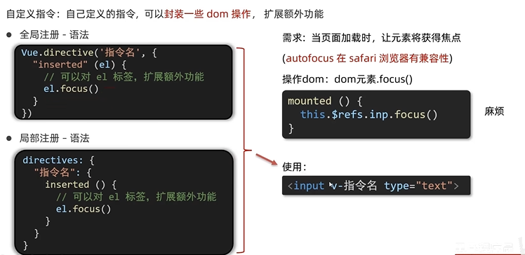

### 指令的值
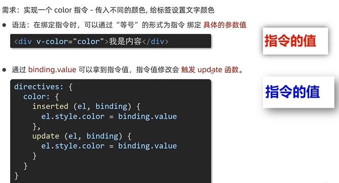

### 自定义指令 v-loading指令封装
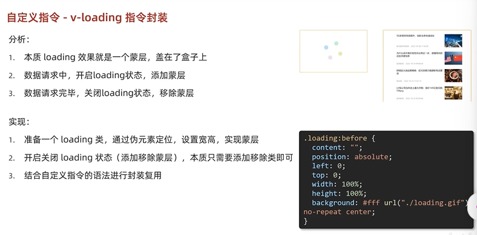

## 插槽 - 默认插槽
作用：让组件内部的一些结构支持自定义

需求：要在页面中显示一个对话框，封装成一个组件

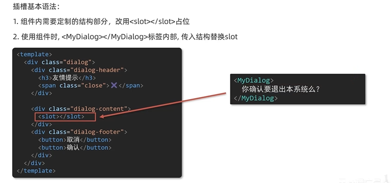

### 插槽 - 后备内容（默认值）

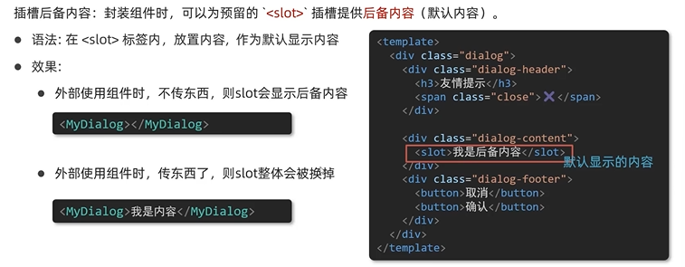

### 插槽 - 具名插槽
默认插槽：一个定制位置

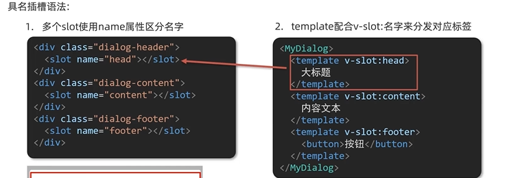

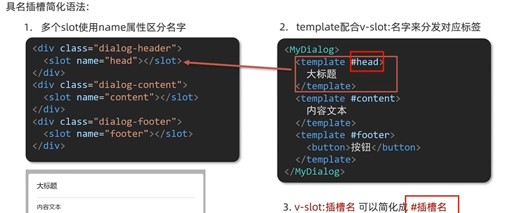

### 插槽 - 作用域插槽

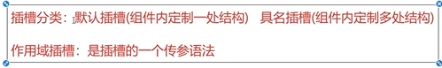

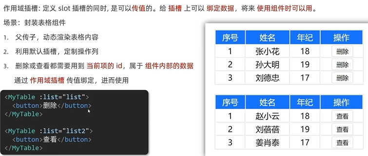

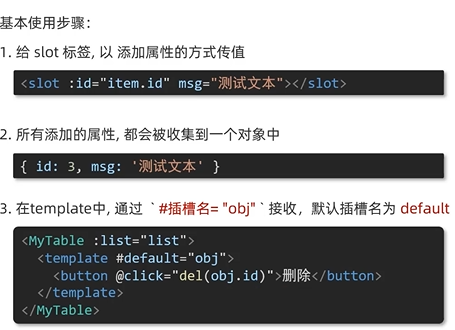

## 单页应用程序：SPA - Single Page Application
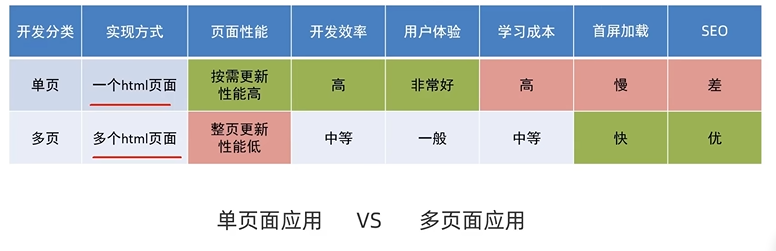

系统类网站/内部网站/文档类网站/移动端站点
：单页面

多页面：公司官网/电商类网站

## 路由
vue中路由：路径和组件的映射关系

### VueRouter
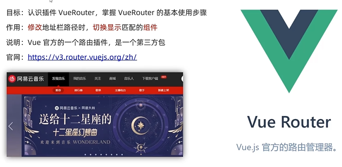

### 使用（5+2）
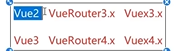

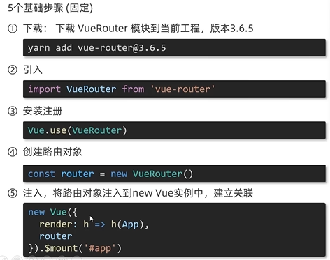

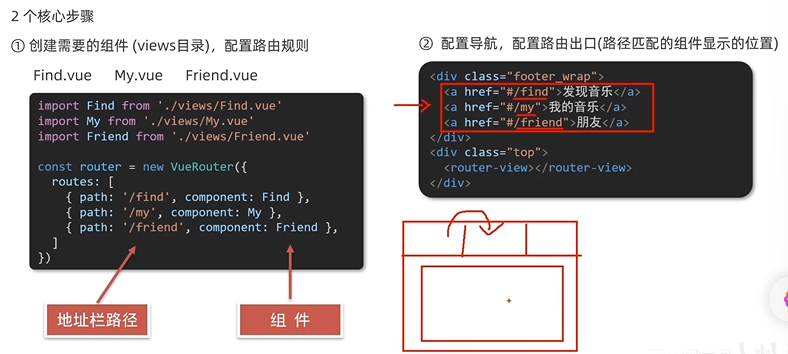

## 组件存放目录问题（组件分类）
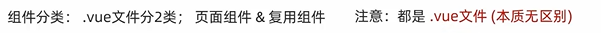

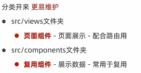
