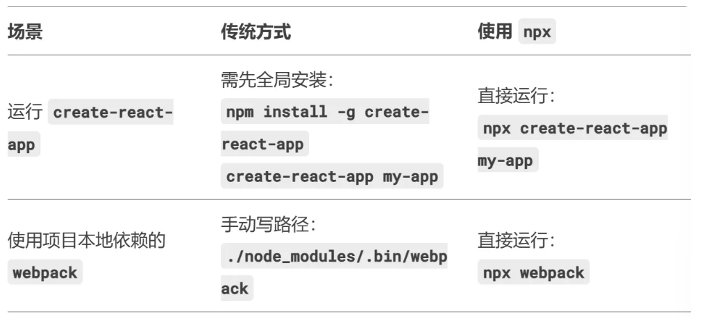

# npx

## 概念

`npx`是`Node.js`自带的包执行工具（随`npm5.2+`版本默认安装），它的核心作用是无需全局安装即可直接运行npm包中的命令

### 与npm的区别

- npm：用于包的安装和管理

- npx：专注于临时执行包的命令，尤其适合一次性使用的工具 

### 核心功能

- 直接运行本地已安装的包（无需配置 `package.json`的`scripts`字段）

```shell
npx eslint # 运行项目本地安装的eslint，无需写完整路径
```

- 临时安装并运行远程包（避免全局安装，减少污染）

```shell
npx create-react-app my-app # 自动下载create-react-app并执行，完成后不保留
```

- 执行不同版本的包

```shell
npx webpack@4.44.1  # 临时使用指定版本的 webpack
```

- 运行项目依赖中的二进制命令

```shell
npx vite  # 即使 vite 未全局安装，只要项目依赖中有即可运行
```

### 典型使用场景

- 脚手架工具：快速初始化项目（如 create-react-app、vite）。

- 一次性命令：比如代码格式化、打包工具等临时任务。

- 避免全局安装：减少全局依赖冲突。

### 工作原理

- 检查命令是否在本地 node_modules/.bin 中存在

    - 若不存在，临时下载包到缓存目录并执行（完成后自动清理）

    - 若存在，直接运行本地版本

### 常见问题

● npx和全局安装的区别

  ○ npx不永久占用磁盘空间，适合临时任务；全局安装（npm install -g）会持久化包

● 缓存位置

  ○ 临时包默认存储在系统缓存目录（可通过npm config get cache查看）

### 总结

