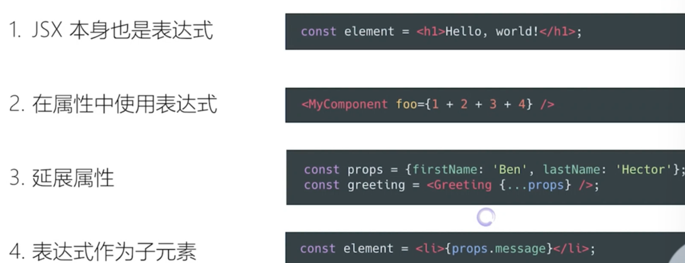
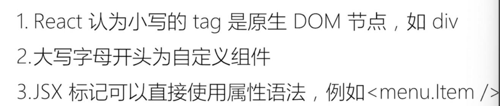
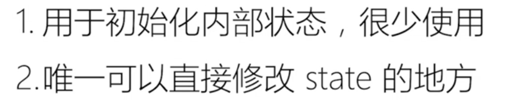
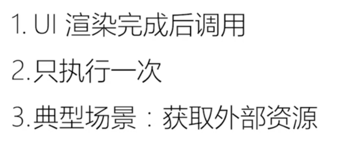
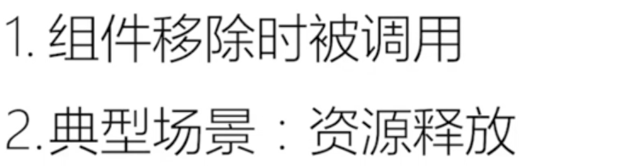
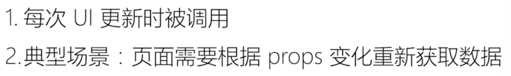
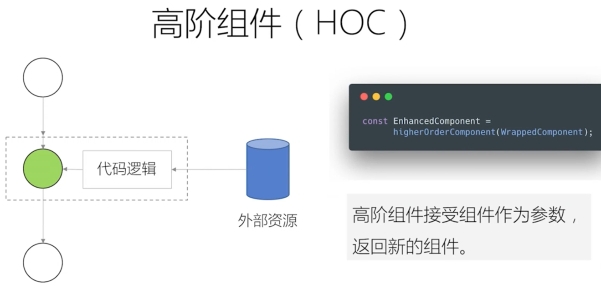

# 知识记录

## Flux架构：单向数据流

衍生项目：Redux、Mobx

## React组件

props + state -> view

外部传的属性加内部维护的状态决定view

单向数据绑定

创建组件遵循的原则：

1、何时创建 -> 单一职责原则：每个组件只做一件事；如果组件变得复杂，应该拆分成小组件；

2、数据状态管理 -> DRY原则：能计算得到的状态不要单独存储；组件尽量无状态，所需数据通过props获取；

## JSX
在JavaScript代码中直接写HTML标记

本质：动态创建组件的语法糖

优点：

约定：自定义组件以大写字母开头

## 生命周期

### constructor

### getDerivedStateFromProps

### componentDidMount

### componentWillUnmount1

### getSnapshotBeforeUpdate

### componentDidUpdate

### shouldComponentUpdate

## Virtual DOM及key属性
虚拟DOM的两个假设：

## 组件设计模式
组件复用的另外两种形式：高阶组件和函数作为子组件

