# 黑马程序员day1

## 介绍

## 开发环境

渲染：App->index.js->public/index.html(root)

## JSX基础

### 高频场景

### 列表渲染实例

### 条件渲染实例

### 复杂条件渲染实例

## 事件绑定

### 传递e

### 传自定义参

### 同时传递事件对象和自定义参数

## react中的组件

### 组件是什么

### react组件

## useState

### 修改状态的规则

### 修改对象状态

## 组件样式处理

:::tip
[loadash](https://lodash.com/docs/)：封装了很多方法的库

:::

## classnames优化类名控制

## 受控表单绑定

## react获取dom

### uuid

### dayjs

## 组件通信

组件通信就是组件之间的数据传递，根据组件嵌套关系的不同，有不同的通信方法

### 父传子

### 父传子 - props说明

### 父传子 - 特殊的prop children

### 子传父

### 使用状态提升实现兄弟组件通信

### 使用context机制跨层级组件通信
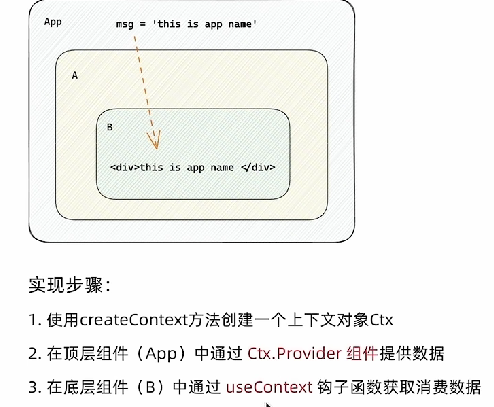

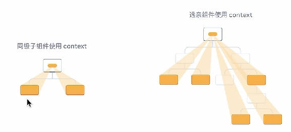

## useEffect
useEffect 是一个React Hook函数，用于在react组件中创建不是由事件引起而是由渲染本身引起的操作，比如发送AJAX请求，更改DOM等等

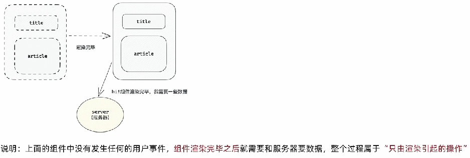

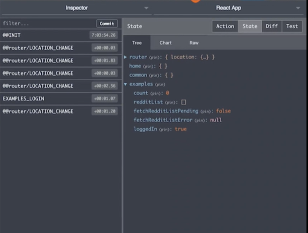

### useEffect依赖项参数说明
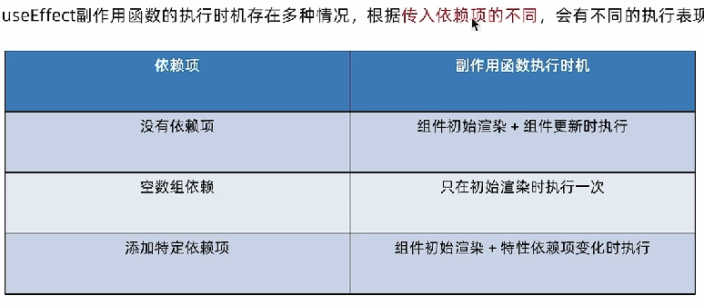

### 清除副作用
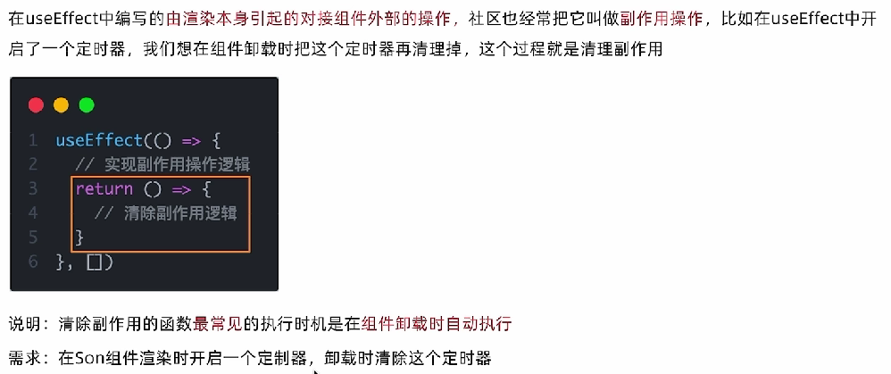

## 自定义Hook函数
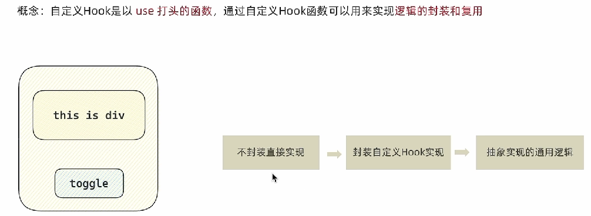

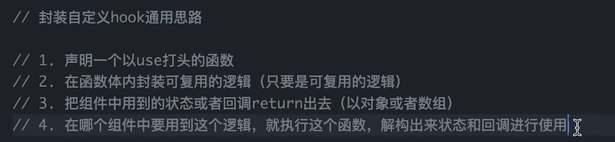

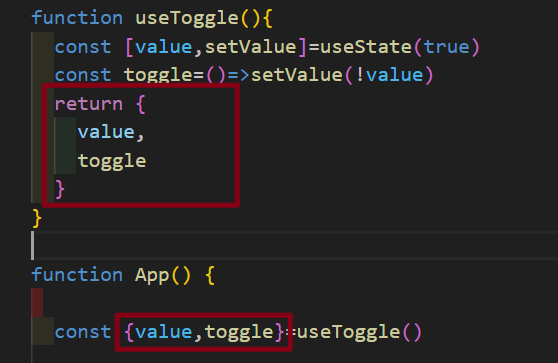

## React Hooks使用规则

## Redux

Redux是react最常用的集中状态管理工具，类似于Vue中的Pinia(Vuex)，可以独立于框架运行

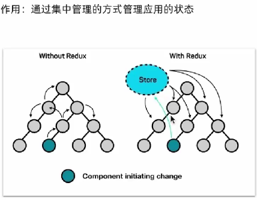

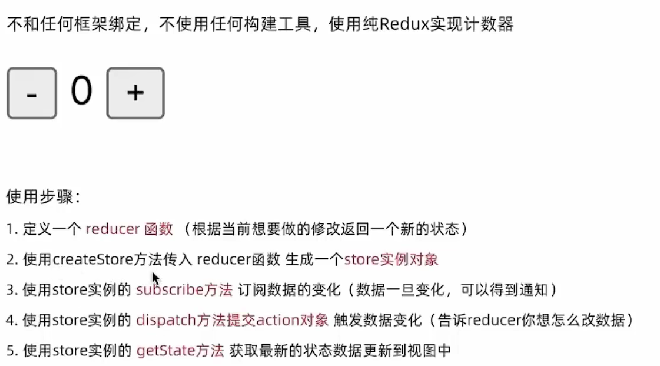

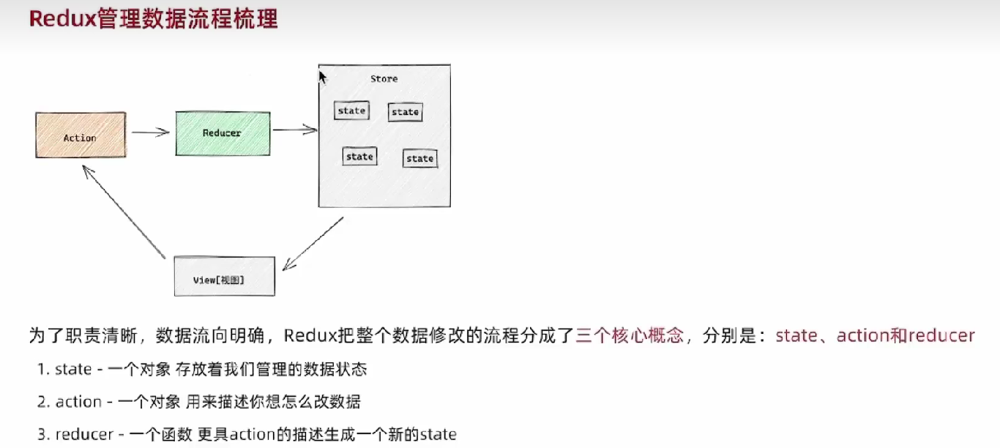

### redux和react - 环境搭建
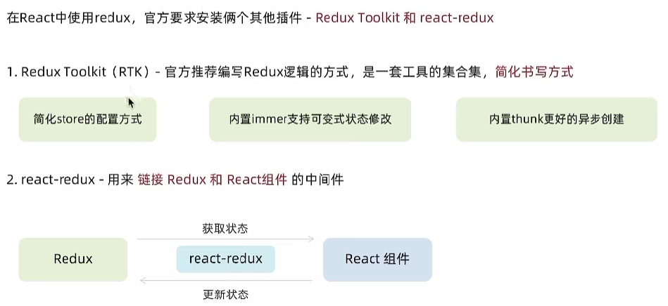

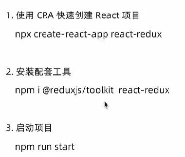

### 目录结构
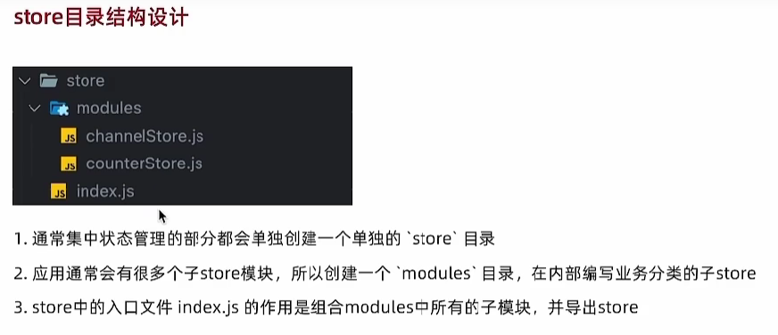

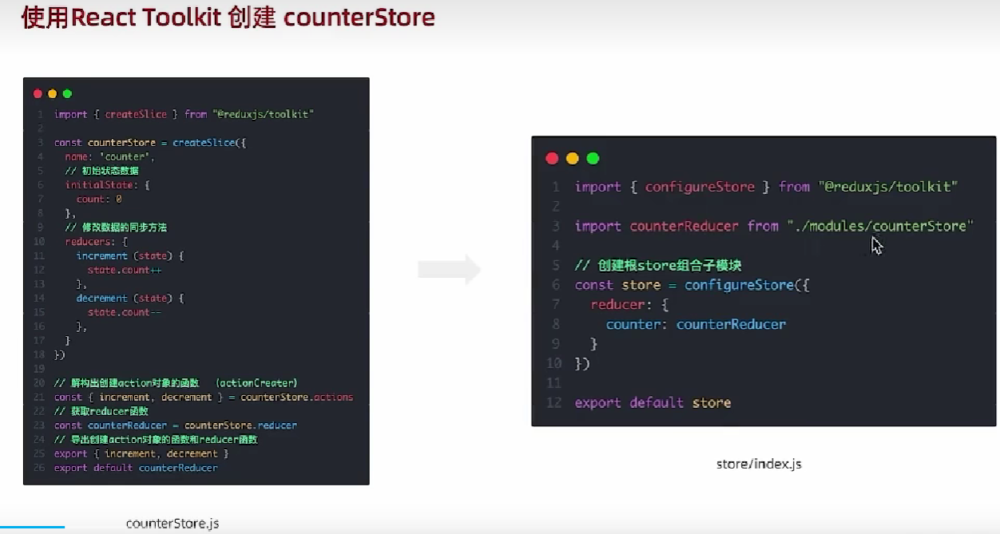

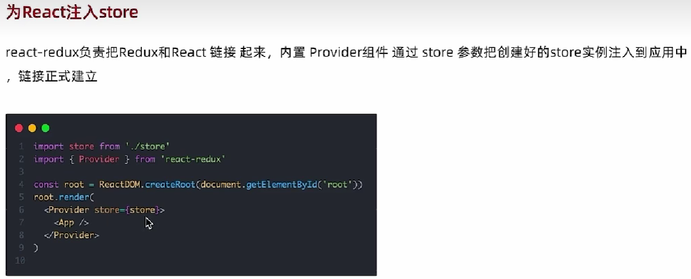

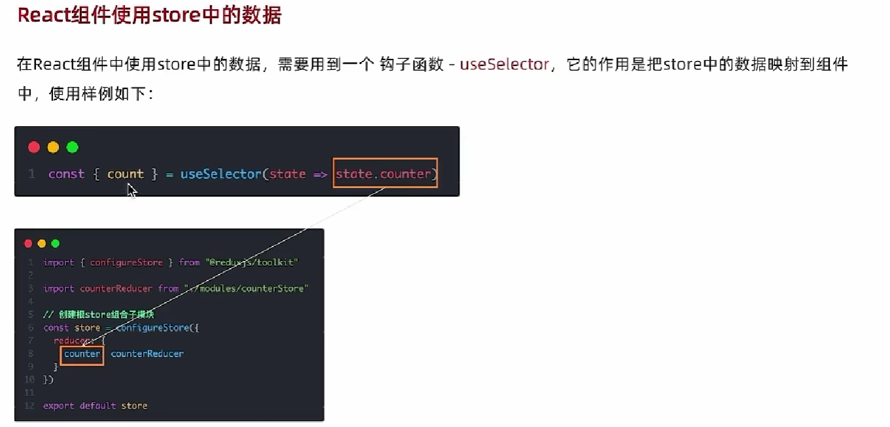

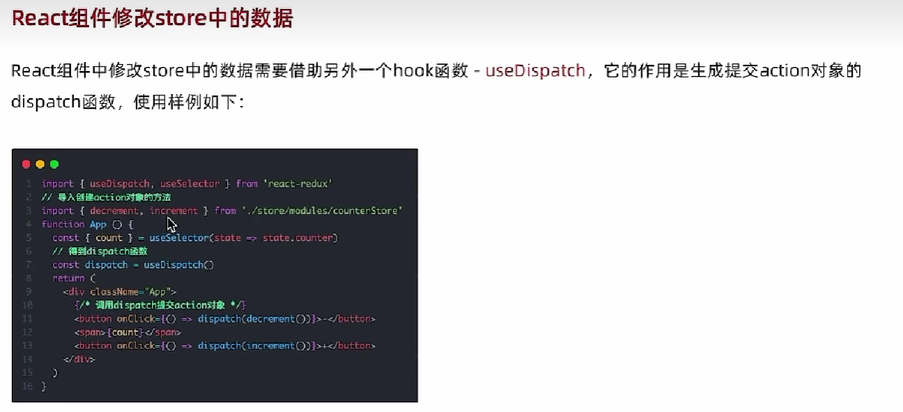

### action传参
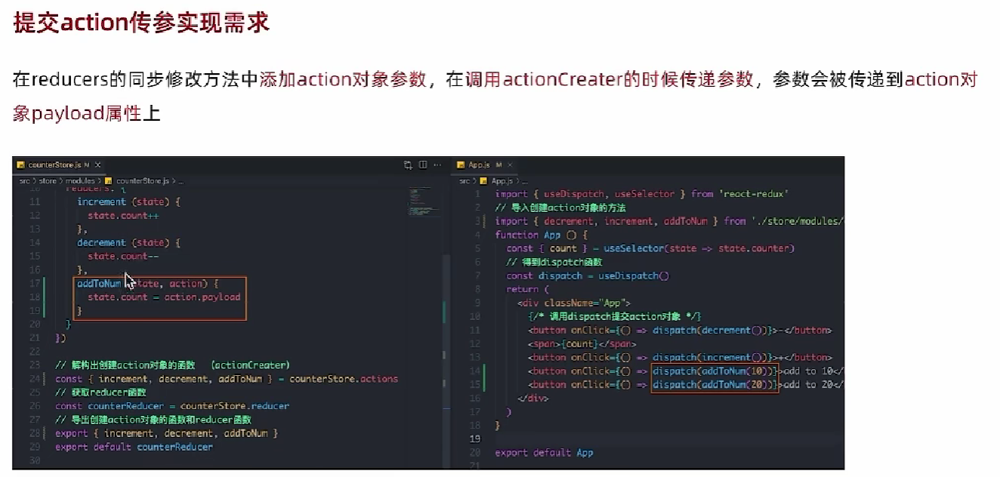

### 异步状态操作
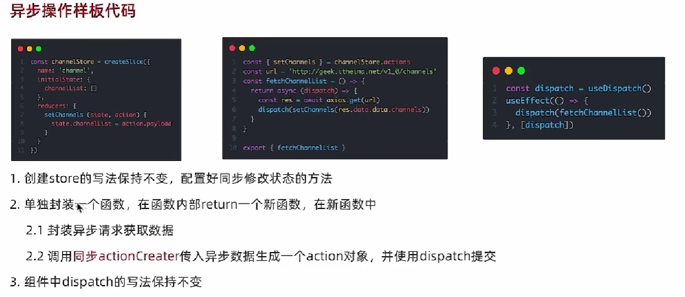

## react devtools
浏览器插件
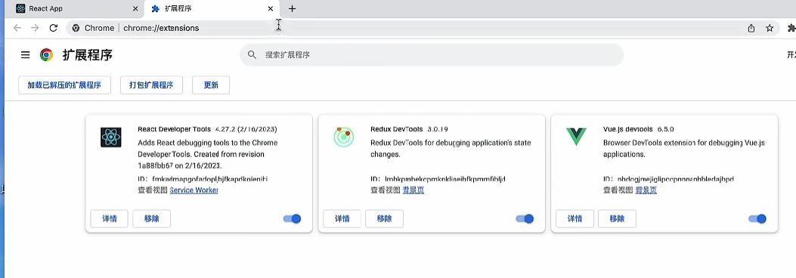

