# 黑马程序员day1
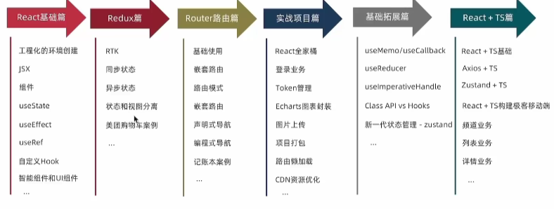

## 介绍
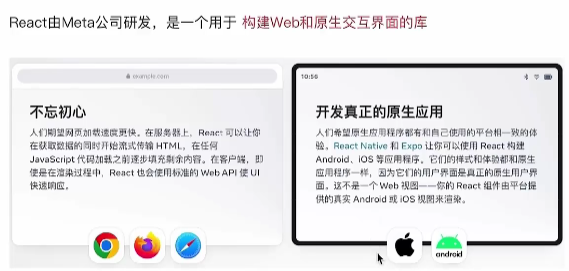
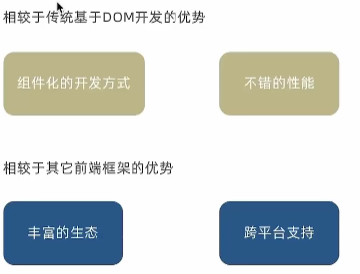

## 开发环境
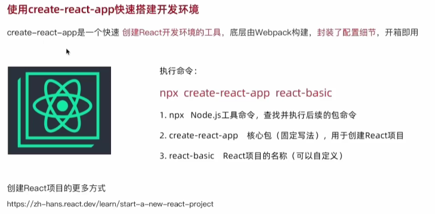

渲染：App->index.js->public/index.html(root)

## JSX基础
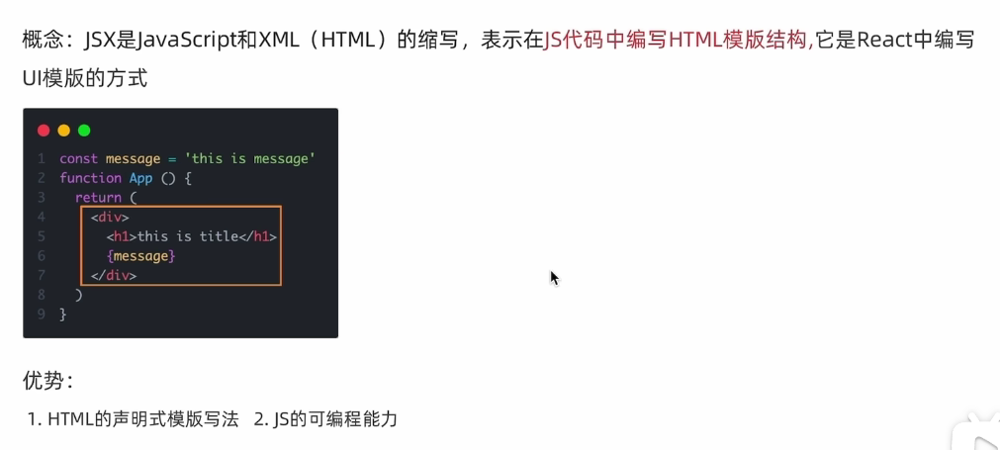

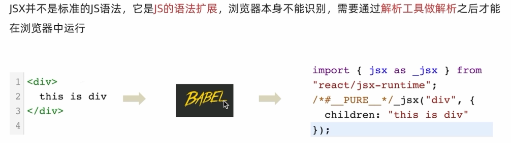

### 高频场景
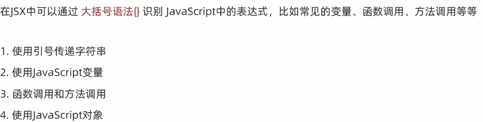

### 列表渲染实例
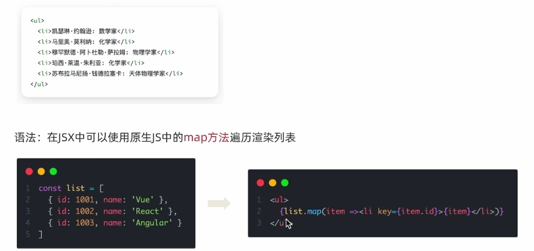

### 条件渲染实例
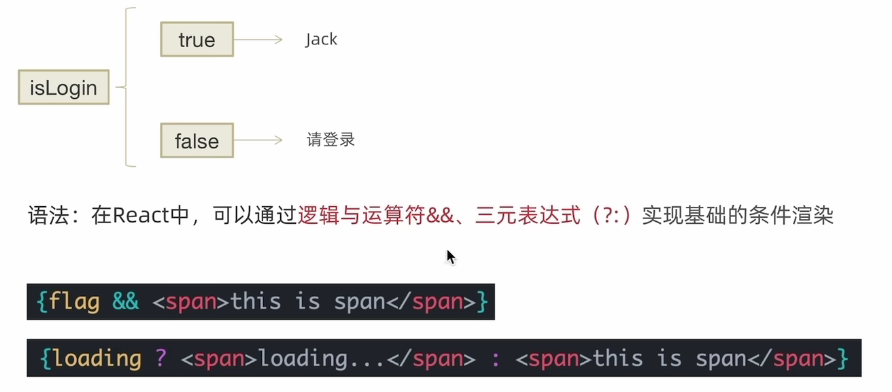

### 复杂条件渲染实例
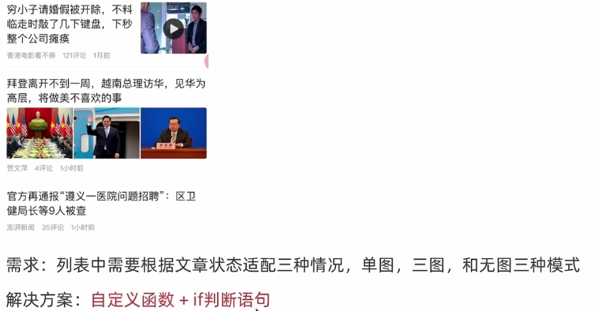

## 事件绑定
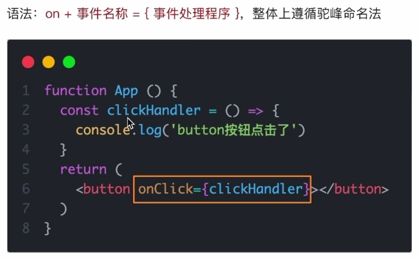

### 传递e
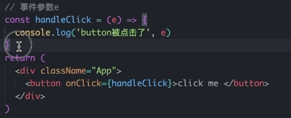

### 传自定义参
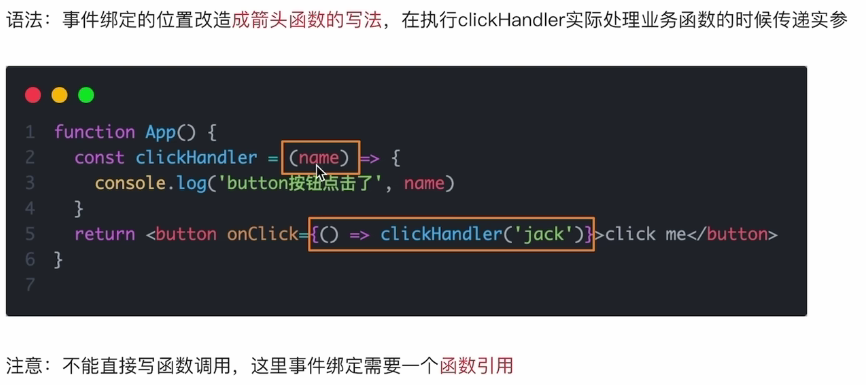

### 同时传递事件对象和自定义参数
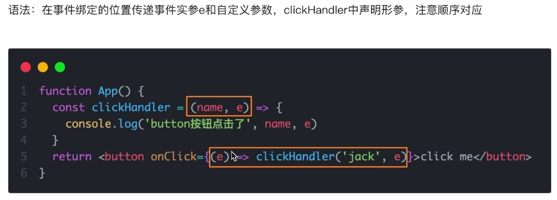

## react中的组件

### 组件是什么
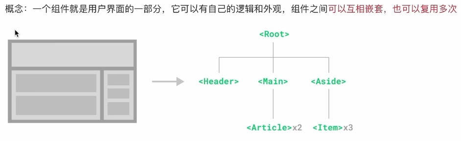

### react组件
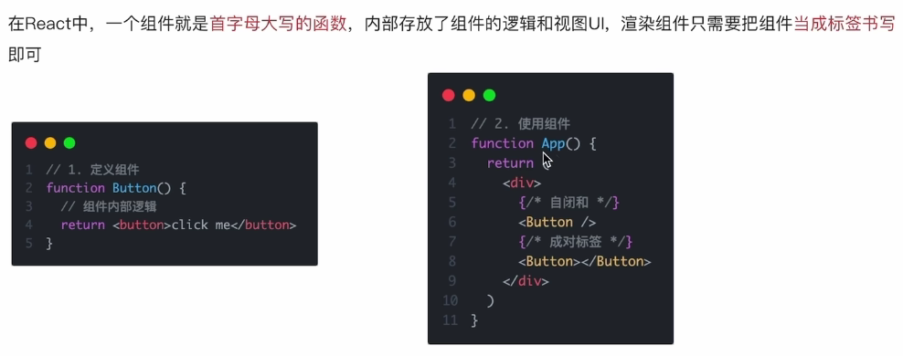

## useState
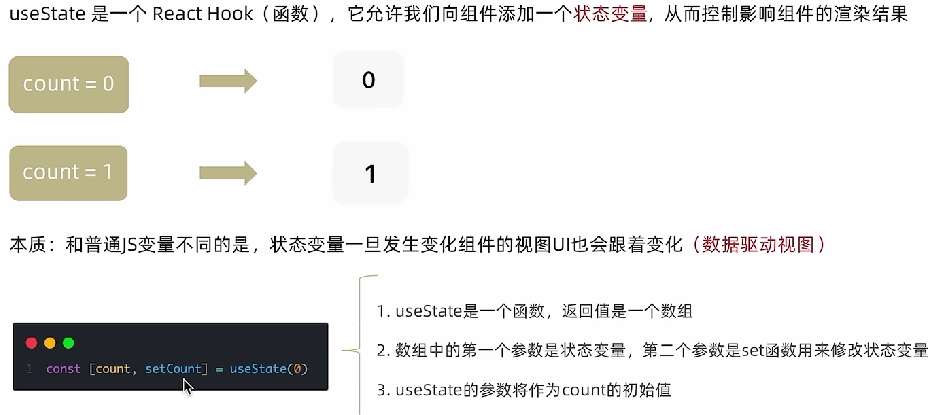

### 修改状态的规则

### 修改对象状态
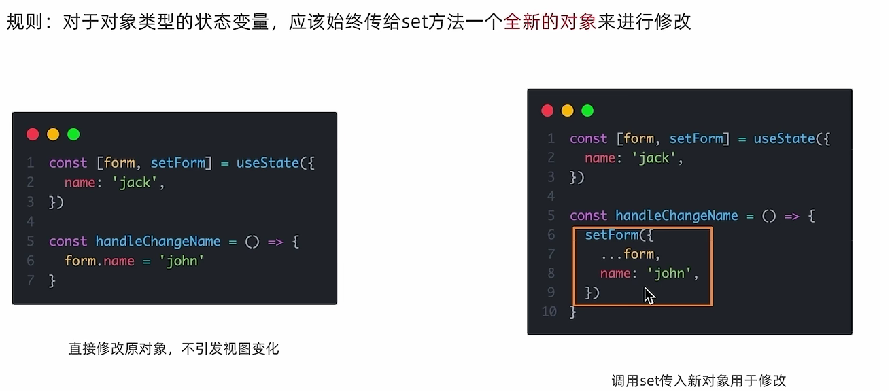

## 组件样式处理
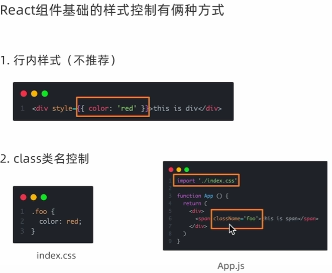

:::tip
[loadash](https://lodash.com/docs/)：封装了很多方法的库
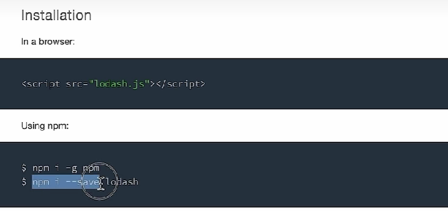
:::

## classnames优化类名控制
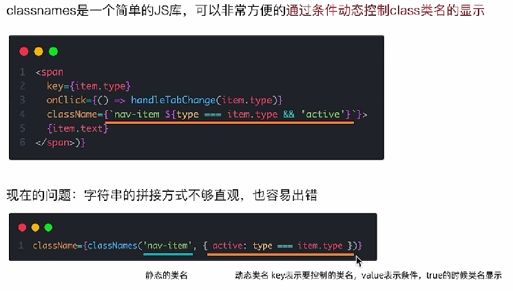
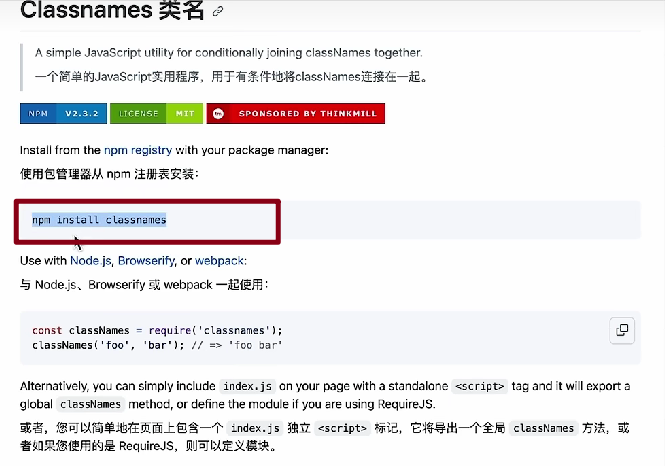

## 受控表单绑定
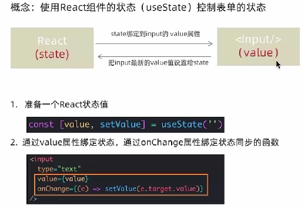

## react获取dom
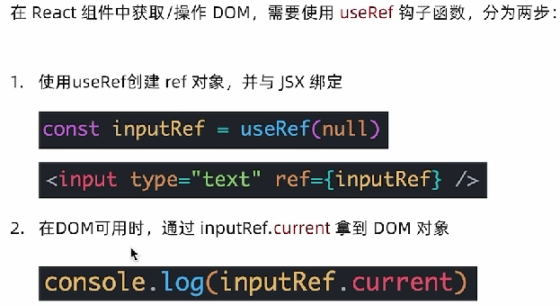

### uuid
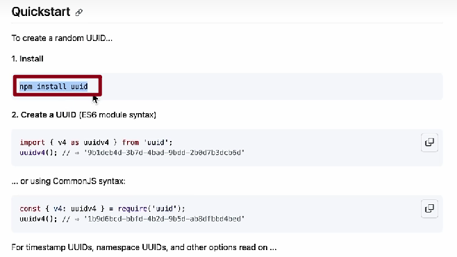

### dayjs
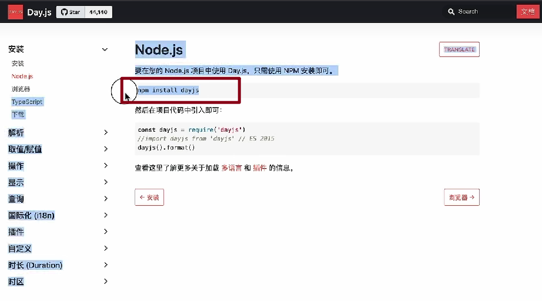

## 组件通信

组件通信就是组件之间的数据传递，根据组件嵌套关系的不同，有不同的通信方法

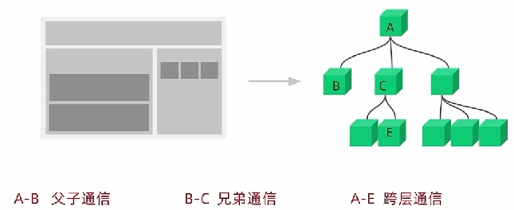

### 父传子
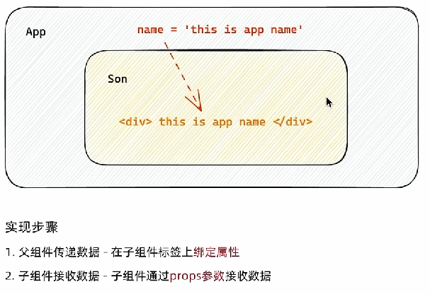

### 父传子 - props说明
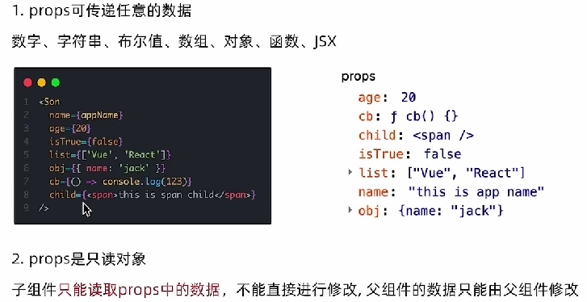

### 父传子 - 特殊的prop children

### 子传父
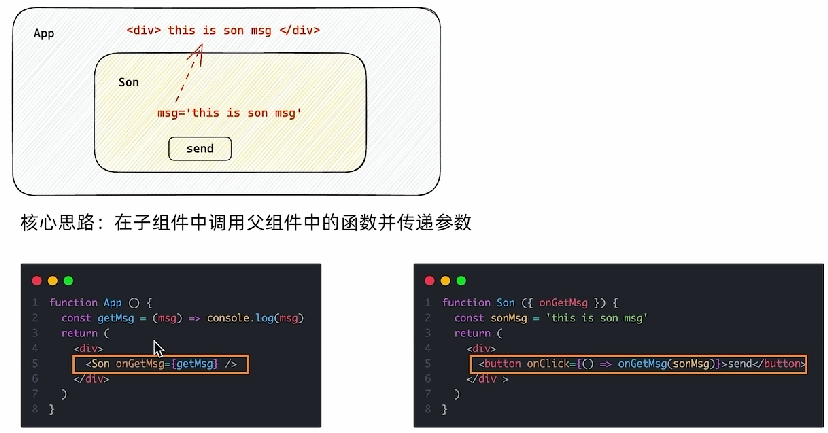

### 使用状态提升实现兄弟组件通信
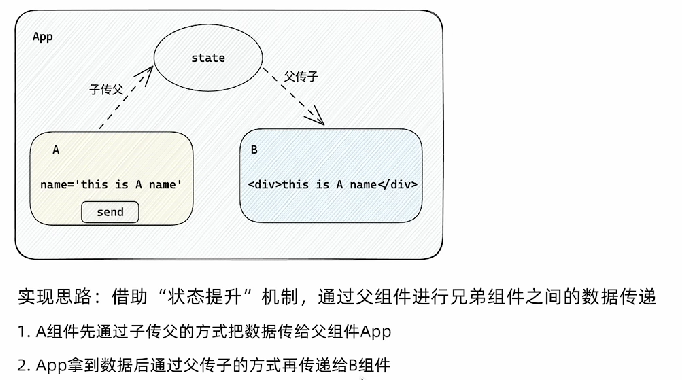

### 使用context机制跨层级组件通信

## useEffect
useEffect 是一个React Hook函数，用于在react组件中创建不是由事件引起而是由渲染本身引起的操作，比如发送AJAX请求，更改DOM等等

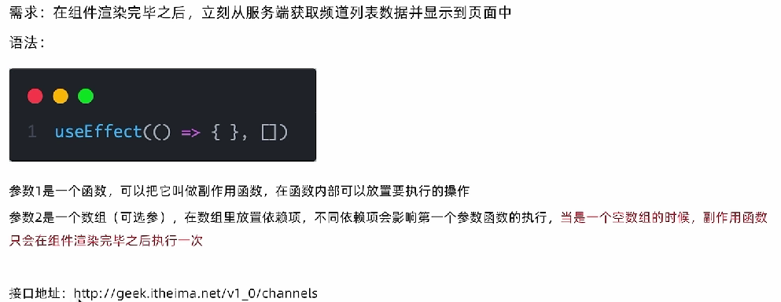

### useEffect依赖项参数说明

### 清除副作用

## 自定义Hook函数

## React Hooks使用规则

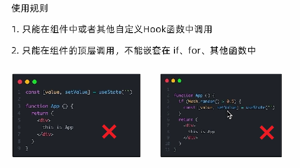

## Redux

Redux是react最常用的集中状态管理工具，类似于Vue中的Pinia(Vuex)，可以独立于框架运行

### redux和react - 环境搭建

### 目录结构

### action传参

### 异步状态操作

## react devtools
浏览器插件

