# 黑马程序员day2

## ReactRouter

### 什么是前端路由
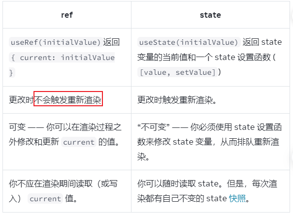

### 创建路由开发环境
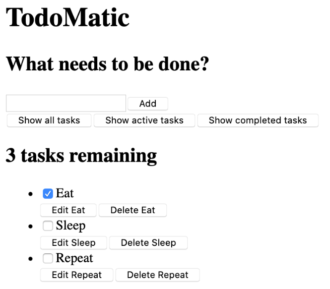

### 抽象路由模块


### 路由导航

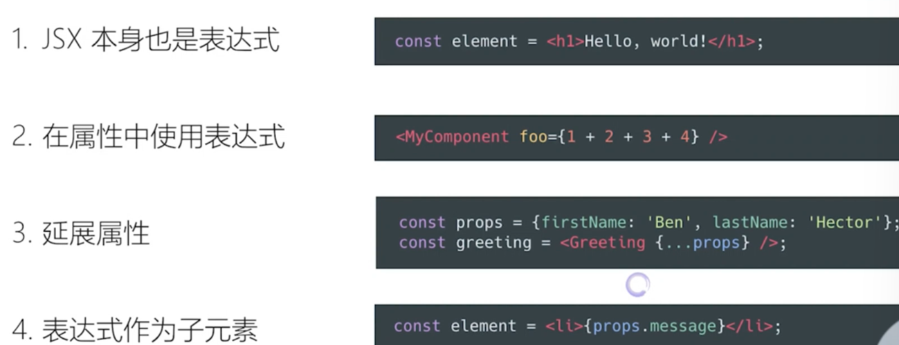

#### 声明式导航
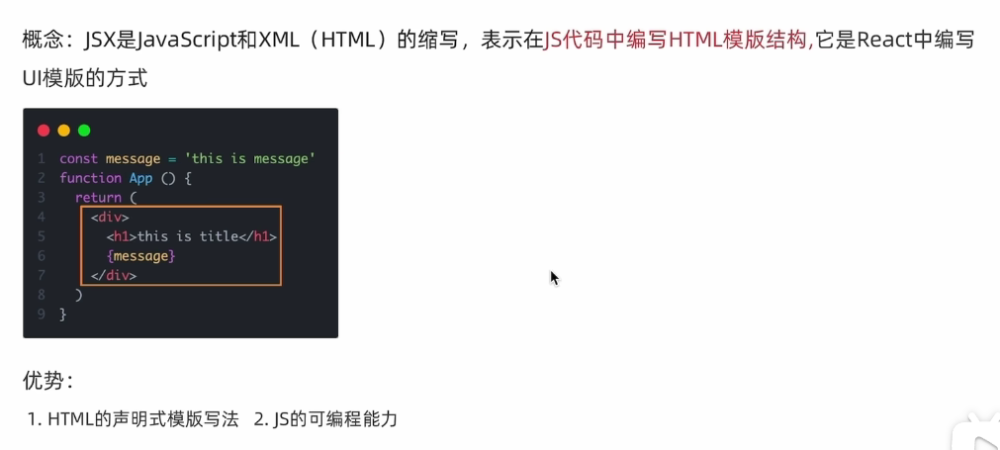

#### 编程式导航
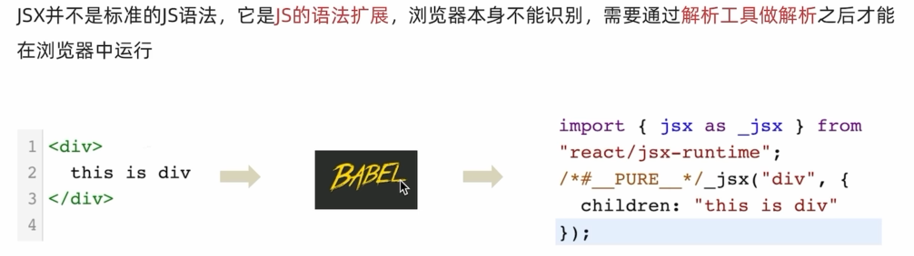

### 路由导航传参
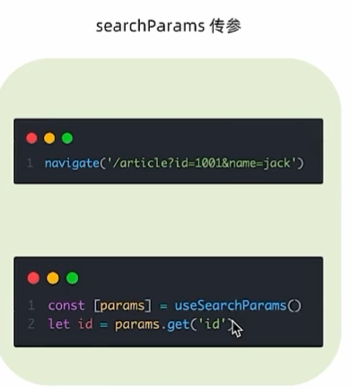
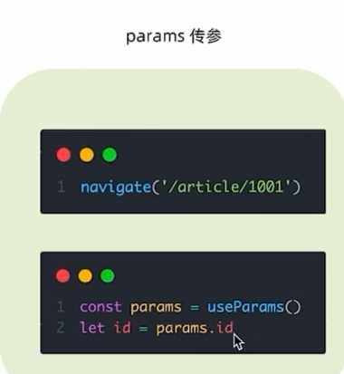

### 嵌套路由配置


### 默认二级路由
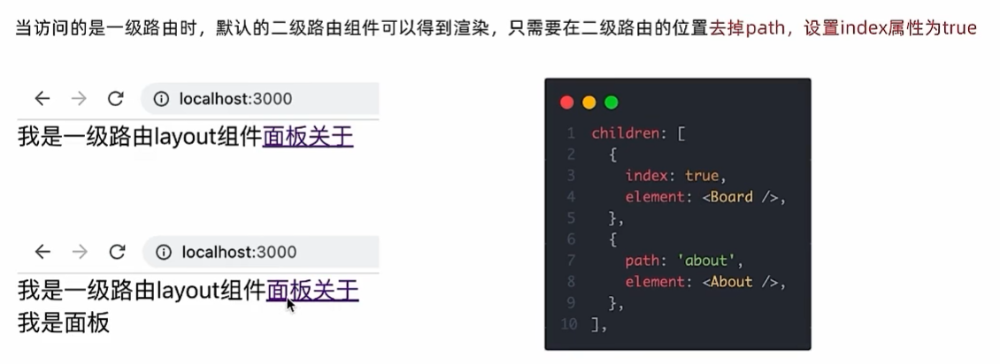

### 404路由配置
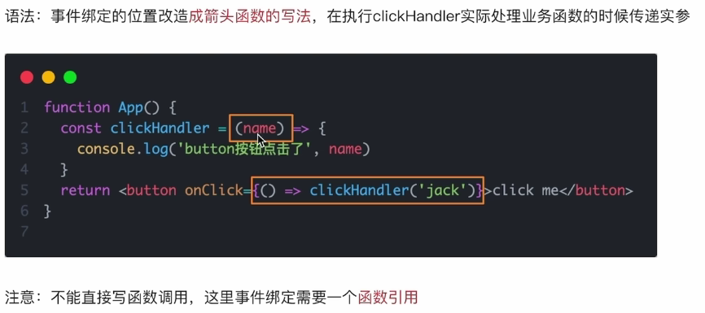

### 两种路由模式
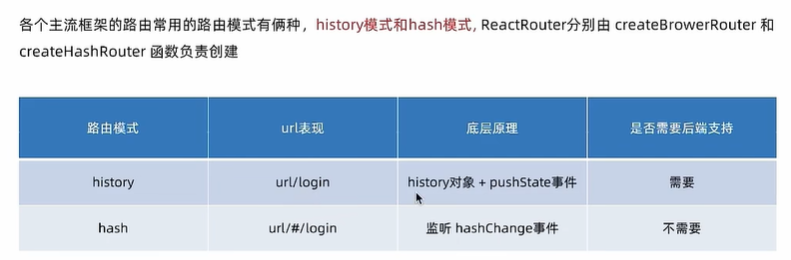

## 案例
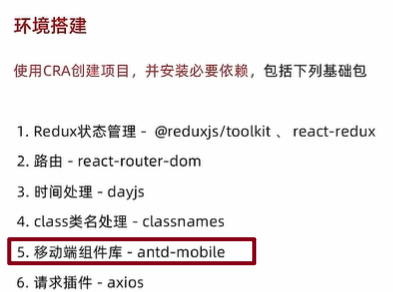

### 别名路径配置
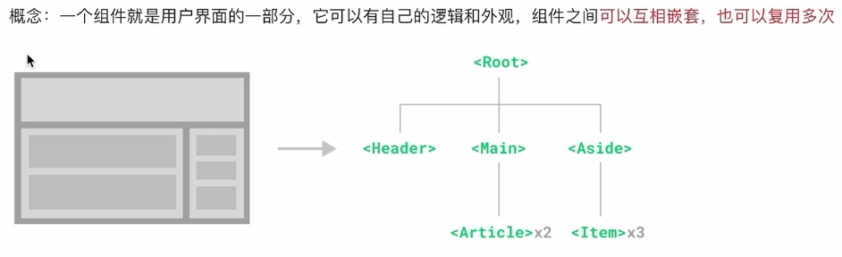

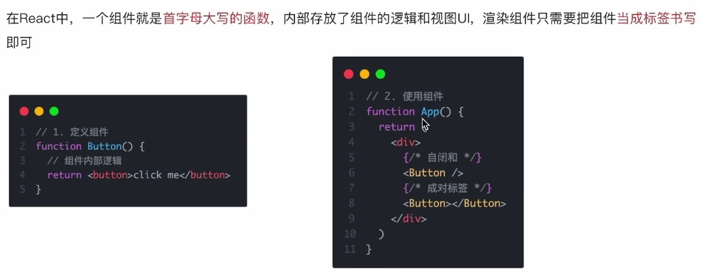

### 联想路径配置
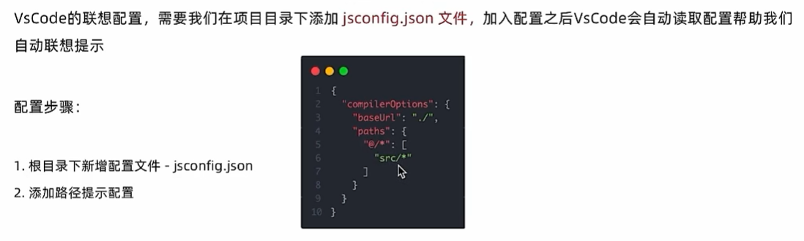

### 数据Mock
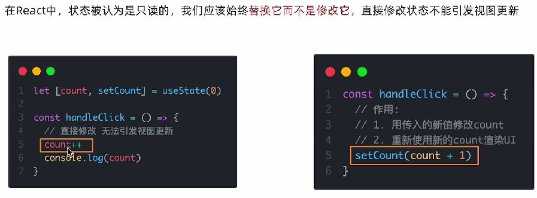

#### json-server实现数据Mock
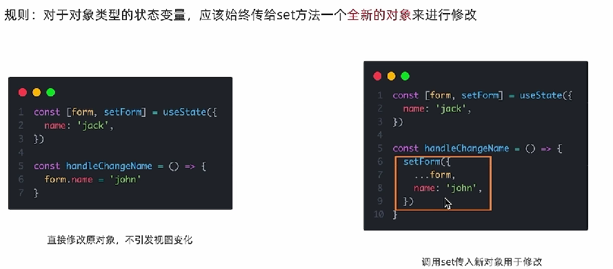

### antD-mobile主题定制
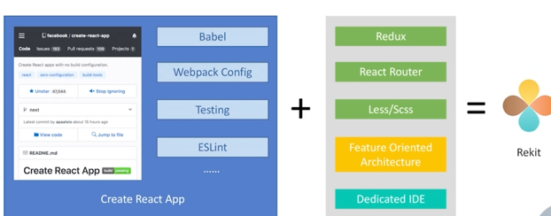

## 使用CRA初始化项目环境
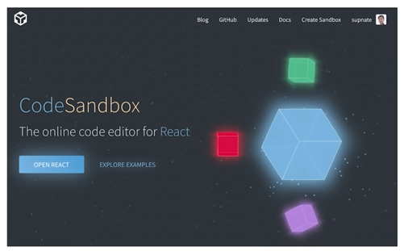

### 安装scss
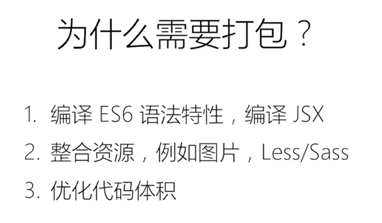
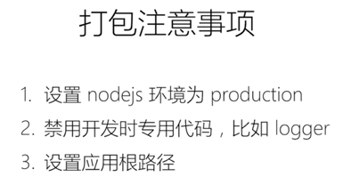

### 安装Ant Design组件库
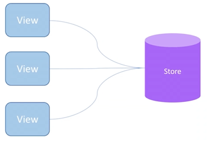

看官方文档即可
```
npm install antd --save
```

### 配置基础路由router


### 配置@别名路径
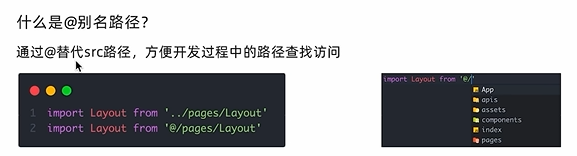
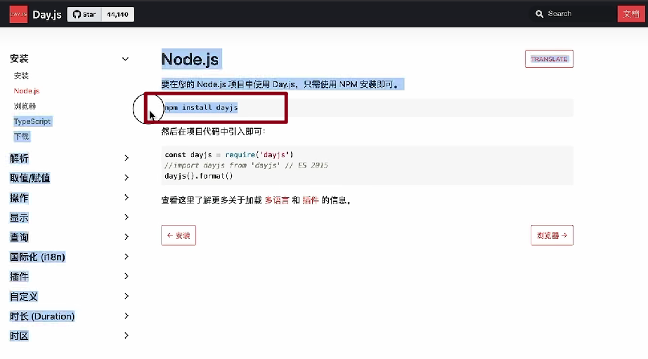
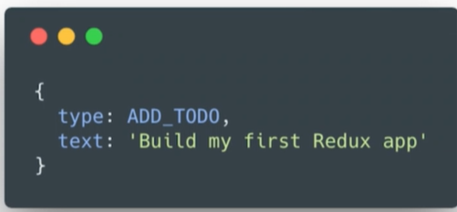

### 使用gitee管理项目


### Axios请求拦截器注入Token
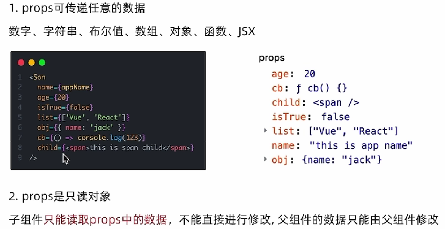

### 使用Token做路由权限控制
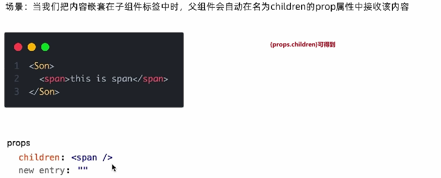
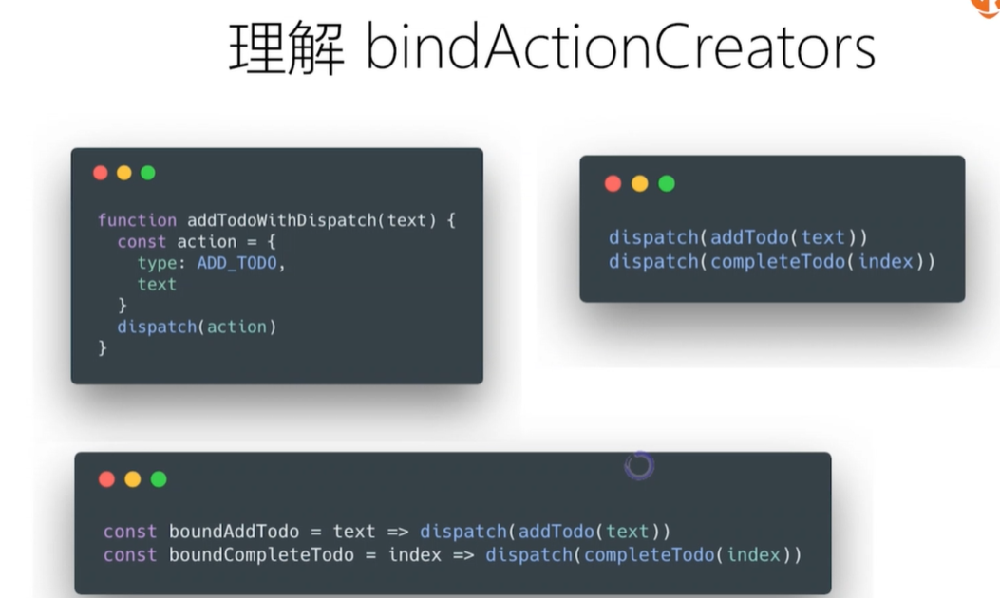
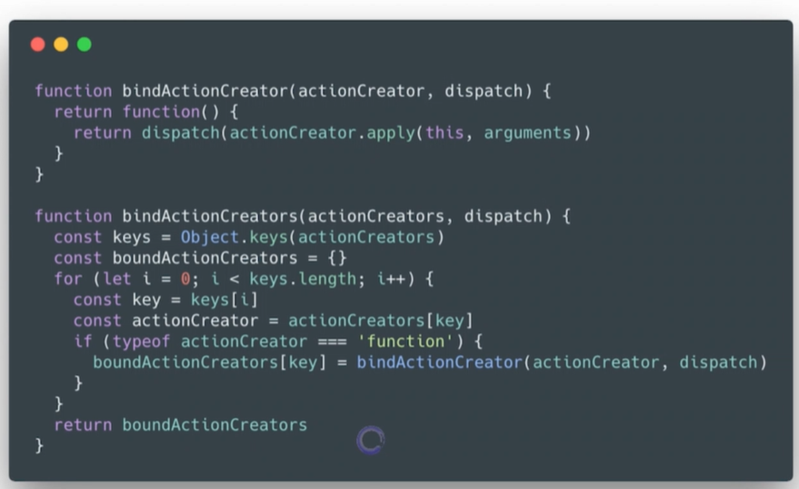


