# 黑马程序员day2

## ReactRouter

### 什么是前端路由
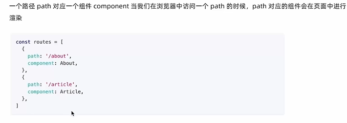

### 创建路由开发环境
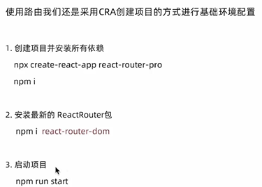

### 抽象路由模块
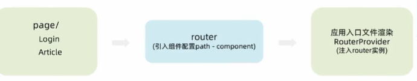

### 路由导航

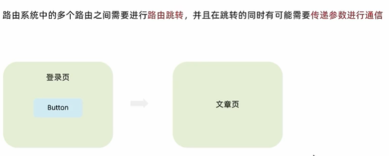

#### 声明式导航
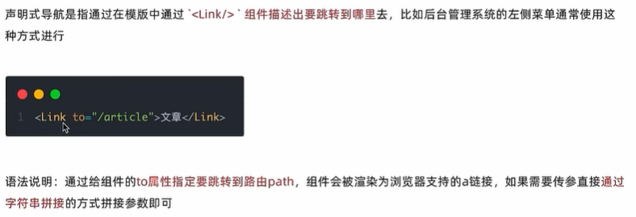

#### 编程式导航
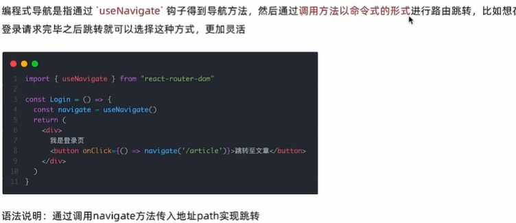

### 路由导航传参
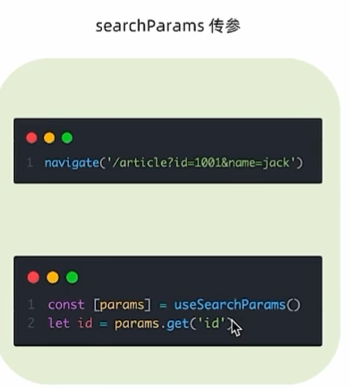
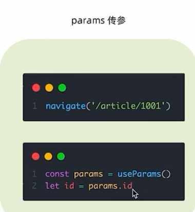

### 嵌套路由配置
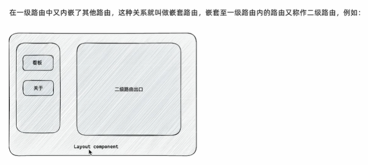

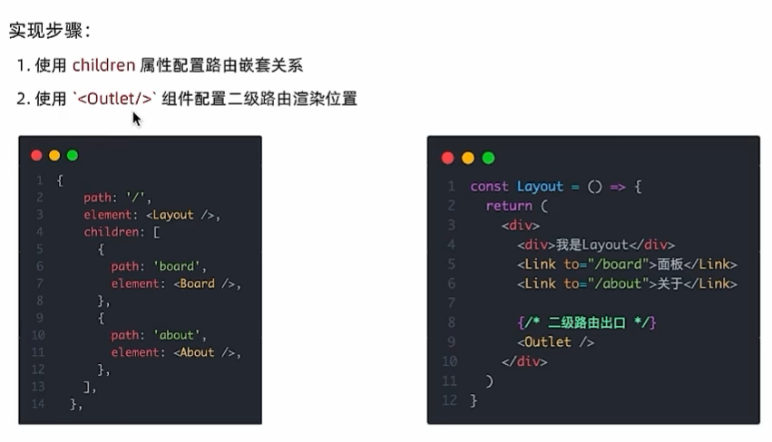

### 默认二级路由
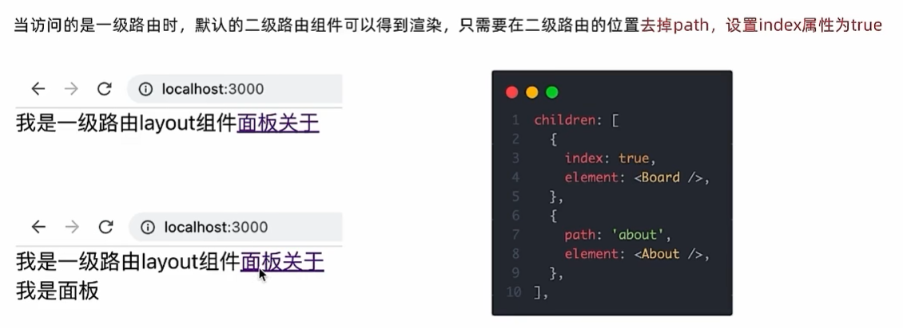

### 404路由配置
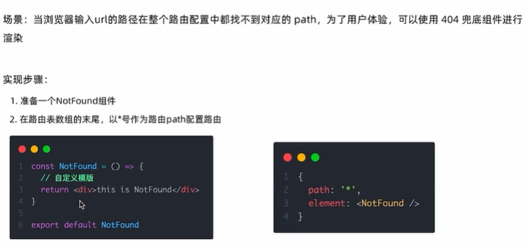

### 两种路由模式
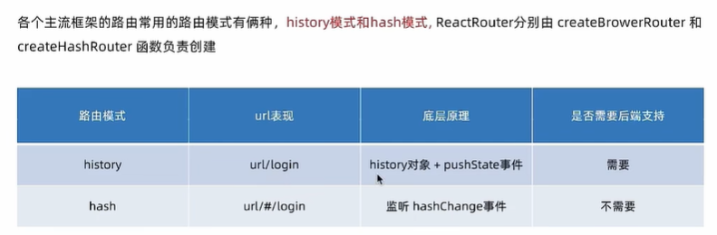

## 案例
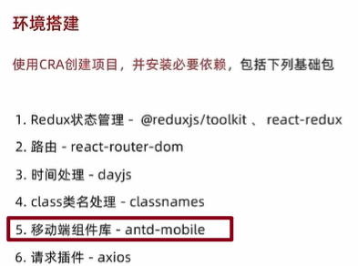

### 别名路径配置
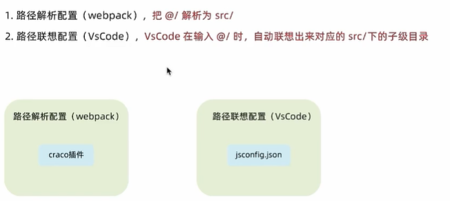

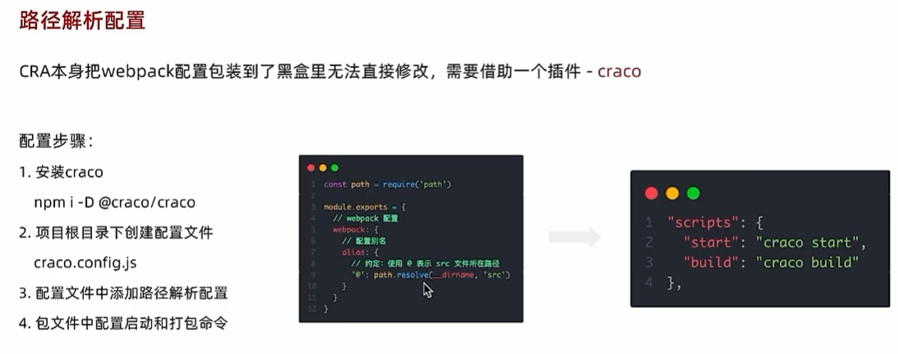

### 联想路径配置
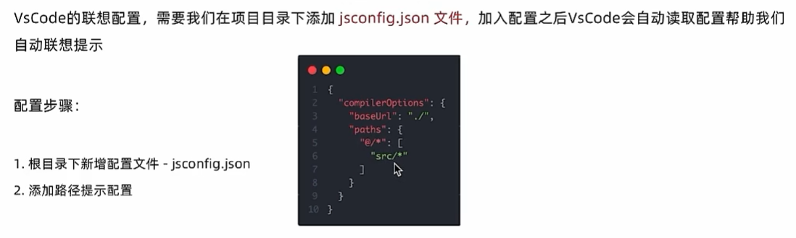

### 数据Mock
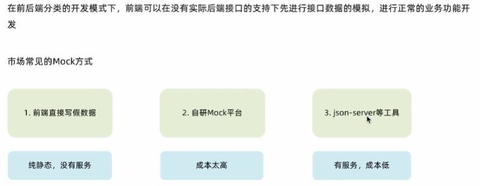

#### json-server实现数据Mock
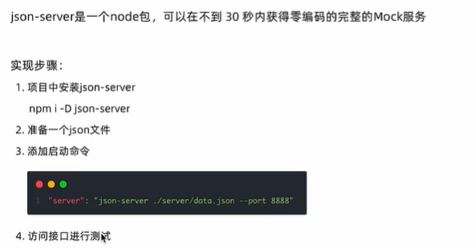

### antD-mobile主题定制


## 使用CRA初始化项目环境
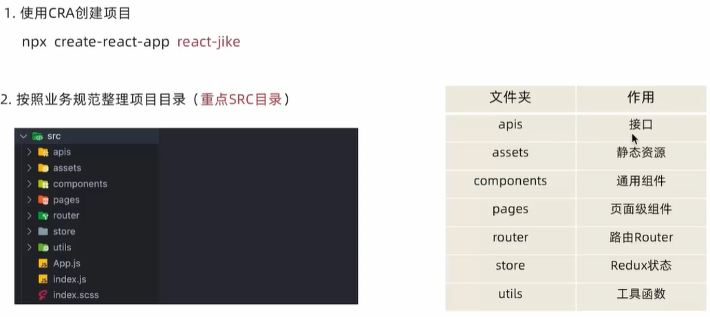

### 安装scss
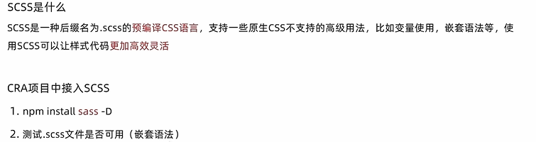
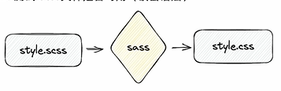

### 安装Ant Design组件库
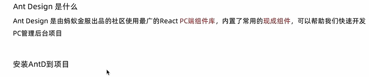

看官方文档即可
```
npm install antd --save
```

### 配置基础路由router
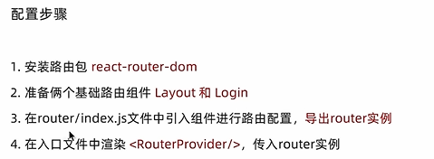

### 配置@别名路径
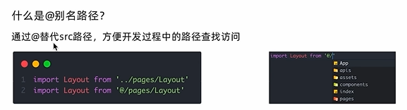
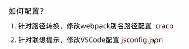
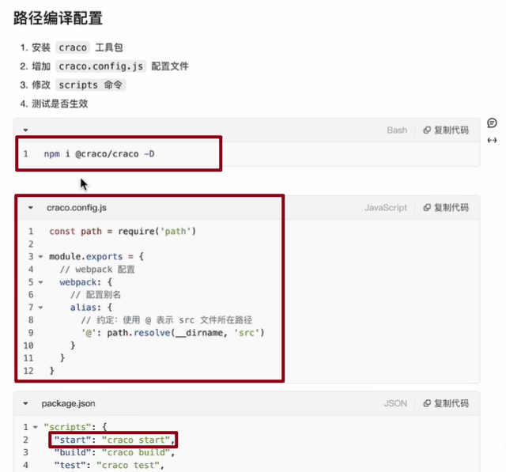

### 使用gitee管理项目
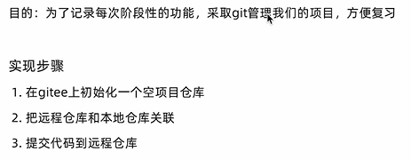

### Axios请求拦截器注入Token
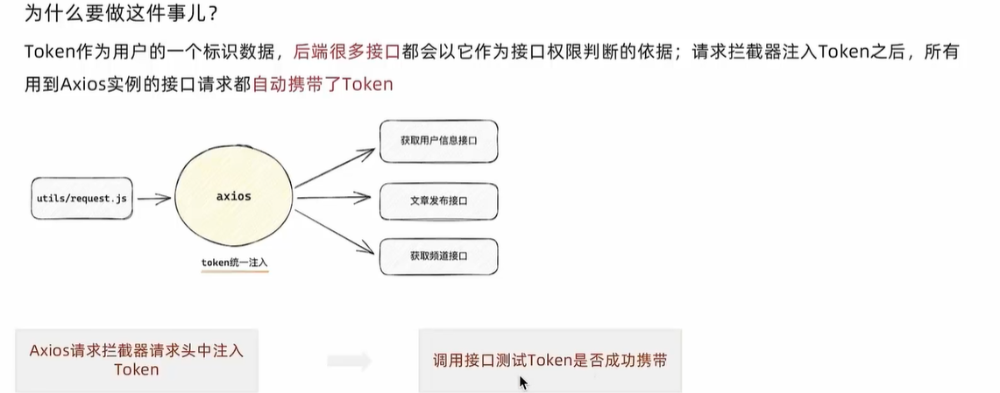

### 使用Token做路由权限控制
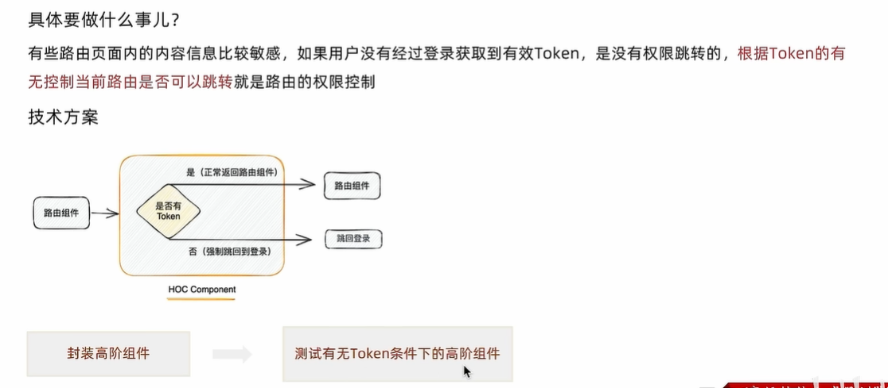
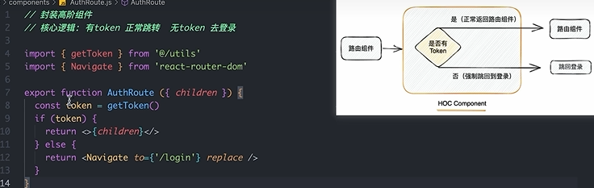
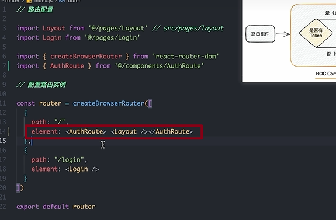

### 初始化样式的相关库
Normalize.css
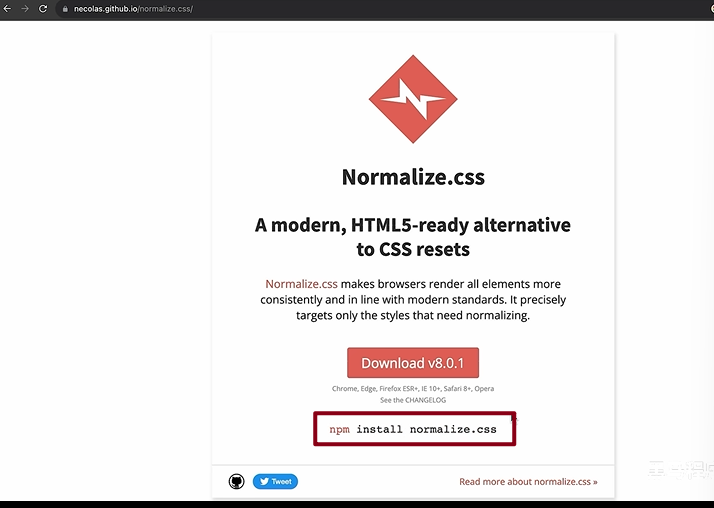

### token失效


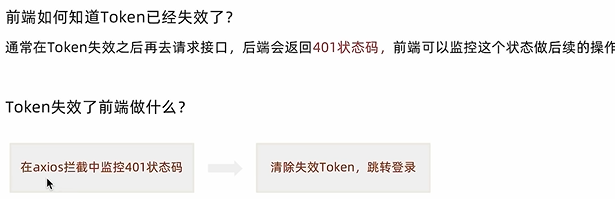

### 富文本编辑器
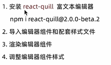

### 项目打包和本地预览
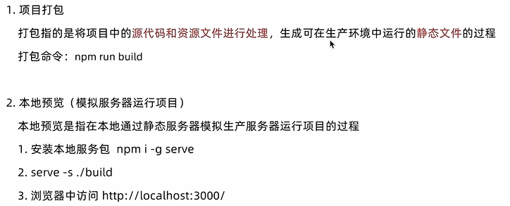

### 打包优化- 配置路由懒加载
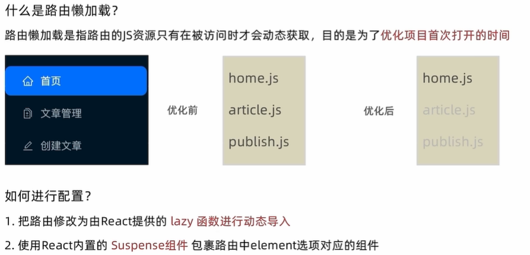
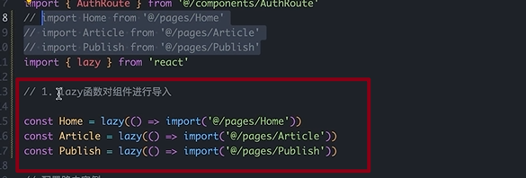
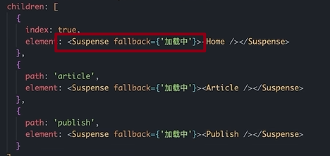

### 打包优化-包体积分析
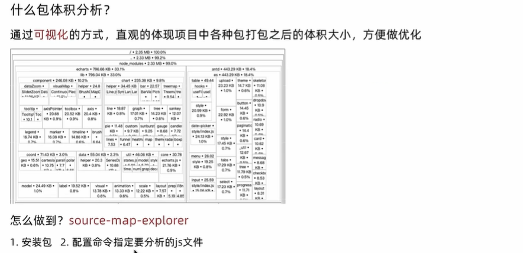
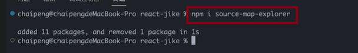
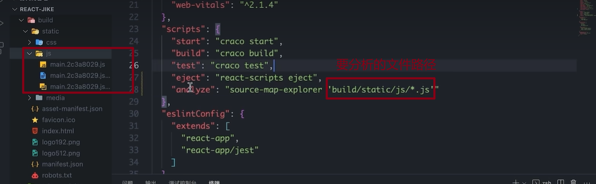
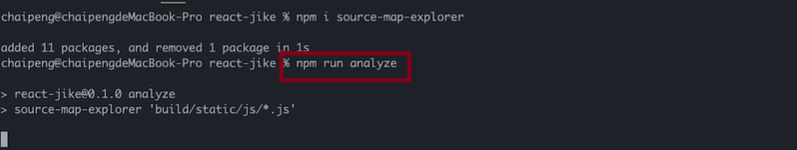

### 打包优化-CDN配置
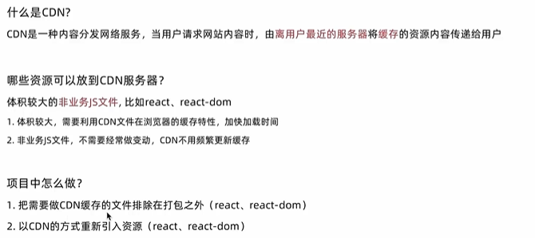

**分析说明**：通过 craco 来修改 webpack 配置，从而实现 CDN 优化

**核心代码**
`craco.config.js`

```javascript
// 添加自定义对于webpack的配置

const path = require('path')
const { whenProd, getPlugin, pluginByName } = require('@craco/craco')

module.exports = {
  // webpack 配置
  webpack: {
    // 配置别名
    alias: {
      // 约定：使用 @ 表示 src 文件所在路径
      '@': path.resolve(__dirname, 'src')
    },
    // 配置webpack
    // 配置CDN
    configure: (webpackConfig) => {
      let cdn = {
        js:[]
      }
      whenProd(() => {
        // key: 不参与打包的包(由dependencies依赖项中的key决定)
        // value: cdn文件中 挂载于全局的变量名称 为了替换之前在开发环境下
        webpackConfig.externals = {
          react: 'React',
          'react-dom': 'ReactDOM'
        }
        // 配置现成的cdn资源地址
        // 实际开发的时候 用公司自己花钱买的cdn服务器
        cdn = {
          js: [
            'https://cdnjs.cloudflare.com/ajax/libs/react/18.1.0/umd/react.production.min.js',
            'https://cdnjs.cloudflare.com/ajax/libs/react-dom/18.1.0/umd/react-dom.production.min.js',
          ]
        }
      })

      // 通过 htmlWebpackPlugin插件 在public/index.html注入cdn资源url
      const { isFound, match } = getPlugin(
        webpackConfig,
        pluginByName('HtmlWebpackPlugin')
      )

      if (isFound) {
        // 找到了HtmlWebpackPlugin的插件
        match.userOptions.files = cdn
      }

      return webpackConfig
    }
  }
}
```

`public/index.html`

```javascript
<body>
  <div id="root"></div>
  <!-- 加载第三发包的 CDN 链接 -->
  <% htmlWebpackPlugin.options.files.js.forEach(cdnURL => { %>
    <script src="<%= cdnURL %>"></script>
  <% }) %>
</body>
```
