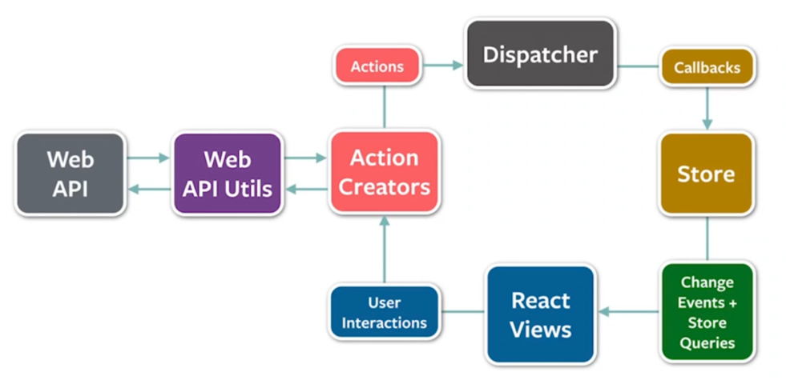
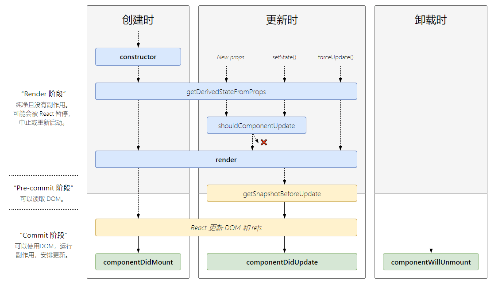
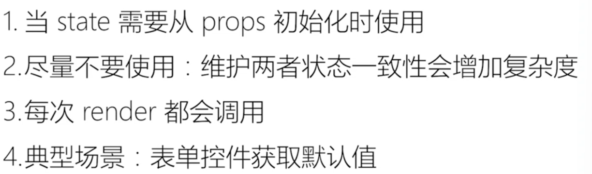
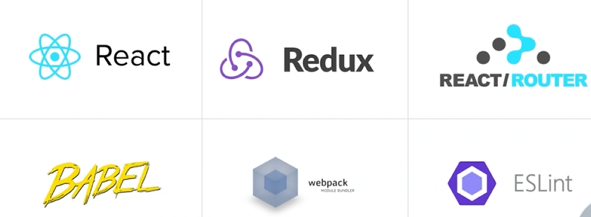

# 黑马程序员day2

## ReactRouter

### 什么是前端路由

### 创建路由开发环境

### 抽象路由模块

### 路由导航

#### 声明式导航

#### 编程式导航

### 路由导航传参

### 嵌套路由配置

### 默认二级路由

### 404路由配置

### 两种路由模式

## 案例

### 别名路径配置

### 联想路径配置

### 数据Mock

#### json-server实现数据Mock

### antD-mobile主题定制

