# Vue单元测试

## 为什么需要测试

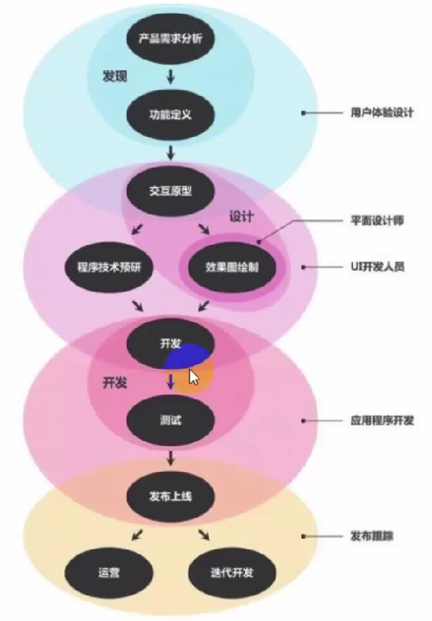

### 前端测试

## vue中的测试
这里采用的是vue官方工具（Vue-CLI）搭建出来的项目，在这个搭建工具中推荐的两种测试分别是**端到端的测试（E2E）**和**单元测试（Unit Test）**

### 端到端

### 单元测试
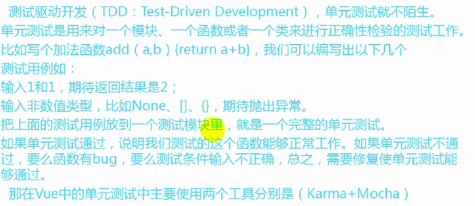

#### Karma
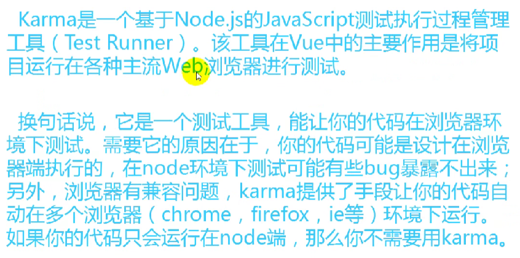

#### Mocha
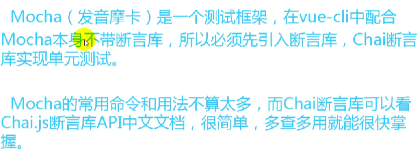

#### 断言库
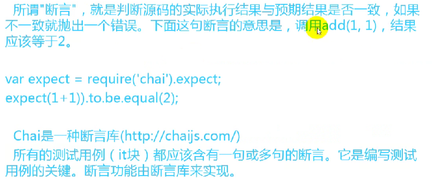

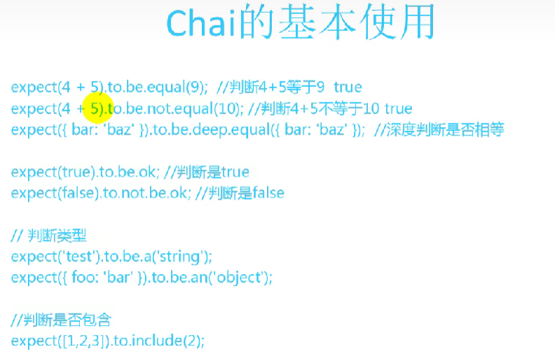

## vue中使用测试步骤

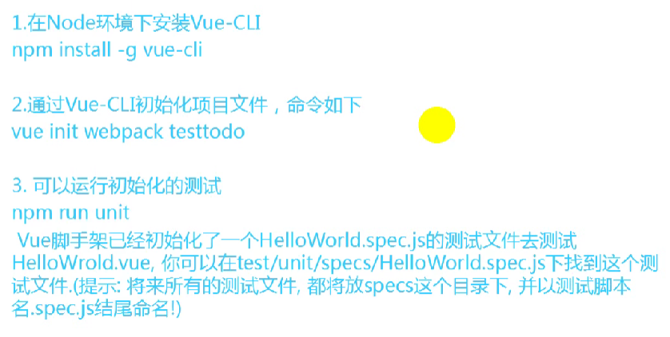

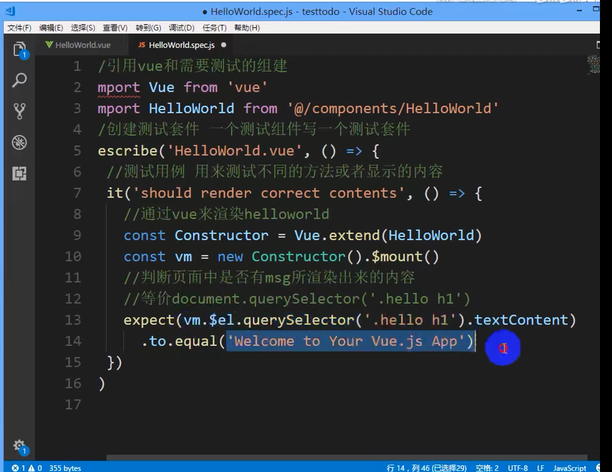
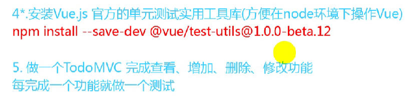

之前的：
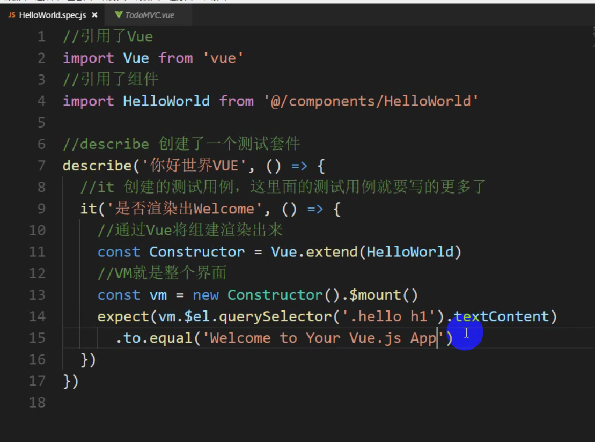
利用测试的：
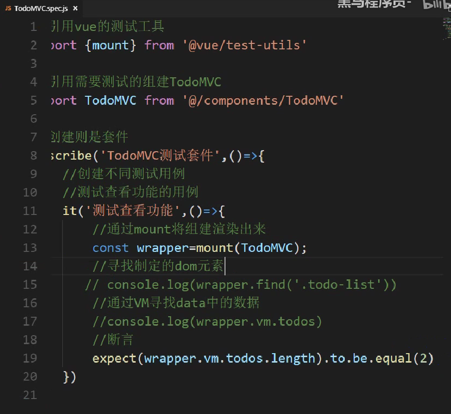

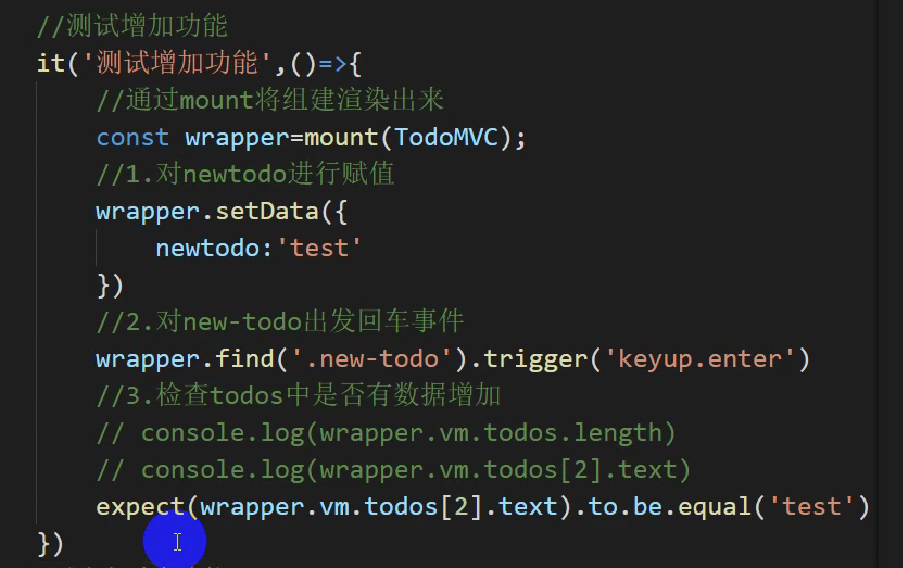

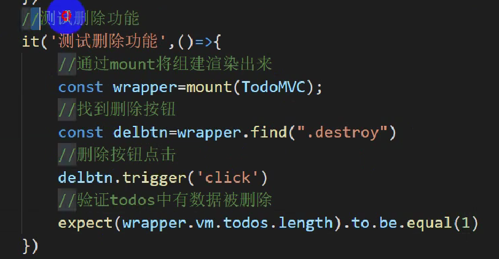

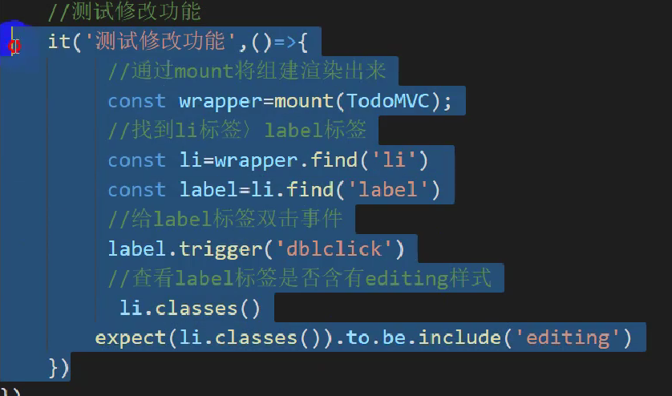
