# day2

## 指令修饰符
通过"."指明一些指令后缀，不同后缀封装了不同的处理操作，可以简化代码

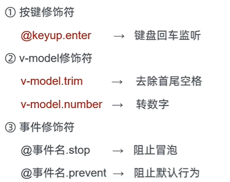

## v-bind对于样式控制的增强-操作class

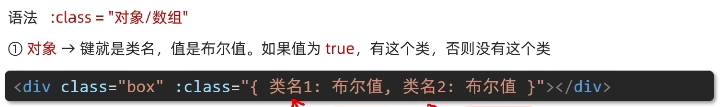

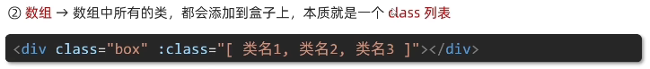
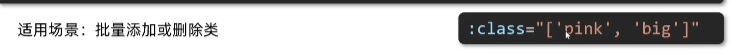

## v-bind对于样式控制的增强-操作style
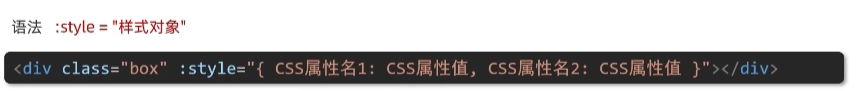
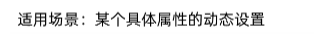

## v-model应用于其他表单元素
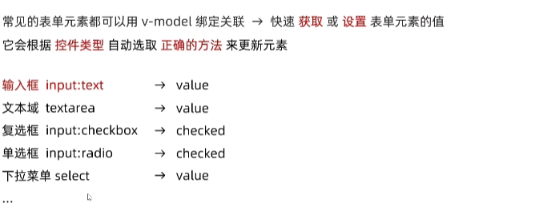

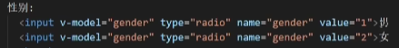

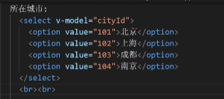

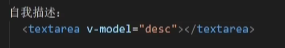

## 计算属性
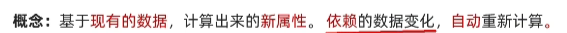

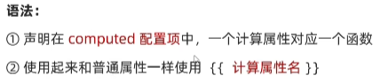

## computed vs methods

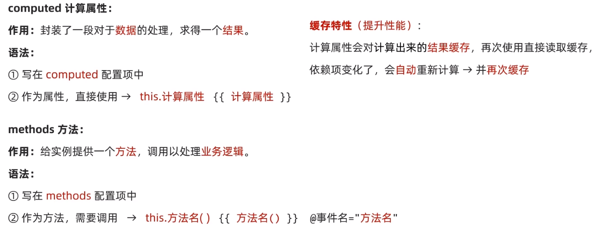

## 计算属性完整写法

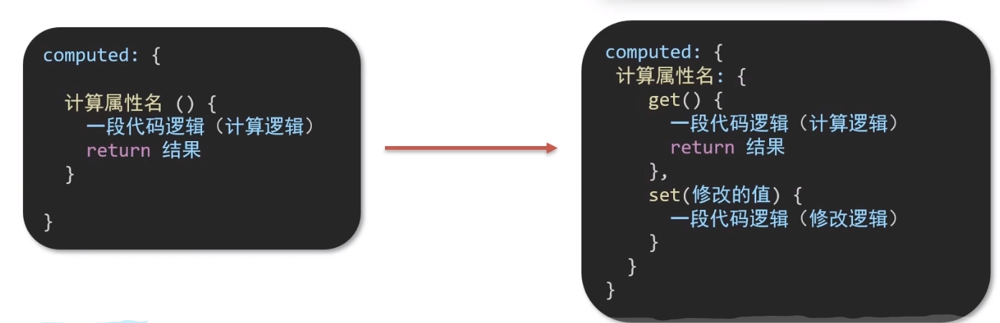
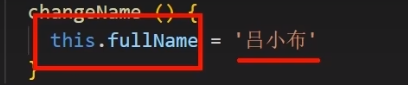

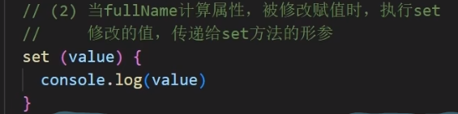

## watch侦听器（监视器）
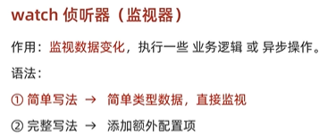

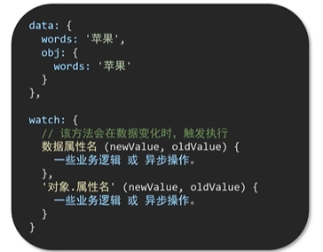

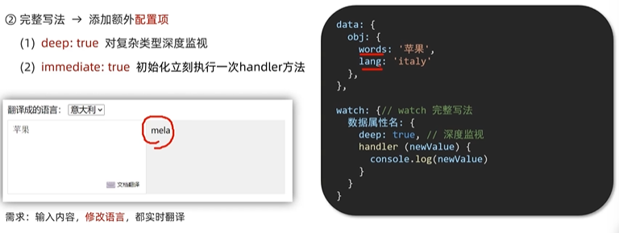
