# day3

## vue生命周期和生命周期的四个阶段

vue生命周期：一个vue实例从创建到销毁的整个过程

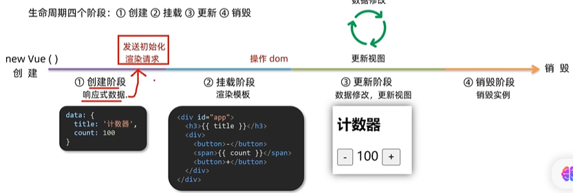

### vue声明周期函数（钩子函数）
vue生命周期过程中，会自动运行一些函数，被称为【生命周期钩子】-> 让开发者可以在【特定阶段】运行自己的代码

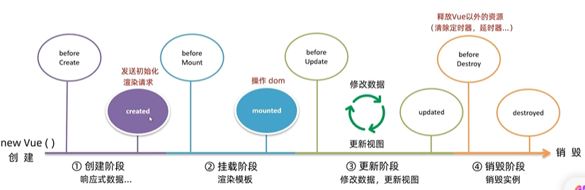

## created应用
请求API获取原始数据

## mounted应用
模板渲染完成，开始操作DOM

## 工程化开发 & 脚手架Vue CLI
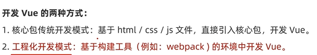
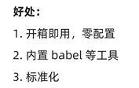
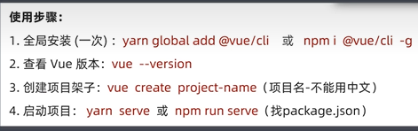

## 脚手架目录介绍 & 项目运行流程
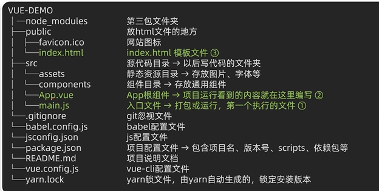

## 组件化开发 & 根组件
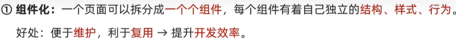

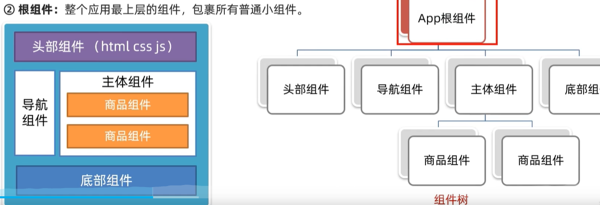

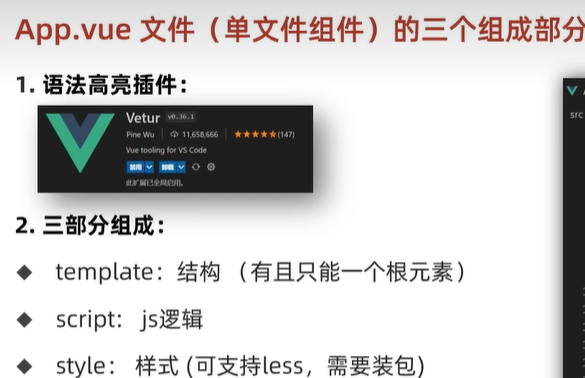

## 普通组件的注册使用
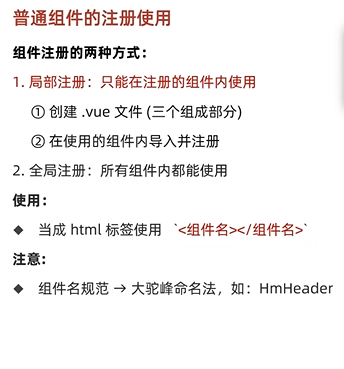

## 全局注册
所有组件内都能使用
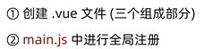
