# 黑马程序员day4

## 组件三大部分--注意点

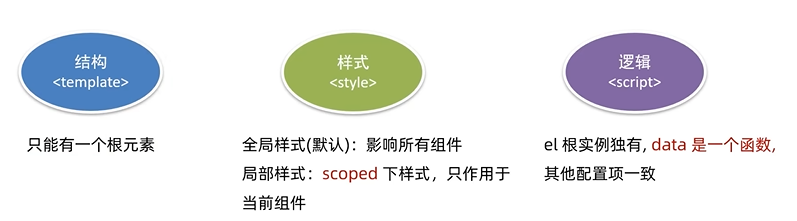

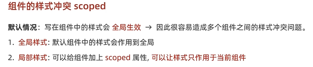

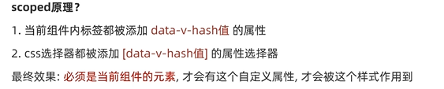

## data是一个函数

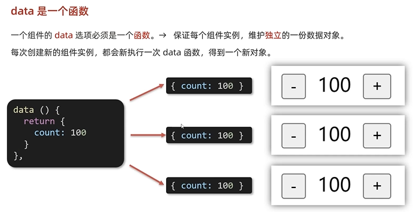

## 组件通信

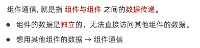

### 组件关系分类
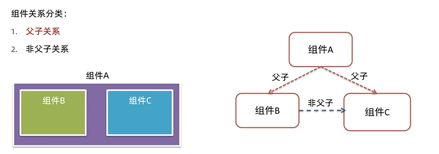

### 解决方案
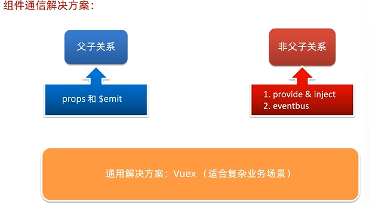

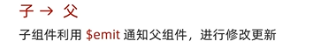

## prop
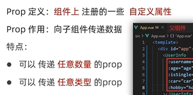

### props校验

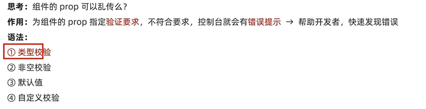

### prop & data   单向数据流

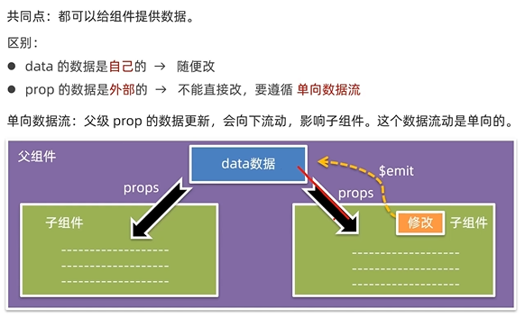

## 非父子通信（拓展） - event bus事件总线

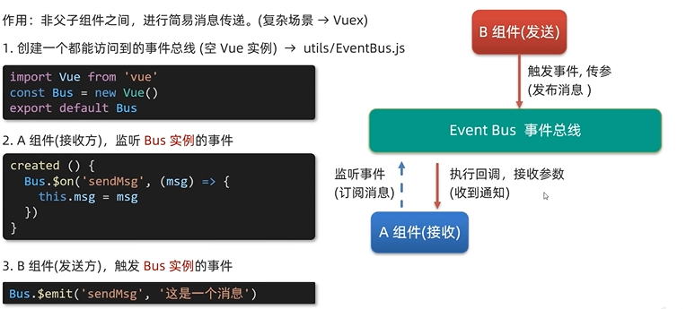

## 非父子通信（拓展） - provide & inject

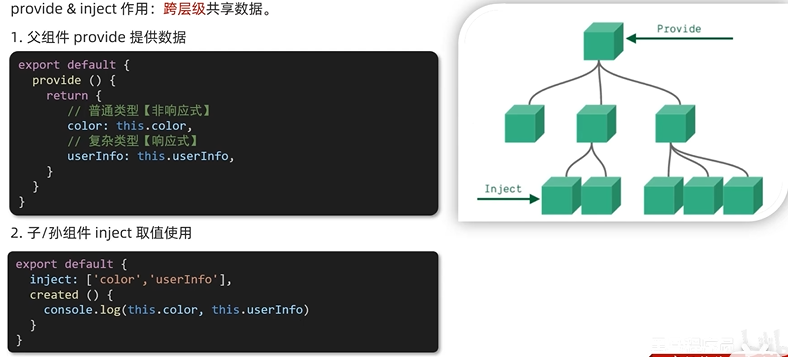

## v-model原理

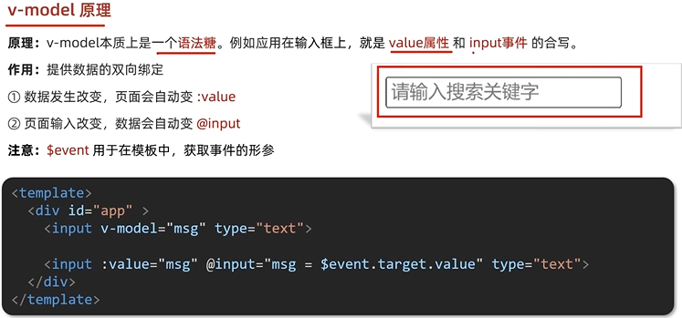

## 表单类组件封装 & v-model简化代码
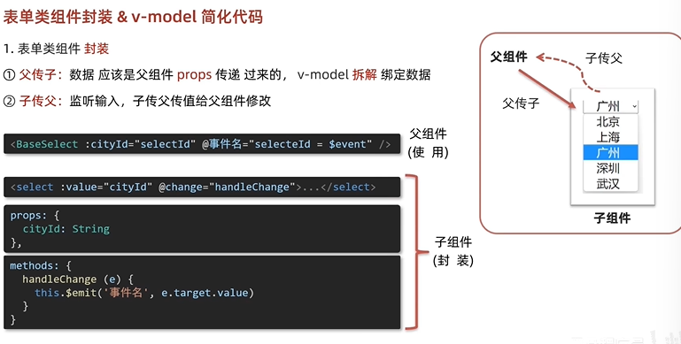

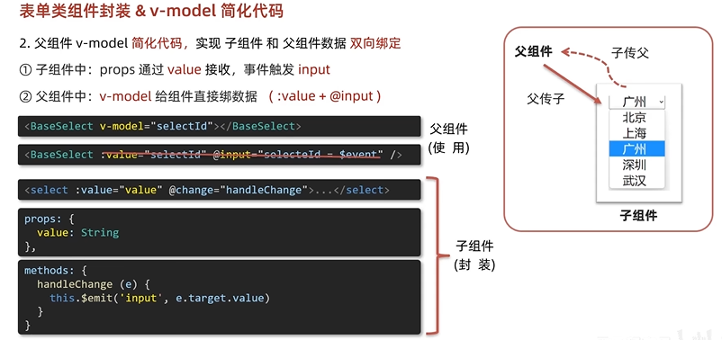

## .sync修饰符
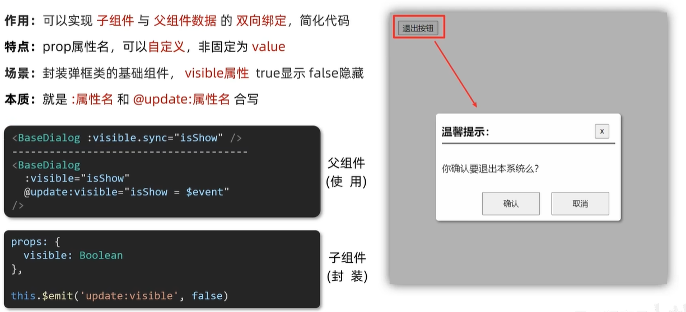

## ref和$refs
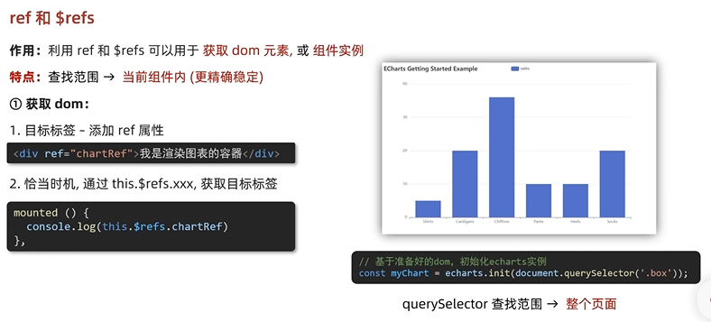
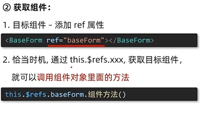

## vue异步更新、$nextTick
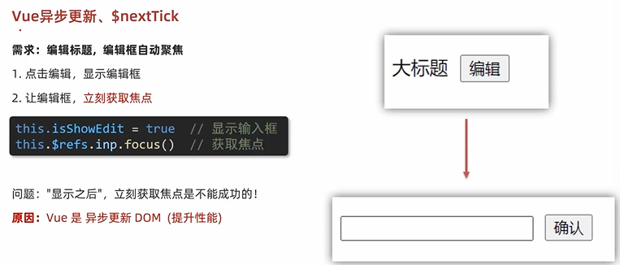
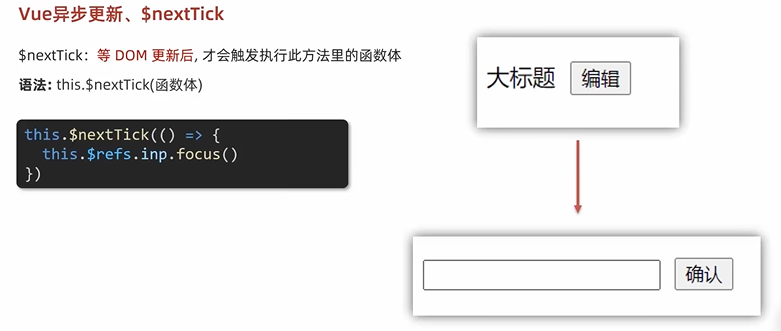
