# 黑马程序员day8

## Vue组件库

vant，vue2对应vant2，vue3对应vant4

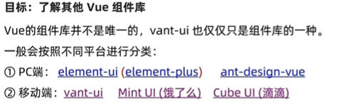

## vant全部导入和按需导入

推荐按需导入

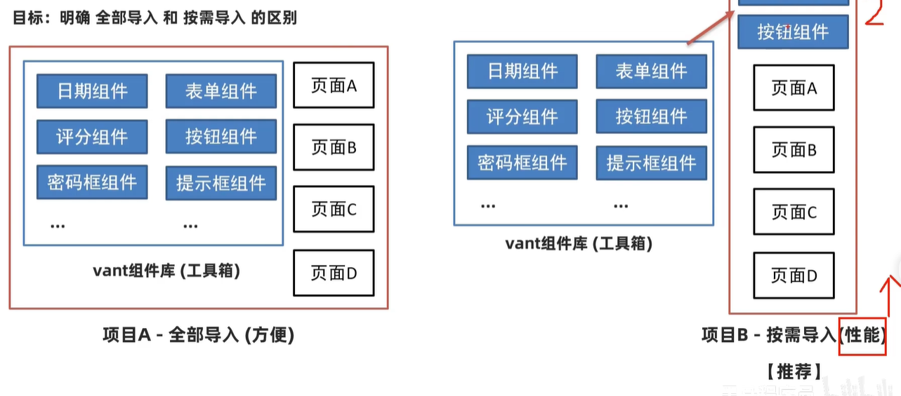

## 项目中的vw适配
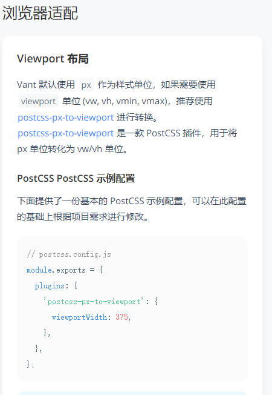

## 路由设计配置
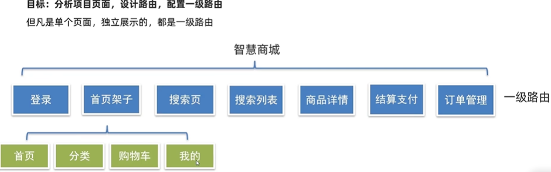

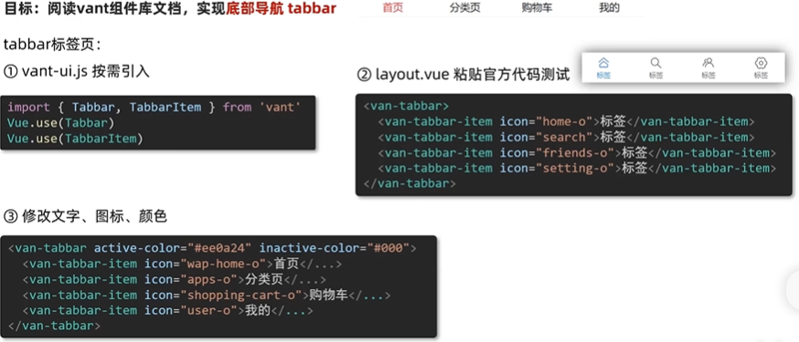

## request模块 - axios封装
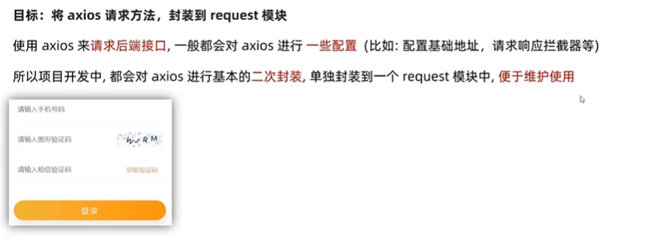
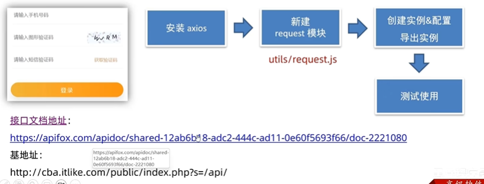

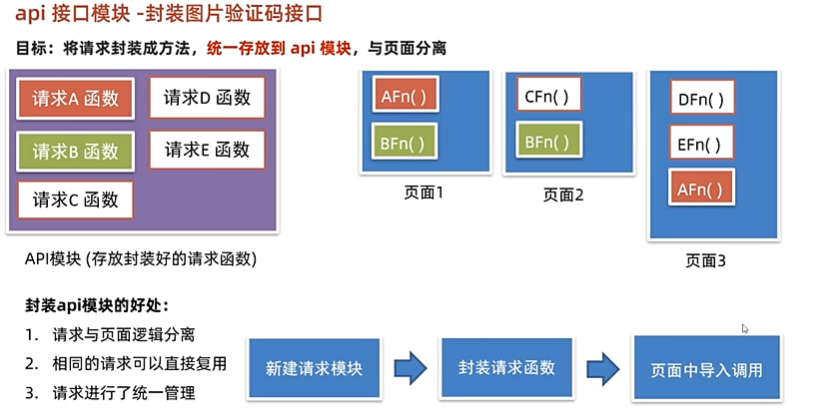

## 响应拦截器--统一处理错误提示
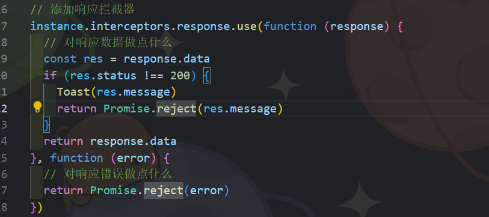

## storage存储模块 - vuex持久化处理
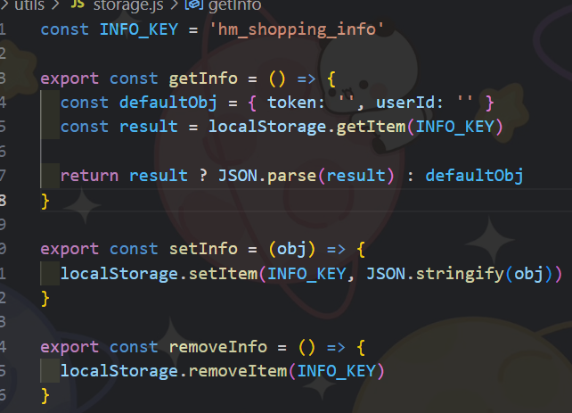

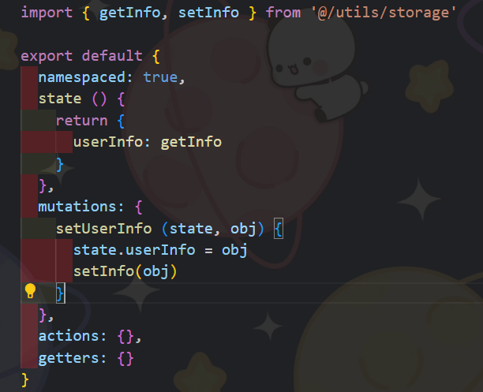

## loading效果
请求拦截器中，每次请求，打开loading

响应拦截器中，每次响应，关闭loading

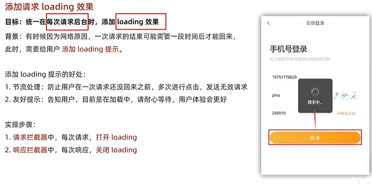

## 页面访问拦截
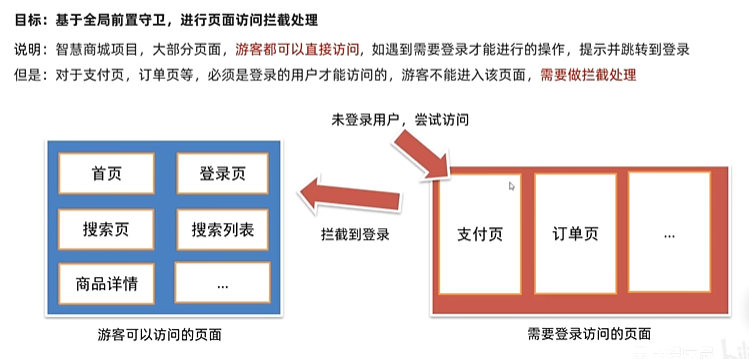

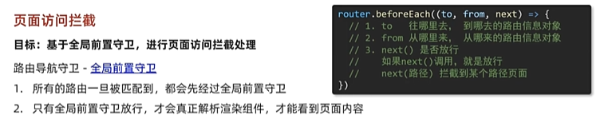

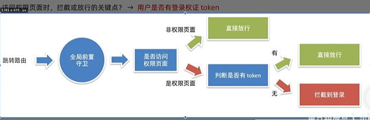

## 打包发布
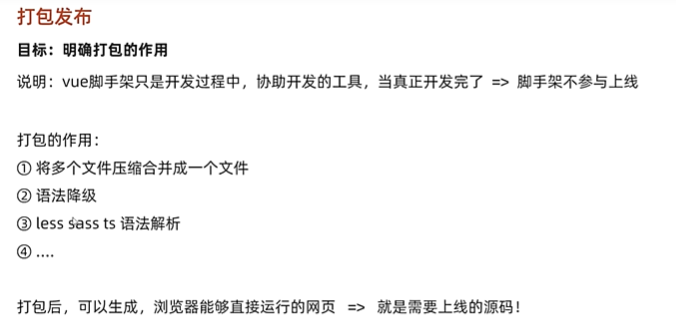

npm run build
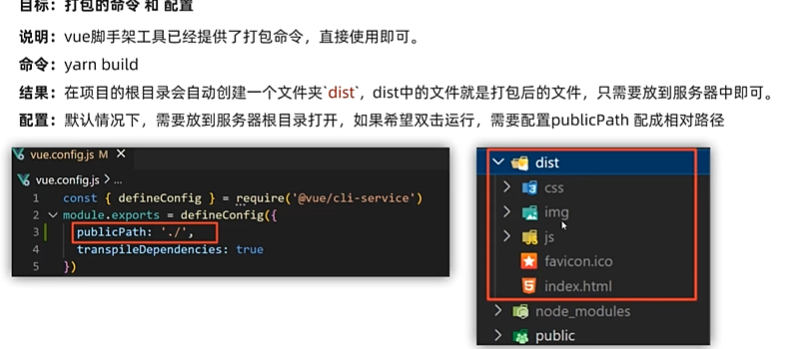

### 优化：路由懒加载
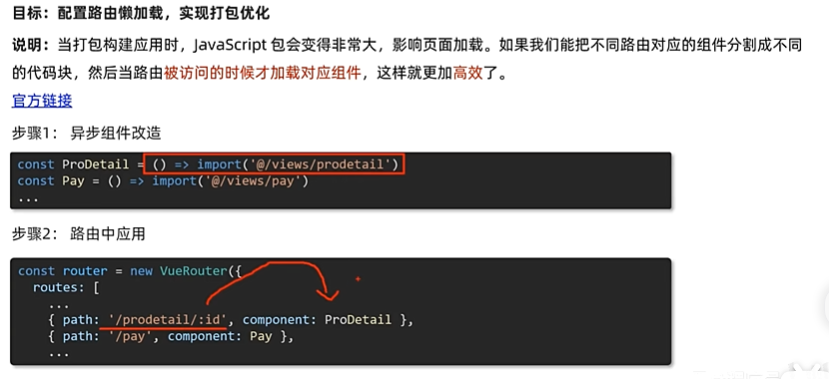