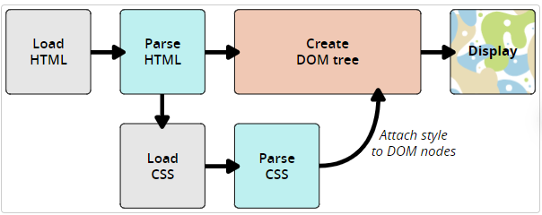

# CSS
CSS是一种样式表语言。

用来指定文档如何展示给用户的一门语言——如网页的样式、布局等。

展示一份文档给用户实际是将文档变成用户可用的文件。

CSS(层叠样式表)可以让你创建好看的网页。可用用于给文档添加样式，也可用于创建布局，还可以用来做一些特效，如动画。


## CSS语法
CSS是一门基于规则的语言——能定义用于网页中特定元素样式的一组规则。

```css
p {
    color: red;
    width: 500px;
    border: 1px solid black;
}
```

```html
<link href="http://fonts.googleapis.com/css?family=Open+Sans" rel="stylesheet" />
```

语法由一个选择器起头，选择了将要用来添加样式的HTML元素。

元素后面输入一对大括号{}，大括号内部定义一个或多个形式为属性property-值value对的声明。每个声明都指定了所选择元素的一个属性，之后跟一个想赋给这个属性的值。

冒号之前是属性，冒号之后是值，不同的CSS属性对应不同的合法值。

一个CSS样式表可以包含很多个规则
```css
h1 {
  color: red;
  font-size: 5em;
}

p {
  color: black;
}
```


## 字体和文本
```css
html {
  font-size: 10px; /* px 表示“像素（pixel）”: 基础字号为 10 像素 */
  font-family: "Open Sans", sans-serif; /* 这应该是你从 Google Fonts 得到的其余输出。 */
}
```

```css
h1 {
  font-size: 60px;
  text-align: center;
}

p,
li {
  font-size: 16px;
  line-height: 2;
  letter-spacing: 1px;
}
```

## CSS模块
CSS由许多模块module构成。许多模块都被组织在自己单独的文档页面，如Backgrounds and Borders模块。

### CSS规范
所有的标准Web技术都被定义在一个巨大的文档中，称作 规范specifications，是由W3C, WHATWG, ECMA, Khronos这些规范化组织所发布的，其中还定义了各种技术是如何工作的。

CSS——是由W3C中的一个名叫CSS Working Group团体发展起来的。

### 浏览器支持
当一个浏览器支持CSS后，就可以用它来进行Web开发了。

但是让所有的浏览器都同时支持一个 CSS 新特性是不现实的，通常都会一个空档期——一些浏览器已经支持而另一些仍未支持。因此，查看特性的实现状态是非常有用的。

## 常见选择器
选择器以HTML为目标，对内容应用样式。

每个CSS规则都以一个选择器或一组选择器为开始，去告述浏览器这些规则应该应用到哪些元素上。

1、通过HTML元素名规定样式

2、通过在HTML元素加个类名class，再选中那个类名给元素添加样式

3、根据元素在文档中的位置

仅选择嵌套在`<li>`元素内的`<em>`可以使用一个称为**包含选择符**的选择器，只是单纯地在两个选择器之间加一个空格

```css
li em{
  color: rebeccapurple;
}
```

在HTML文档中设置直接出现在标题后面并且与标题具有相同层级的段落样式，为此需要在两个选择器之间添加一个`+`号（称为**相邻选择符**）

```css
h1 + p {
  font-size: 200%;
}
```

4、根据状态确定样式

例子：修改链接的样式时，需要定位（针对）`<a>`标签，取决于是否是未访问的、访问过的、被鼠标悬停的、被键盘定位的，抑或是正在被点击当中的状态，这个标签有着不同的状态，可以使用CSS去定位或者针对这些不同的状态去修饰。

```css
a:link{
  color: pink;
}

a:visited{
  color:green;
}
```

可以改变链接被鼠标悬停的时候的样式，例如移除下划线
```css
a:hover{
  text-decoration: none;
}
```

5、同时使用选择器和选择符
```css
article p span {...}

h1 + ul + p {}
```


| 选择器名称                           | 选择的内容                                                   | 示例                                                         |
| ------------------------------------ | ------------------------------------------------------------ | ------------------------------------------------------------ |
| 元素选择器（也称作标签或类型选择器） | 所有指定类型的 HTML 元素                                     | `p` 选择 `<p>`                                               |
| ID 选择器                            | 具有特定 ID 的元素。单一 HTML 页面中，每个 ID 只对应一个元素，一个元素只对应一个 ID | `#my-id` 选择 `<p id="my-id">` 或 `<a id="my-id">`           |
| 类选择器                             | 具有特定类的元素。单一页面中，一个类可以有多个实例           | `.my-class` 选择 `<p class="my-class">` 和 `<a class="my-class">` |
| 属性选择器                           | 拥有特定属性的元素                                           | `img[src]` 选择 `` 但不是 ``     |
| 伪类选择器                           | 特定状态下的特定元素（比如鼠标指针悬停于链接之上）           | `a:hover` 选择仅在鼠标指针悬停在链接上时的 `<a>` 元素        |

### 优先级
CSS 语言有一些规则来控制在发生冲突的情况下哪个选择器更强大。这些规则被称为层叠（cascade）和优先级（specificity）。后面的样式会替换样式表中较早出现的冲突样式。这就是层叠规则。

一个类被认为是更具体的，因此它比元素选择器优先级更高，所以它取消了其他冲突的样式声明。

## CSS组成

### 外部样式表
在一个单独的扩展名为`.css`的文件中包含CSS

使用HTML `<link>`元素来链接外部样式表文件
```html
<link rel="stylesheet" href="styles.css" />
```

### 内部样式表
一个内部样式表驻留在HTML文档内部。要创建一个内部样式表，要把CSS放置在包含HTML `<head>`元素中的`<style>`元素内

```html
<!doctype html>
<html lang="zh-CN">
  <head>
    <meta charset="utf-8" />
    <title>我的 CSS 测试</title>
    <style>
      h1 {
        color: blue;
        background-color: yellow;
        border: 1px solid black;
      }
      p {
        color: red;
      }
    </style>
  </head>
  <body>
    <h1>Hello World!</h1>
    <p>这是我的第一个 CSS 示例</p>
  </body>
</html>
```

对于有多个页面的网站来说，内部样式表是一种不太有效的工作方式

### 内联样式
内联样式是影响单个HTML元素的CSS声明，包含在元素的style属性中。在一个HTML文档中，内联样式的实现可能如下：

```html
<!doctype html>
<html lang="zh-CN">
  <head>
    <meta charset="utf-8" />
    <title>我的 CSS 测试</title>
  </head>
  <body>
    <h1 style="color: blue;background-color: yellow;border: 1px solid black;">
      Hello World!
    </h1>
    <p style="color:red;">这是我的第一个 CSS 示例</p>
  </body>
</html>
```

尽可能避免以这种方式使用CSS。

这不符合最佳实践：

1、对CSS的维护效率最低的实现

2、内联CSS还将(CSS)表现性代码与HTML内容混合在一起，使一切都难以阅读和理解。

### 属性和值
在最基本的层面上，CSS 由两个组成部分组成：

- 属性：指示想要更改的样式特征

- 值：每个指定的属性都有一个值，这个值表示如何对属性施加样式

#### 函数
虽然大多数值是相对简单的关键字或数值，但也有一些值是以函数的形式出现的

**calc()函数**
```css
.outer {
  border: 5px solid black;
}

.box {
  padding: 10px;
  width: calc(90% - 30px);
  background-color: rebeccapurple;
  color: white;
}
```

**Transform函数**
Transform的不同取值，如rotate()

```css
.box {
  margin: 30px;
  width: 100px;
  height: 100px;
  background-color: rebeccapurple;
  transform: rotate(0.8turn);
}
```

**@规则**
CSS的@rules是一些特殊的规则，提供了关于CSS应该执行什么或如何表现的指令。

有些@规则很简单，只有一个关键词和一个值，例如，@import将一个样式表导入另一个CSS样式表

```css
@import "styles2.css"
```

有一个常见的@规则是@media，被用来创建媒体查询。媒体查询使用条件逻辑来应用CSS样式

```css
body {
  background-color: pink;
}

@media (min-width: 30em) {
  body {
    background-color: blue;
  }
}
```

#### 简写属性
一些属性，如 font、background、padding、border 和 margin 等属性称为简写属性。它们允许在一行中设置多个属性值，从而节省时间并使代码更整洁。
```css
background: red url(bg-graphic.png) 10px 10px repeat-x fixed;

/* 等价于 */
background-color: red;
background-image: url(bg-graphic.png);
background-position: 10px 10px;
background-repeat: repeat-x;
background-attachment: fixed;
```

## CSS：一切皆盒子
css布局主要是基于盒子模型。页面上每个盒子都有类似的属性：
- padding（内边距）：是指内容周围的空间。
- border（边框）：是紧接着内边距的线。
- margin（外边距）：是围绕元素边界外侧的空间。

## CSS如何工作
下面的步骤是浏览加载网页的简化版本，而且不同的浏览器在处理文件的时候会有不同的方式，但是下面的步骤基本都会出现。

1、浏览器载入HTML文件

2、将 HTML 文件转化成一个 DOM（Document Object Model），DOM 是文件在计算机内存中的表现形式

3、接下来，浏览器会拉取该 HTML 相关的大部分资源，比如嵌入到页面的图片、视频和 CSS 样式。JavaScript 则会稍后进行处理

4、浏览器拉取到 CSS 之后会进行解析，根据选择器的不同类型（比如 element、class、id 等等）把他们分到不同的“桶”中。浏览器基于它找到的不同的选择器，将不同的规则（基于选择器的规则，如元素选择器、类选择器、id 选择器等）应用在对应的 DOM 的节点中，并添加节点依赖的样式（这个中间步骤称为渲染树）。

5、上述的规则应用于渲染树之后，渲染树会依照应该出现的结构进行布局。

6、网页展示在屏幕上（这一步被称为着色）。



### DOM
一个 DOM 有一个树形结构，标记语言中的每一个元素、属性以及每一段文字都对应着结构树中的一个节点（Node/DOM 或 DOM node）。节点由节点本身和其他 DOM 节点的关系定义，有些节点有父节点，有些节点有兄弟节点（同级节点）。

**当浏览器遇到无法解析的CSS代码时**，浏览器什么也不会做，继续解析下一个CSS样式

遇到无法理解的属性或者值，会忽略这些并继续解析下面的CSS；遇到无法解析的选择器时，会忽略整个选择器规则，然后解析下一个CSS选择器