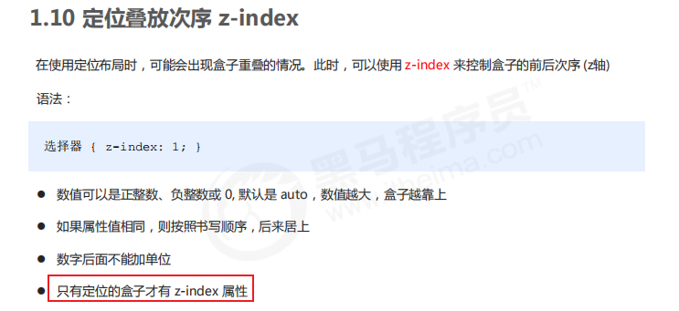
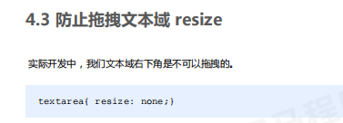
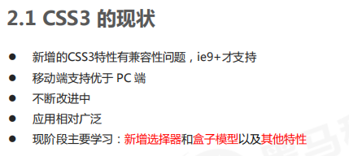
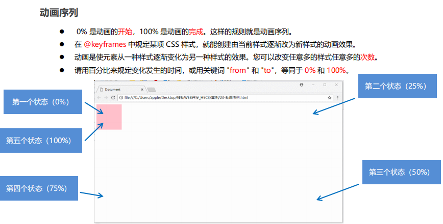
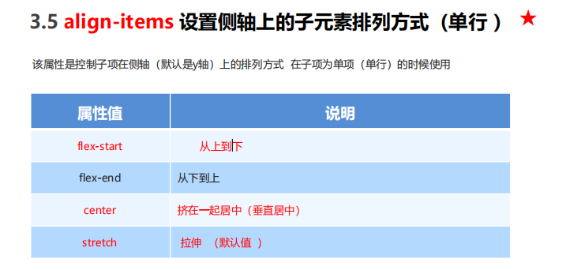

# 样式设置

## 字体属性


## 文本属性
`em`是一个相对单位，就是当前元素(font-size) 1个文字的大小，如果当前元素没有设置大小，则会按照父元素的1个文字大小。


## 背景属性


## 盒子模型
页面布局要学习三大核心：盒子模型、浮动和定位。

CSS盒子模型本质上是一个盒子，封装周围的HTML元素，包括：

- 边框border


**表格的细线边框**


- 外边距margin

外边距可以让块级盒子水平居中，但必须满足：
1、盒子必须指定了宽度
2、盒子左右的外边距都设置为auto
```css
/* 三种写法都可以 */
margin-left:auto;
margin-right:auto;

margin:auro;

margin:0 auto;
```
上述是让块级元素水平居中，行内元素或者行内块元素水平居中给其父元素添加`text-align:center`即可


**外边距合并**


- 内边距padding

如果盒子本身没有指定width/height属性，则padding不会撑开盒子大小


**清楚内外边距**


- 实际内容


## 圆角边框border-radius


## 盒子阴影box-shadow


## 文字阴影


## 浮动float
### 传统网页布局

1、普通流/文档流（标准流）

标签按照规定好默认方式排列


2、浮动

有很多布局效果，标准流没有办法完成，此时就可以利用浮动完成布局，因为浮动可以改变元素标签默认的排列方式

浮动最典型的应用：可以让多个块级元素一行内排列显示


**浮动特性**


**清除浮动**


3、定位

:::info
1、某个元素可以自由的在一个盒子内移动位置，并且压住其他盒子。

2、当滚动窗口，盒子是固定屏幕某个位置。

以上效果，标准流或浮动都无法快速实现，此时需要定位来实现

所以：

1、浮动可以让多个块级盒子一行没有缝隙排列显示，经常用于横向排列盒子

2、定位则是可以让盒子自由的在某个盒子内移动位置或者固定屏幕中某个位置，并且可以压住其他盒子
:::





## 元素的显示与隐藏
本质：让一个元素在页面中隐藏或者显示出来


## 用户界面样式
界面样式，就是更改一些用户操作样式，以便提高更好的用户体验：

- 更改用户的鼠标样式

- 表单轮廓

- 防止表单域拖拽

### 鼠标样式cursor


### 表单轮廓


### 表单域拖拽


## vertical-align属性应用


## 溢出文字省略号表示


## HTML5的新特性
HTML5的新增特性主要是针对以前的不足，增加了一些新的标签、新的表单和新的表单属性等。

这些新特性都有兼容性的问题，基本是IE9+以上版本的浏览器才支持，如果不考虑兼容性问题，可以大量使用这些新特性。

### 语义化标签
div对于搜索引擎来说，是没有语义的。


### 多媒体标签
1、音频`<audio>`


2、视频`<video>`


### input类型


## CSS3新特性

### 选择器


### 盒子模型


### 过渡


## CSS3 2D转换
转换transform是CSS3中具有颠覆性的特征之一，可以实现元素的位移、旋转、缩放等效果。


## CSS3动画animation
动画animation是CSS3中具有颠覆性的特征之一，可通过设置多个节点来精确控制一个或一组动画，常用来实现复杂的动画效果

相比于过渡，动画可以实现更多变化，更多控制，连续自动播放等效果

### 基本使用
使用动画分为两步：

1、先定义动画

2、再使用动画





## 3D转换


## 浏览器私有前缀


## 移动端


## 视口
视口viewport就是浏览器显示页面内容的屏幕区域。

视口可以分为布局视口、视觉视口和理想视口。

### 布局视口layout viewport


### 视觉视口visual viewport


### 理想视口ideal viewport


### meta视口标签


### 标准的viewport设置
- 视口宽度和设备保持一致

- 视口的默认缩放比例1.0

- 不允许用户自行缩放

- 最大允许的缩放比例1.0

- 最小允许的缩放比例1.0


## 移动端布局


### 流式布局（百分比布局）


### flex布局





### rem布局
rem(root em)是一个相对单位，类似em，em是父元素字体大小。

rem的基准是相对于html元素的字体大小

rem的优势：父元素文字大小可能不一致，但整个页面只有一个html，可以很好来控制整个页面的元素大小

#### 媒体查询


#### 媒体查询+rem实现元素动态大小变化


#### rem适配方案


### Less


### 响应式布局


#### Bootstrap前端开发框架


**优点**

- 标准化的html+css规范
- 提供了一套简洁、直观、强悍的组件
- 有自己的生态圈，不断的更新迭代
- 让开发更简单，提高开发效率

**版本**
- 2.x.x：停止维护,兼容性好,代码不够简洁，功能不够完善。
- 3.x.x：目前使用最多,稳定,但是放弃了 IE6-IE7。对 IE8 支持但是界面效果不好,偏向用于开发响应式布局、移动设备优先的 WEB 项目。
- 4.x.x ：最新版，目前还不是很流行

**使用（四步）：**

1、创建文件夹结构


2、创建html骨架结构


3、引入相关样式文件


4、书写内容


#### Bootstrap栅格系统


### vw/vh


