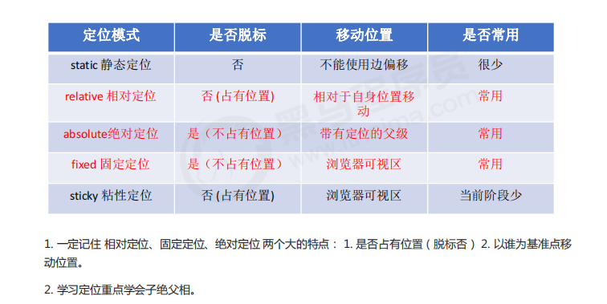

# 样式设置

## 字体属性


## 文本属性
`em`是一个相对单位，就是当前元素(font-size) 1个文字的大小，如果当前元素没有设置大小，则会按照父元素的1个文字大小。


## 背景属性


## 盒子模型
页面布局要学习三大核心：盒子模型、浮动和定位。

CSS盒子模型本质上是一个盒子，封装周围的HTML元素，包括：

- 边框border


**表格的细线边框**


- 外边距margin

外边距可以让块级盒子水平居中，但必须满足：
1、盒子必须指定了宽度
2、盒子左右的外边距都设置为auto
```css
/* 三种写法都可以 */
margin-left:auto;
margin-right:auto;

margin:auro;

margin:0 auto;
```
上述是让块级元素水平居中，行内元素或者行内块元素水平居中给其父元素添加`text-align:center`即可


**外边距合并**


- 内边距padding

如果盒子本身没有指定width/height属性，则padding不会撑开盒子大小


**清楚内外边距**


- 实际内容


## 圆角边框border-radius


## 盒子阴影box-shadow


## 文字阴影


## 浮动float
### 传统网页布局

1、普通流/文档流（标准流）

标签按照规定好默认方式排列


2、浮动

有很多布局效果，标准流没有办法完成，此时就可以利用浮动完成布局，因为浮动可以改变元素标签默认的排列方式

浮动最典型的应用：可以让多个块级元素一行内排列显示


**浮动特性**


**清除浮动**


3、定位

:::info
1、某个元素可以自由的在一个盒子内移动位置，并且压住其他盒子。

2、当滚动窗口，盒子是固定屏幕某个位置。

以上效果，标准流或浮动都无法快速实现，此时需要定位来实现

所以：

1、浮动可以让多个块级盒子一行没有缝隙排列显示，经常用于横向排列盒子

2、定位则是可以让盒子自由的在某个盒子内移动位置或者固定屏幕中某个位置，并且可以压住其他盒子
:::





## 元素的显示与隐藏
本质：让一个元素在页面中隐藏或者显示出来


