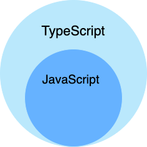
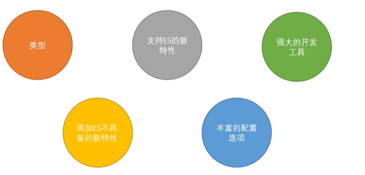
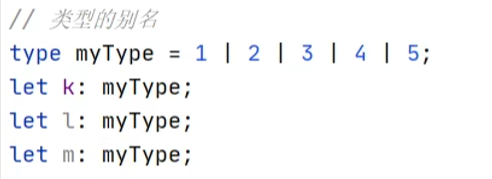

# 基础知识

## 与JavaScript的区别
typescript是JavaScript的超集，扩展了JavaScript的语法，因此现有的 JavaScript 代码可与 TypeScript 一起工作无需任何修改，TypeScript 通过类型注解提供编译时的静态类型检查。




typescript增加了：


## typescript安装
`tsc`
```
npm install -g typescript
```

`app.ts`：
```ts
// Greets the world.
console.log("Hello world!");
```

通过运行typescript包安装的命令tsc来检查：
```bash
tsc app.ts
```

得到了一些文件输出。tsc 编译或转换为纯 JavaScript 文件后 app.ts 文件的输出`app.js`。


使用node命令执行app.js文件：

```bash
node app.js
# Hello world!
```


## 基本类型

变量声明：
```ts
let a:number;
a=1;
// 需要指定变量类型，以后使用过程中只能是该类型
let c=false;
// 如果声明完变量直接进行赋值，ts可以自动对变量进行类型检测

function sum(a:number,b:number){
    return a+b;
}

// 指定返回值类型
function sum(a:number,b:number):number{
    return a+b;
}
```


枚举：




