# vue3

## vue3优势
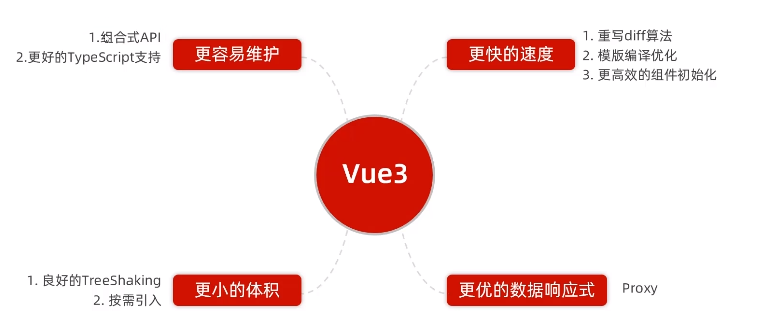

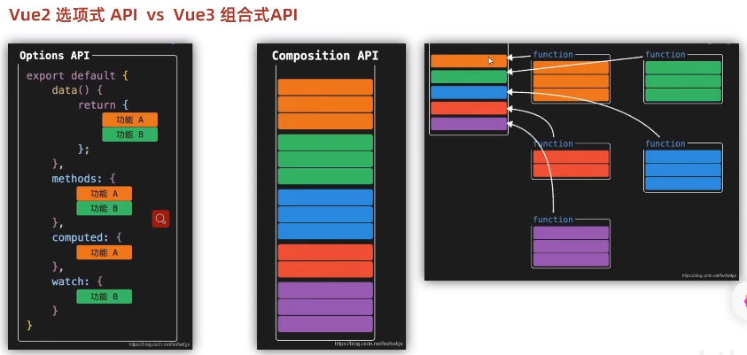

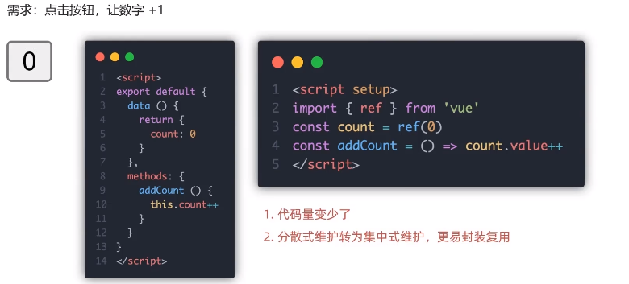

## create-vue搭建vue3项目

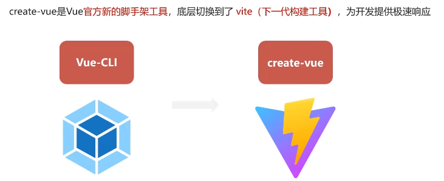
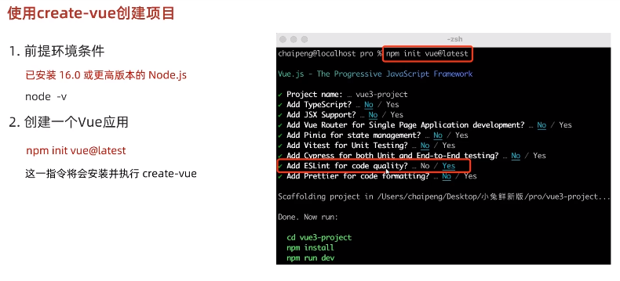

### 项目目录和关键文件
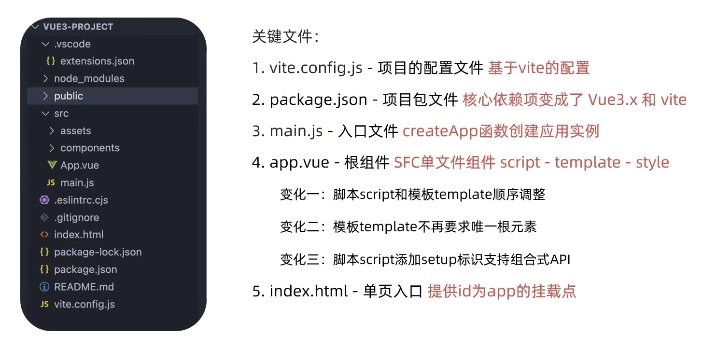

## 组合式API-setup选项

### setup选项的写法和执行时机
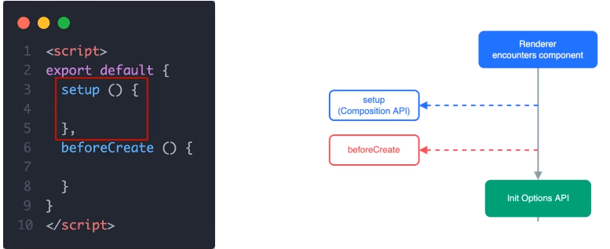
1、setup执行时机比beforeCreate还要早

2、setup函数中，获取不到this

3、数据和函数，需要在setup最后return，才能在模板中应用
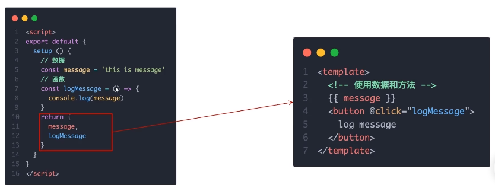

### setup语法糖
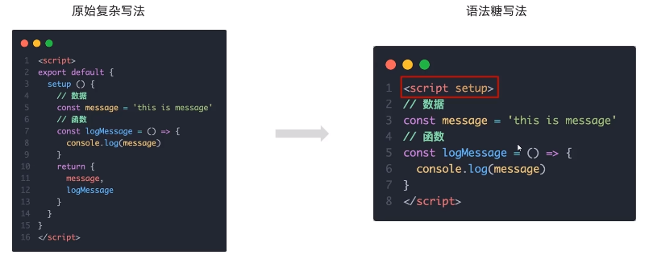

4、可以通过setup语法糖简化代码

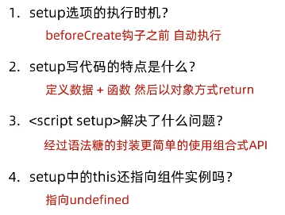

## 组合式API-reactive和ref函数

### reactive()

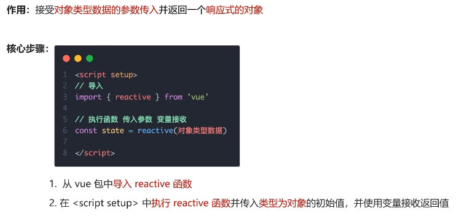

### ref()
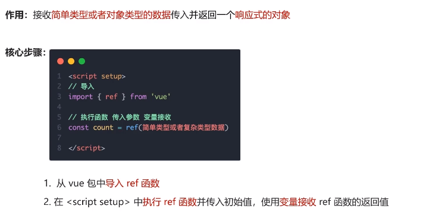

## 组合式API - computed

### computed计算属性函数
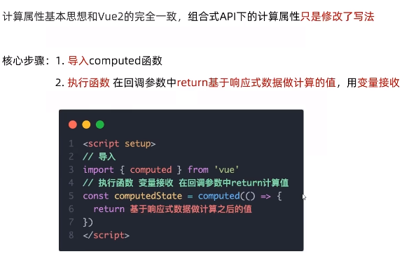

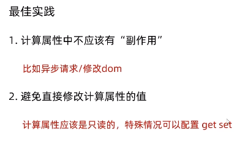

## 组合式API - watch
### watch函数
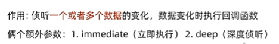

### 侦听单个数据
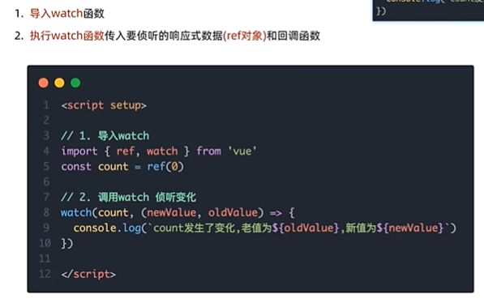

### 侦听多个数据

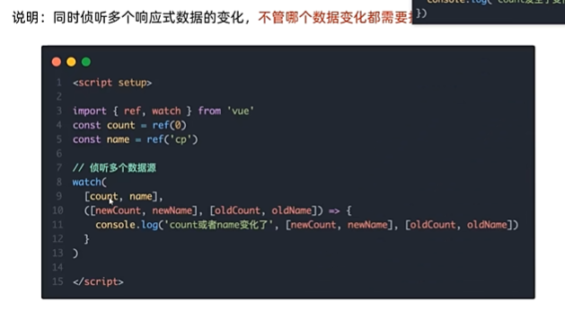

### immediate
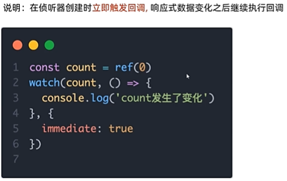

### deep
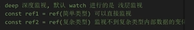

### 精确侦听对象的某个属性

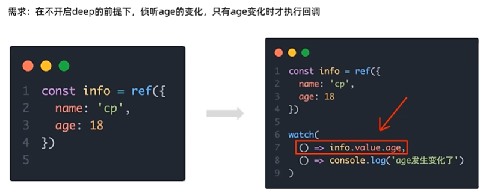

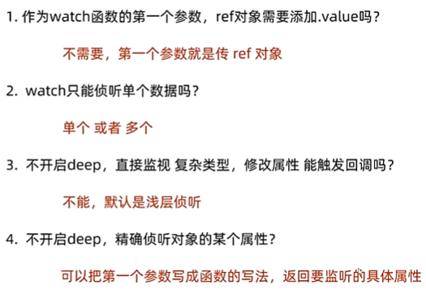

## 组合式API - 生命周期函数
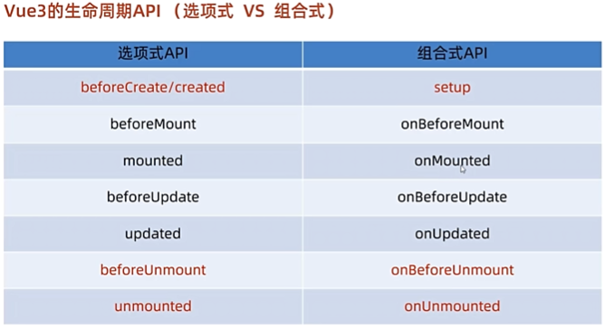

## 组合式API - 父子通信

### 父传子
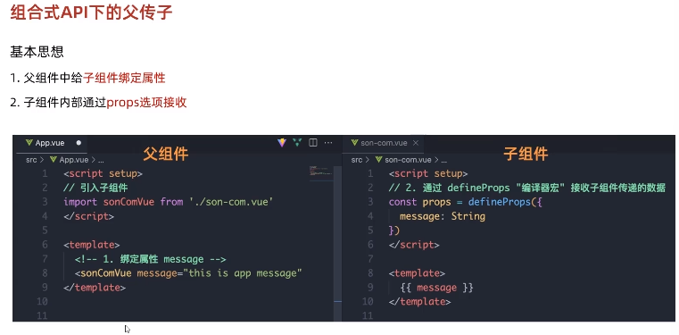

### 子传父
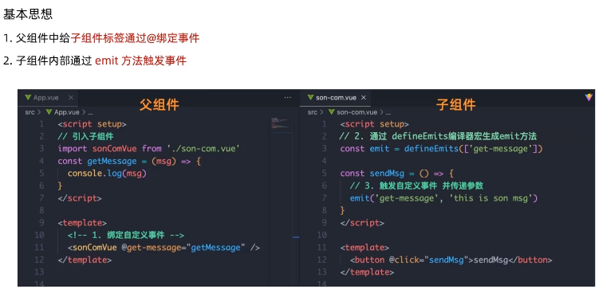

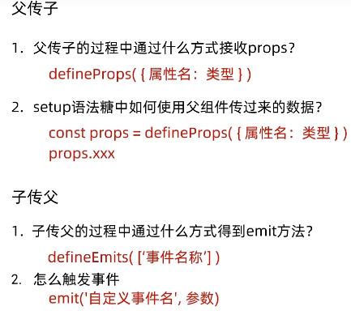

## 组合式API - 模板引用
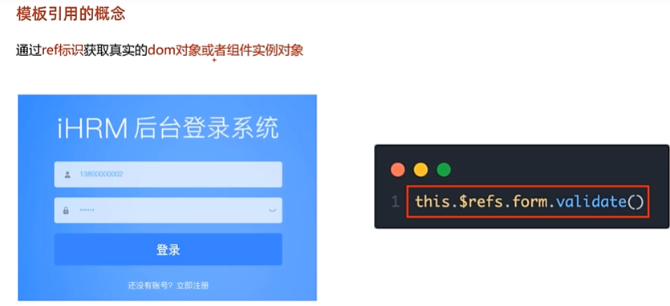

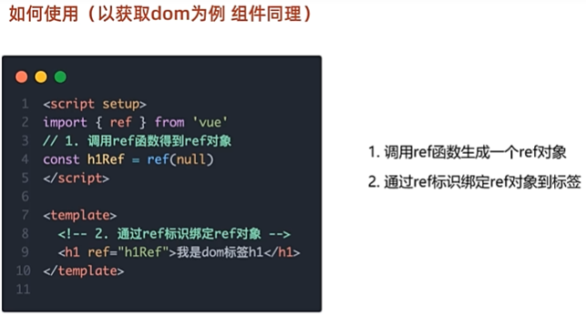

### defineExpose()
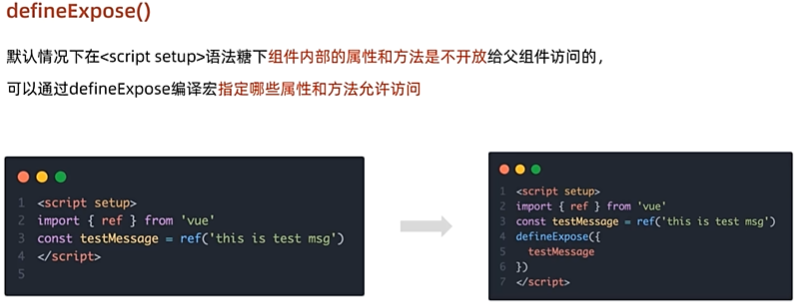

## 组合式API - provide 和inject
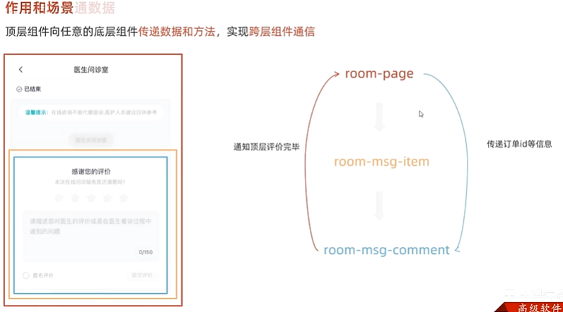

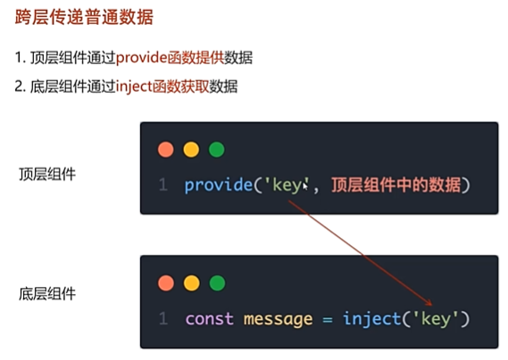

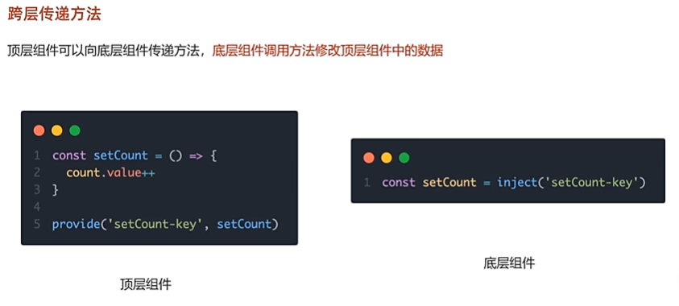

## vue3.3新特性-defineOptions
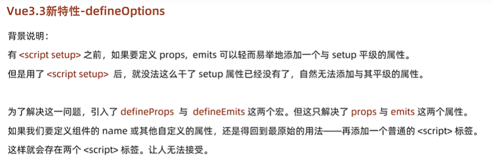

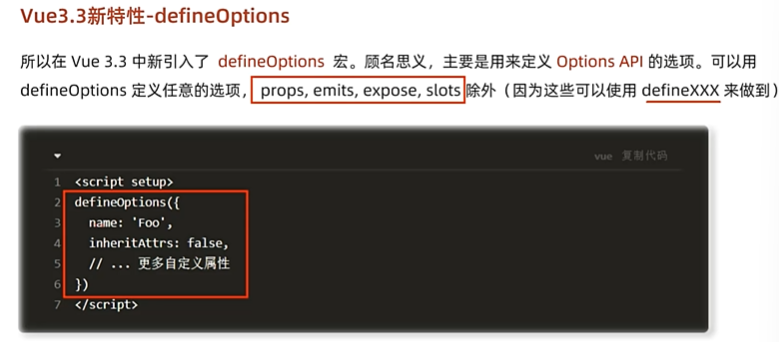

## vue3.3新特性-defineModel
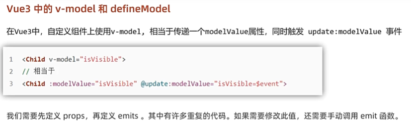
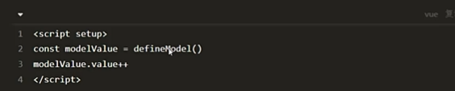

## Pinia快速入门
Pinia是vue最新的状态管理工具，是vuex的替代品

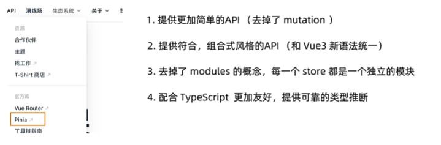

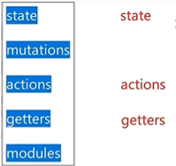

### 手动添加Pinia到vue项目
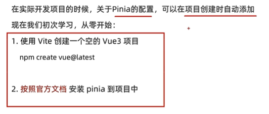

### pinia持久化插件
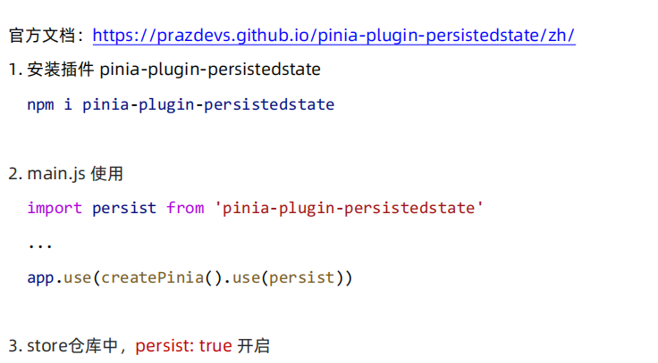

## vue3案例
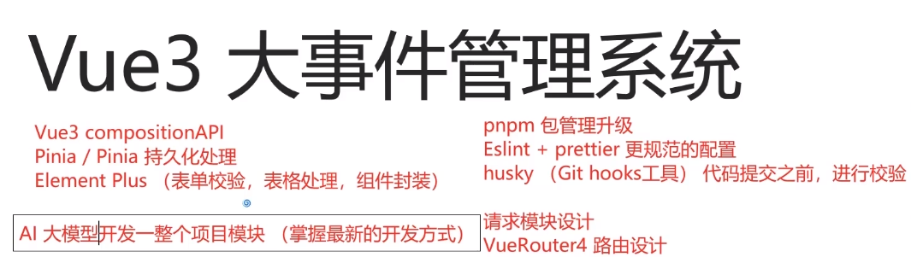

### Eslint配置代码风格
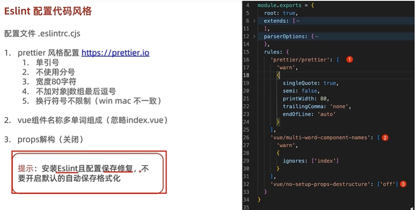

### 提交前做代码检查
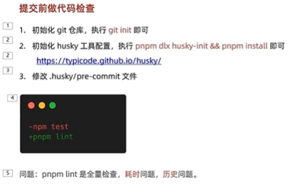

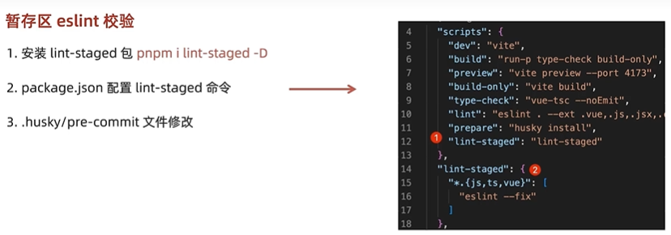

### vuerouter4
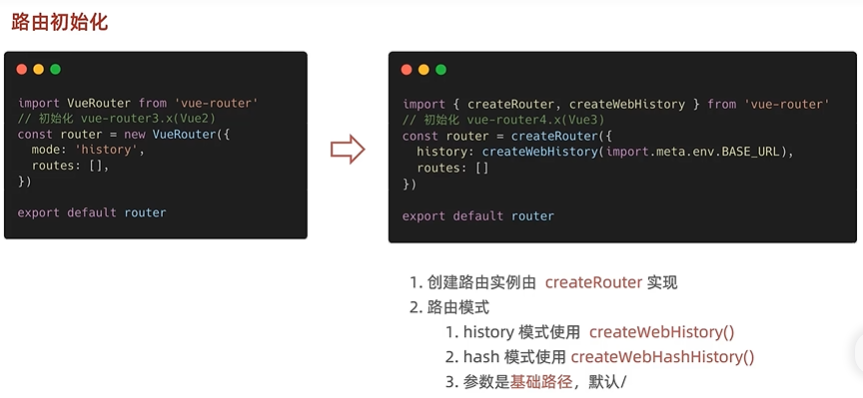

### element plus插件
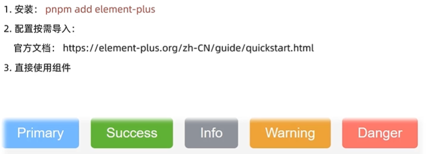

## Pinia构建用户仓库和持久化
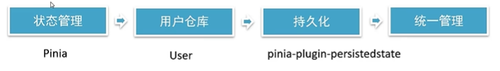

### pinia独立维护

### 仓库统一导出

## 请求工具设计
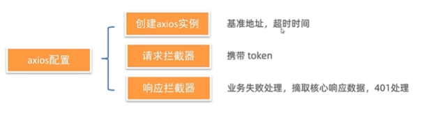
