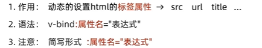

# 黑马程序员day1

## Vue是什么
Vue是一个用于构建用户界面的渐进式框架

Vue的两种使用方式：

1、Vue核心包开发

场景：局部模块改造

2、Vue核心包&Vue插件 工程化开发

场景：整站开发

## 创建实例

创建Vue实例初始化渲染核心步骤：

## 插值表达式{{}}

## Vue核心特性：响应式

## 开发者工具下载

谷歌插件

## vue指令

vue会根据不同的`指令`，针对标签实现不同的`功能`

指令：带有`v-前缀`的特殊`标签属性`

### v-html

### v-show vs v-if

### v-else v-else-if
1、作用：辅助v-if进行判断渲染

2、语法：v-else  v-else-if="表达式"

3、注意：需要紧挨着v-if一起使用

### v-on

v-on:click可以写成@click，即@事件名

注意：methods函数内的this指向vue实例

**v-on调用传参**

### v-bind

### v-for

**key**

语法：key属性=“唯一标识”
作用：给列表项添加唯一标识。便于Vue进行列表项的正确排序复用

### v-model

