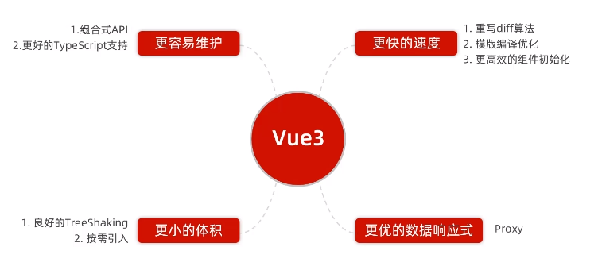
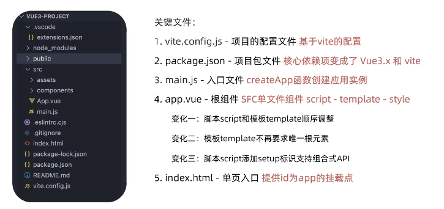
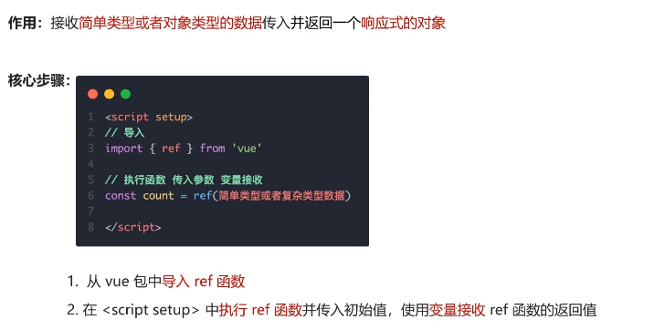
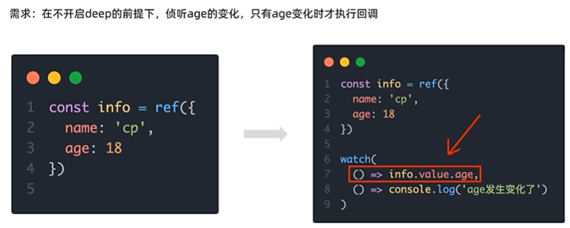

# 黑马程序员day4

## 组件三大部分--注意点

## data是一个函数

## 组件通信

### 组件关系分类

### 解决方案

## prop

### props校验

### prop & data   单向数据流

## 非父子通信（拓展） - event bus事件总线

## 非父子通信（拓展） - provide & inject

## v-model原理

## 表单类组件封装 & v-model简化代码

## .sync修饰符

## ref和$refs

## vue异步更新、$nextTick

