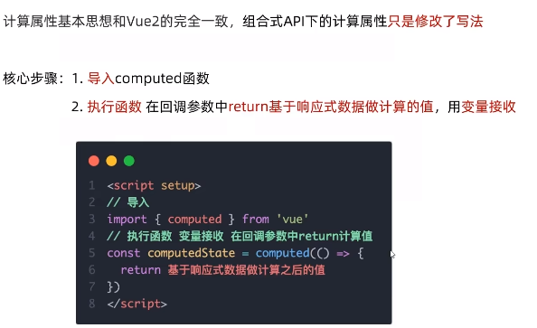

# 黑马程序员day7

## vuex概述

### 创建一个空仓库

### 核心概念 - state状态

### 核心概念 - mutations
vuex遵循单向数据流，组件中不能直接修改仓库中的值

strict:true可以开启严格模式，即在组件中直接修改则报错

最终上线不需要加strict(消耗性能)

**传参语法**

不支持传多个参数，可以改成数组或者对象形式

**输入框“双向绑定”**

store的数据不支持双向绑定，因为是单向流的，所以可以利用v-model拆分成:value和@input的形式进行绑定

**辅助函数mapMutations**

### 核心概念 - actions

**辅助函数**

### 核心概念 - getters

### 核心概念 - 模块module（进阶语法）

**模块拆分**

**访问模块内的内容**

